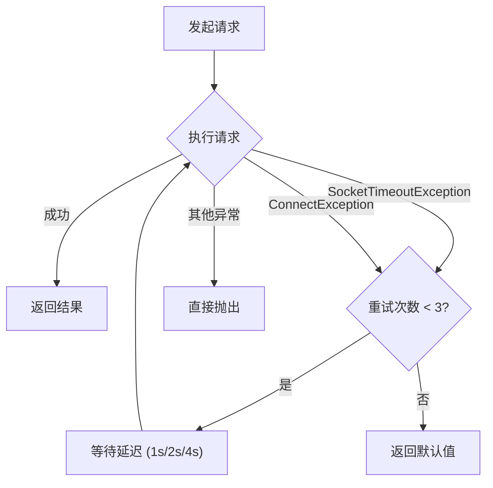
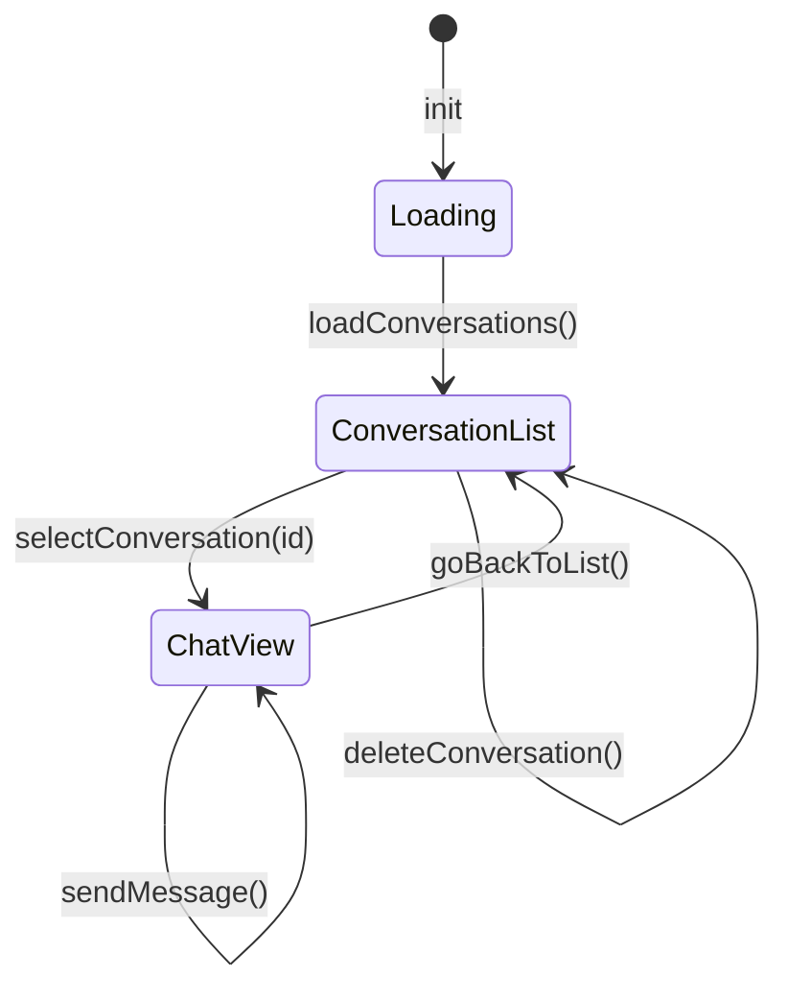
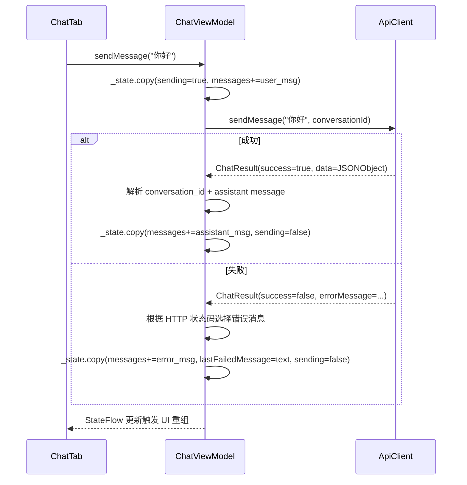
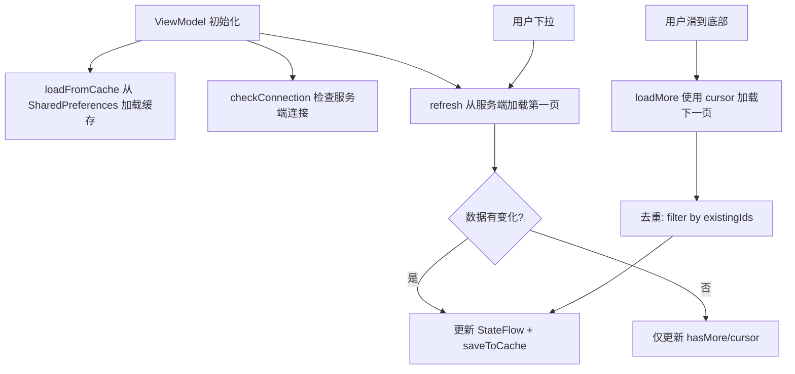
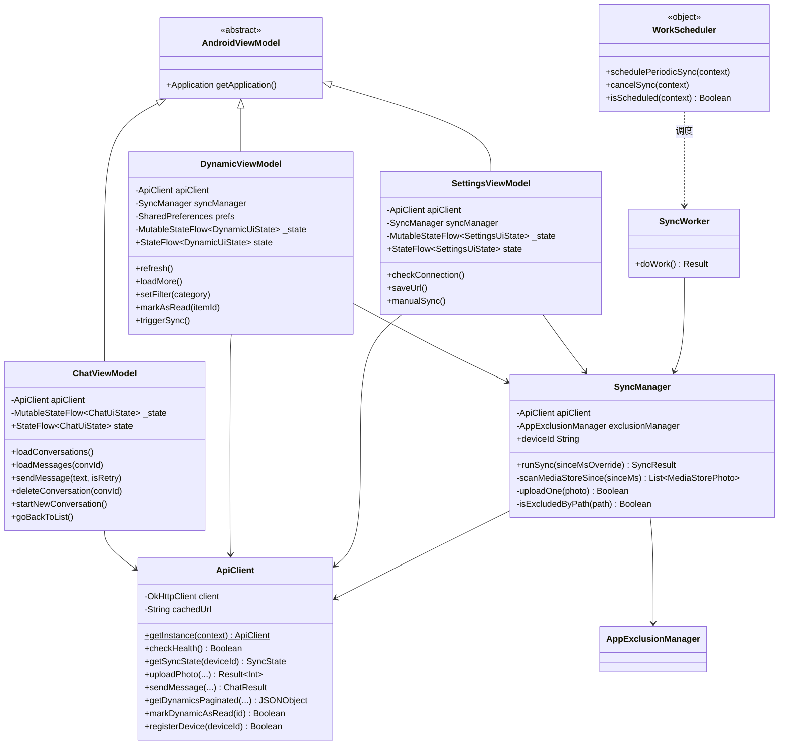

# MVVM 架构

Evatar Android 采用经典的 MVVM (Model-View-ViewModel) 架构，通过 Jetpack Compose 的 `StateFlow` + `collectAsState()` 实现响应式数据流。

## 架构分层

```
┌─────────────────────────────────────────────────┐
│  View Layer (Compose)                           │
│  OnboardingScreen / ChatTab / DynamicTab / ...  │
│  通过 collectAsState() 订阅 StateFlow          │
├─────────────────────────────────────────────────┤
│  ViewModel Layer                                │
│  ChatViewModel / DynamicViewModel / ...         │
│  MutableStateFlow<UiState> + viewModelScope     │
├─────────────────────────────────────────────────┤
│  Model Layer                                    │
│  ApiClient (Singleton) + SyncManager            │
│  OkHttp 同步调用 + Dispatchers.IO 协程调度      │
└─────────────────────────────────────────────────┘
```

## 状态管理模式

所有 ViewModel 遵循统一的状态管理模式：

```kotlin
// 1. 定义不可变的 UI State data class
data class ChatUiState(
    val conversations: List<UiConversation> = emptyList(),
    val messages: List<UiMessage> = emptyList(),
    val activeConvId: String? = null,
    val sending: Boolean = false,
    val loading: Boolean = true,
    val lastFailedMessage: String? = null,
)

// 2. ViewModel 内部持有可变 StateFlow
class ChatViewModel(app: Application) : AndroidViewModel(app) {
    private val _state = MutableStateFlow(ChatUiState())
    val state: StateFlow<ChatUiState> = _state  // 对外暴露只读

    // 3. 通过 .copy() 更新状态
    fun sendMessage(text: String) {
        _state.value = _state.value.copy(sending = true)
        viewModelScope.launch {
            val result = apiClient.sendMessage(text, _state.value.activeConvId)
            _state.value = _state.value.copy(
                messages = _state.value.messages + UiMessage("assistant", result.data),
                sending = false
            )
        }
    }
}

// 4. Compose 中订阅
@Composable
fun ChatTab(viewModel: ChatViewModel = viewModel()) {
    val state by viewModel.state.collectAsState()
    // 直接使用 state.conversations, state.messages 等
}
```

### 三个 ViewModel 的状态定义

| ViewModel | State 类 | 关键字段 |
|-----------|---------|---------|
| `ChatViewModel` | `ChatUiState` | `conversations`, `messages`, `activeConvId`, `sending`, `loading`, `lastFailedMessage` |
| `DynamicViewModel` | `DynamicUiState` | `items`, `loading`, `loadingMore`, `hasMore`, `serverConnected`, `filter`, `unreadCounts` |
| `SettingsViewModel` | `SettingsUiState` | `serverUrl`, `urlField`, `serverConnected`, `saved`, `lastResult`, `isSyncing` |

## ApiClient 单例

`ApiClient` 是整个应用唯一的 HTTP 客户端入口，采用双重检查锁单例模式：

```kotlin
class ApiClient private constructor(private val context: Context) {
    companion object {
        @Volatile private var INSTANCE: ApiClient? = null

        fun getInstance(context: Context): ApiClient {
            return INSTANCE ?: synchronized(this) {
                INSTANCE ?: ApiClient(context.applicationContext).also { INSTANCE = it }
            }
        }
    }
}
```

### OkHttp 配置

```kotlin
private val client = OkHttpClient.Builder()
    .connectTimeout(15, TimeUnit.SECONDS)    // 连接超时
    .writeTimeout(120, TimeUnit.SECONDS)     // 上传超时 (大文件)
    .readTimeout(180, TimeUnit.SECONDS)      // AI 响应超时 (可能很慢)
    .addInterceptor(logging)                 // BASIC 级别日志
    .build()
```

### 重试机制 (executeWithRetry)



重试仅对 `SocketTimeoutException` 和 `ConnectException` 生效，其他异常直接抛出。延迟策略为指数退避：1000ms → 2000ms → 4000ms。

```kotlin
private val RETRY_DELAYS = longArrayOf(1000, 2000, 4000)

private inline fun <T> executeWithRetry(request: Request, default: T, transform: (Response) -> T): T {
    for (attempt in 0 until MAX_RETRIES) {
        try {
            return execute(request, transform)
        } catch (e: SocketTimeoutException) { /* retry */ }
          catch (e: ConnectException) { /* retry */ }
          catch (e: Exception) { throw e }  // 非可重试异常
        if (attempt < MAX_RETRIES - 1) {
            Thread.sleep(RETRY_DELAYS[attempt])
        }
    }
    return default
}
```

### 所有 API 方法

| 方法 | HTTP | 端点 | 说明 |
|------|------|------|------|
| `checkHealth()` | GET | `/api/health` | 服务器健康检查 |
| `getSyncState(deviceId)` | GET | `/api/photos/sync-state` | 获取设备同步状态 |
| `setSyncSince(deviceId, sinceMs)` | POST | `/api/photos/sync-state` | 设置同步起始时间 |
| `uploadPhoto(...)` | POST | `/api/photos/upload` | Multipart 上传截图 |
| `sendMessage(message, conversationId, filePath?)` | POST | `/api/chat/send-with-file` | 发送聊天消息 (可附带文件) |
| `getConversations()` | GET | `/api/chat/conversations` | 获取会话列表 |
| `deleteConversation(conversationId)` | DELETE | `/api/chat/conversations/{id}` | 删除会话 |
| `getConversationMessages(conversationId)` | GET | `/api/chat/conversations/{id}` | 获取会话消息 |
| `getDynamicsPaginated(cursor, limit, category?)` | GET | `/api/dynamics?cursor=&limit=&category=` | 游标分页获取动态 |
| `markDynamicAsRead(dynamicId)` | PUT | `/api/dynamics/{id}/read` | 标记动态为已读 |
| `registerDevice(deviceId)` | POST | `/api/push/register` | 注册推送设备 |

## ChatViewModel 详解

ChatViewModel 管理两个视图状态：**会话列表**和**聊天界面**。

```kotlin
class ChatViewModel(app: Application) : AndroidViewModel(app) {
    private val apiClient = ApiClient.getInstance(app)
    private val _state = MutableStateFlow(ChatUiState())
    val state: StateFlow<ChatUiState> = _state

    init { loadConversations() }  // 初始化时自动加载会话列表
}
```

### 会话列表管理



### 消息发送流程



### 错误处理策略

```kotlin
val errorMsg = when {
    result.errorMessage.contains("401") -> "认证失败"      // chat_error_auth
    result.errorMessage.contains("500") -> "服务器错误"    // chat_error_server
    result.errorMessage.contains("timeout") -> "请求超时"  // chat_error_timeout
    result.errorMessage.contains("connect") -> "无法连接"  // chat_error_connect
    else -> "发送失败: ${result.errorMessage}"            // chat_error_send_prefix
}
```

失败消息会保存在 `lastFailedMessage` 中，用户可以通过重试栏重新发送。

## DynamicViewModel 详解

DynamicViewModel 实现了 **本地缓存优先 + 服务端刷新** 的策略：



### 游标分页

```kotlin
// 首次加载
fun refresh() {
    val json = apiClient.getDynamicsPaginated(cursor = 0, limit = 30, category = filter)
    nextCursor = json.optInt("next_cursor", 0)
    hasMore = json.optBoolean("has_more", false)
}

// 加载更多
fun loadMore() {
    if (loadingMore || !hasMore || nextCursor == 0) return
    val json = apiClient.getDynamicsPaginated(cursor = nextCursor, limit = 30, category = filter)
    // 去重后合并
    val uniqueNew = newItems.filter { it.id !in existingIds }
    val merged = state.items + uniqueNew
}
```

### 本地缓存

使用 `SharedPreferences` 缓存最近 100 条动态数据：

```kotlin
private fun saveToCache(items: List<UiDynamic>) {
    val jsonArray = JSONArray()
    for (item in items.take(100)) {  // 最多缓存 100 条
        jsonArray.put(JSONObject().apply {
            put("id", item.id); put("title", item.title); /* ... */
        })
    }
    prefs.edit().putString("cached_items", jsonArray.toString()).apply()
}
```

缓存的作用是 **即时展示**：用户打开页面时先显示缓存数据，避免白屏，然后服务端数据到达后自动刷新。

## SettingsViewModel 详解

SettingsViewModel 管理服务器配置和同步控制：

```kotlin
class SettingsViewModel(app: Application) : AndroidViewModel(app) {
    private val apiClient = ApiClient.getInstance(app)
    private val syncManager = SyncManager(app)

    init {
        // 从 ApiClient 加载已保存的 URL
        _state.value = _state.value.copy(serverUrl = apiClient.getServerUrl())
        checkConnection()
    }

    fun saveUrl() {
        val trimmed = urlField.trim()
        when {
            trimmed.isEmpty() -> urlError = "URL 不能为空"
            !trimmed.startsWith("http://") && !trimmed.startsWith("https://") ->
                urlError = "URL 必须以 http:// 或 https:// 开头"
            else -> {
                apiClient.setServerUrl(trimmed)  // 持久化到 SharedPreferences
                checkConnection()                 // 验证连接
            }
        }
    }

    fun manualSync() {
        val result = syncManager.runSync()
        lastSyncMessage = when {
            result.total == 0 -> "已是最新，无需同步"
            result.success > 0 && result.failed == 0 -> "同步完成: ${result.success} 张新截图"
            else -> "同步完成: ${result.success} 成功, ${result.failed} 失败"
        }
    }
}
```

## SyncManager 协调器

`SyncManager` 是同步流程的核心协调器，负责 MediaStore 扫描和并发上传：

```kotlin
class SyncManager(context: Context) {
    val apiClient = ApiClient.getInstance(context)
    private val exclusionManager = AppExclusionManager(context)

    // 设备唯一标识: "{制造商}_{型号}_{ANDROID_ID}"
    val deviceId: String by lazy {
        "${Build.MANUFACTURER}_${Build.MODEL}_${Settings.Secure.ANDROID_ID}"
    }

    suspend fun runSync(sinceMsOverride: Long? = null): SyncResult {
        // 1. 确定同步起始时间
        val sinceMs = sinceMsOverride ?: apiClient.getSyncState(deviceId).lastSyncedTsMs

        // 2. 扫描 MediaStore
        val newPhotos = scanMediaStoreSince(sinceMs)

        // 3. Semaphore(3) 并发上传
        val semaphore = Semaphore(MAX_CONCURRENT)
        coroutineScope {
            newPhotos.map { photo ->
                async { semaphore.withPermit { uploadOne(photo) } }
            }.awaitAll()
        }
    }
}
```

### 并发控制

使用 `kotlinx.coroutines.sync.Semaphore` 限制最大并发上传数为 3：

```kotlin
private const val MAX_CONCURRENT = 3

val semaphore = Semaphore(MAX_CONCURRENT)
coroutineScope {
    newPhotos.map { photo ->
        async {
            ensureActive()  // 检查协程是否已取消
            semaphore.withPermit {
                uploadOne(photo)
            }
        }
    }.awaitAll()
}
```

### content:// URI 处理

API 29+ 的 MediaStore 返回 `content://` URI 而非文件路径，需要先复制到临时文件：

```kotlin
private suspend fun uploadOne(photo: MediaStorePhoto): Boolean {
    val uploadPath = if (photo.filePath.startsWith("content://")) {
        val tmpFile = File(appContext.cacheDir, "upload_${photo.id}_${photo.displayName}")
        appContext.contentResolver.openInputStream(Uri.parse(photo.filePath))?.use { input ->
            tmpFile.outputStream().use { output -> input.copyTo(output) }
        }
        tmpFile.absolutePath
    } else {
        photo.filePath
    }

    return try {
        apiClient.uploadPhoto(filePath = uploadPath, /* ... */)
    } finally {
        if (uploadPath != photo.filePath) File(uploadPath).delete()  // 清理临时文件
    }
}
```

## WorkScheduler 调度器

`WorkScheduler` 是一个 `object` 单例，管理 WorkManager 周期任务：

```kotlin
object WorkScheduler {
    private const val UNIQUE_WORK_NAME = "evatar_sync"

    fun schedulePeriodicSync(context: Context) {
        val constraints = Constraints.Builder()
            .setRequiredNetworkType(NetworkType.CONNECTED)  // 需要网络
            .build()

        val request = PeriodicWorkRequestBuilder<SyncWorker>(30, TimeUnit.MINUTES)
            .setConstraints(constraints)
            .build()

        WorkManager.getInstance(context).enqueueUniquePeriodicWork(
            UNIQUE_WORK_NAME,
            ExistingPeriodicWorkPolicy.KEEP,  // 已存在则保留
            request
        )
    }
}
```

`WorkScheduler` 在 `EvatarApp.onCreate()` 中被调用，确保应用每次启动时注册定时任务。

## 类关系图


