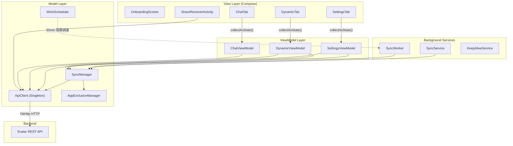
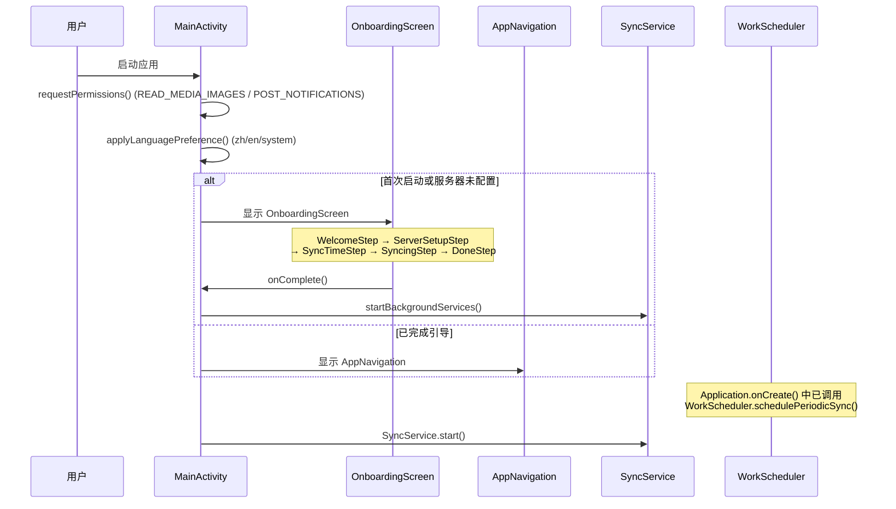

# Android 概览

Evatar Android 客户端是一个纯 Kotlin 编写的原生应用，使用 Jetpack Compose 构建声明式 UI。核心功能包括：自动扫描设备截图并同步到后端服务、AI 智能对话、动态信息流浏览，以及灵活的设置管理。

## 项目结构

以下是 `android/app/src/main/java/com/evatar/app/` 下的完整 Kotlin 文件树：

```
com/evatar/app/
├── EvatarApp.kt                      # Application 入口
│   └── 创建通知渠道 (evatar_sync, evatar_keepalive)
│   └── 调用 WorkScheduler.schedulePeriodicSync() 注册定时同步
│
├── MainActivity.kt                   # 主 Activity
│   └── 权限请求 (READ_MEDIA_IMAGES / POST_NOTIFICATIONS)
│   └── 语言偏好应用 (zh / en / system)
│   └── OnboardingScreen ↔ AppNavigation 切换逻辑
│   └── startBackgroundServices() 启动 SyncService + 注册设备
│
├── network/
│   └── ApiClient.kt                  # HTTP 客户端单例
│       └── OkHttpClient 实例 (connectTimeout=15s, writeTimeout=120s, readTimeout=180s)
│       └── executeWithRetry() 指数退避重试 (最多 3 次, 延迟 1s/2s/4s)
│       └── 服务器 URL 持久化 (SharedPreferences: evatar_prefs)
│       └── API: checkHealth, getSyncState, setSyncSince, uploadPhoto,
│                sendMessage, getConversations, deleteConversation,
│                getConversationMessages, getDynamicsPaginated,
│                markDynamicAsRead, registerDevice
│
├── viewmodel/
│   ├── ChatViewModel.kt              # 聊天 ViewModel
│   │   └── ChatUiState: conversations, messages, activeConvId, sending, loading, lastFailedMessage
│   │   └── 功能: loadConversations, loadMessages, sendMessage (含重试), deleteConversation
│   │
│   ├── DynamicViewModel.kt           # 动态 ViewModel
│   │   └── DynamicUiState: items, loading, loadingMore, hasMore, serverConnected, filter, unreadCounts
│   │   └── 功能: refresh (cursor=0), loadMore (cursor 分页), setFilter, markAsRead, triggerSync
│   │   └── 本地缓存: SharedPreferences (dynamics_cache) 存储最近 100 条
│   │
│   └── SettingsViewModel.kt          # 设置 ViewModel
│       └── SettingsUiState: serverUrl, urlField, serverConnected, saved, lastResult, isSyncing
│       └── 功能: checkConnection, updateUrlField, saveUrl (含 URL 校验), manualSync
│
├── sync/
│   ├── SyncManager.kt                # 核心同步管理器
│   │   └── deviceId = "{MANUFACTURER}_{MODEL}_{ANDROID_ID}"
│   │   └── runSync(): 查询服务端同步状态 → 扫描 MediaStore → Semaphore(3) 并发上传
│   │   └── scanMediaStoreSince(): ContentResolver 查询 Screenshots 目录
│   │   └── uploadOne(): content:// URI → 临时文件 → Multipart 上传 → 清理
│   │   └── isExcludedByPath(): 根据 AppExclusionManager 过滤排除的应用
│   │
│   ├── SyncWorker.kt                 # WorkManager CoroutineWorker
│   │   └── doWork(): checkHealth → runSync → 失败时 Result.retry()
│   │
│   ├── SyncService.kt                # 前台 Service (60 秒同步循环)
│   │   └── LifecycleService + lifecycleScope.launch
│   │   └── 常驻通知显示同步进度
│   │
│   └── WorkScheduler.kt              # WorkManager 调度器
│       └── schedulePeriodicSync(): 每 30 分钟, NetworkType.CONNECTED 约束
│       └── ExistingPeriodicWorkPolicy.KEEP 避免重复注册
│
├── settings/
│   └── AppExclusionManager.kt        # 应用排除管理器
│       └── 默认排除: com.android.settings, com.android.camera, com.android.systemui
│       └── 存储: SharedPreferences (app_exclusion_prefs)
│
├── keepalive/
│   ├── KeepAliveService.kt           # 保活前台 Service
│   │   └── 每 30 秒 checkHealth 更新悬浮窗状态
│   │
│   └── OverlayWindow.kt             # 悬浮窗实现 (需 SYSTEM_ALERT_WINDOW 权限)
│
└── ui/
    ├── AppNavigation.kt              # 主导航框架
    │   └── 三个 Tab: DYNAMIC, CHAT, SETTINGS
    │   └── 自定义底部导航栏 (无 Navigation 组件, 状态直接管理)
    │   └── 聊天全屏模式时隐藏底部栏 (AnimatedVisibility)
    │   └── 左右滑动手势切换 Tab
    │
    ├── ShareReceiverActivity.kt      # 分享接收 Activity
    │   └── ACTION_SEND 处理: 图片 → 上传, 文本 → sendMessage
    │
    ├── components/
    │   └── MarkdownText.kt           # Markdown 文本渲染组件
    │
    ├── screens/
    │   ├── OnboardingScreen.kt       # 引导流程 (5 步)
    │   │   └── WELCOME → SERVER_SETUP → SYNC_TIME → SYNCING → DONE
    │   │
    │   ├── ChatTab.kt                # 聊天 Tab
    │   │   └── ConversationList: 下拉刷新 + 会话行 + 删除确认
    │   │   └── ChatView: 消息气泡 + Markdown 渲染 + 打字动画 + 重试栏
    │   │
    │   ├── DynamicTab.kt             # 动态 Tab
    │   │   └── FilterChip 分类筛选 (all/insight/reminder/report/note)
    │   │   └── 卡片列表 + 展开/折叠 + 已读标记 + 无限滚动加载
    │   │
    │   └── SettingsTab.kt            # 设置 Tab
    │       └── 服务器配置、同步控制、主题切换、语言切换、电池优化、悬浮窗
    │
    └── theme/
        └── Theme.kt                  # Material3 主题
            └── EvatarColors: Observatory 色板 (暗色/亮色)
            └── EvatarTypography: 11 级字体排版系统
            └── EvatarTheme: darkColorScheme / lightColorScheme
```

## 技术栈

| 类别 | 技术 | 版本 | 用途 |
|------|------|------|------|
| 语言 | Kotlin | 2.0 (JVM 17) | 全量 Kotlin，无 Java 代码 |
| UI 框架 | Jetpack Compose | BOM 2024.06.00 | 声明式 UI 构建 |
| 设计系统 | Material3 | - | 自定义 Observatory 色板，暗色/亮色双主题 |
| 网络 | OkHttp | 4.12.0 | 同步阻塞调用 + 协程 Dispatchers.IO 调度 |
| JSON | Gson + org.json | 2.11.0 | 响应解析 (JSONObject/JSONArray) |
| 后台任务 | WorkManager | 2.9.1 | 30 分钟周期同步，网络约束 |
| 图片加载 | Coil Compose | 2.6.0 | Compose 原生 AsyncImage |
| 权限 | Accompanist Permissions | 0.34.0 | Compose 声明式权限请求 |
| 协程 | kotlinx-coroutines-android | 1.8.1 | ViewModel 并发控制 |

## 构建配置

```kotlin
android {
    namespace = "com.evatar.app"
    compileSdk = 34          // Android 14
    defaultConfig {
        applicationId = "com.evatar.app"
        minSdk = 26          // Android 8.0 Oreo (支持通知渠道)
        targetSdk = 34       // Android 14
        versionCode = 1
        versionName = "0.1.0"
    }
    kotlinOptions { jvmTarget = "17" }
    buildFeatures { compose = true }
}
```

### API 级别兼容性

| API 级别 | Android 版本 | 应用中的使用场景 |
|----------|-------------|-----------------|
| 26 (minSdk) | 8.0 Oreo | `NotificationChannel` 创建、前台 Service |
| 28 | 9.0 Pie | `Build.MANUFACTURER` 可靠返回 |
| 29 | 10 | MediaStore `content://` URI（取代已废弃的 `DATA` 列） |
| 33 | 13 | `READ_MEDIA_IMAGES` + `POST_NOTIFICATIONS` 运行时权限 |

## 架构总览



## 启动流程



## 相关文档

- [MVVM 架构](./architecture) — ViewModel、ApiClient、SyncManager 详解
- [页面说明](./screens) — 各页面 UI 结构与交互
- [同步机制](./sync) — MediaStore 扫描、上传、定时任务
