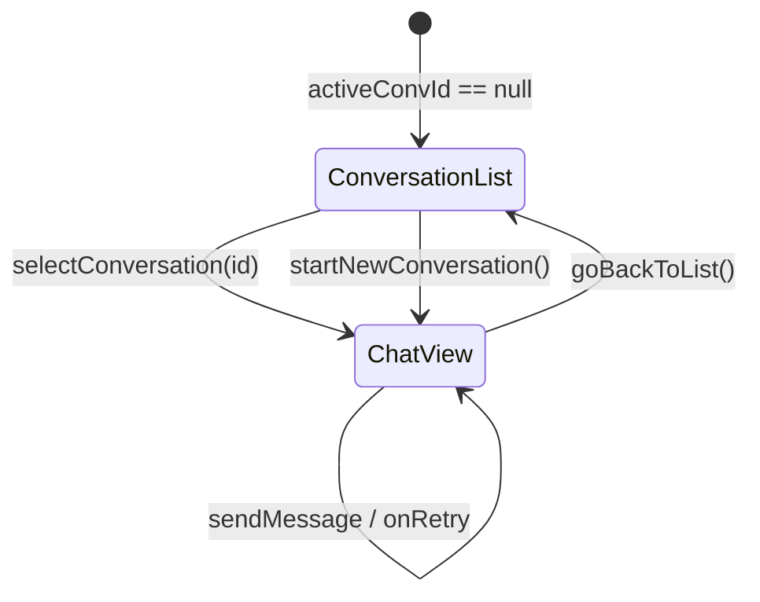

# 页面说明

## 导航架构 (AppNavigation)

应用采用自定义底部导航栏，包含三个 Tab：

| Tab | 枚举值 | 选中图标 | 未选中图标 | 对应页面 |
|-----|--------|---------|-----------|---------|
| 动态 | `DYNAMIC` | `Icons.Filled.Newspaper` | `Icons.Outlined.Newspaper` | `DynamicTab` |
| 聊天 | `CHAT` | `Icons.Filled.ChatBubble` | `Icons.Outlined.ChatBubble` | `ChatTab` |
| 设置 | `SETTINGS` | `Icons.Filled.Settings` | `Icons.Outlined.Settings` | `SettingsTab` |

底部导航栏在聊天全屏模式（`chatIsFullScreen = true`）时通过 `AnimatedVisibility` 滑动隐藏。

### 手势导航

- **DynamicTab 内**：左右滑动切换分类筛选 (FilterChip)
- **ChatTab 会话列表**：右滑切换到 DynamicTab
- **ChatView 聊天界面**：右滑返回会话列表

```kotlin
// AppNavigation.kt 核心结构
@Composable
fun AppNavigation(themeMode: String, onThemeChange: (String) -> Unit) {
    var selectedTab by remember { mutableStateOf(Tab.DYNAMIC) }
    var chatIsFullScreen by remember { mutableStateOf(false) }

    Scaffold(
        bottomBar = {
            AnimatedVisibility(visible = !chatIsFullScreen) {
                // 自定义 Row 底部导航栏
            }
        }
    ) { padding ->
        when (selectedTab) {
            Tab.DYNAMIC -> DynamicTab()
            Tab.CHAT -> ChatTab(
                onChatActiveChange = { chatIsFullScreen = it },
                onSwipeToPrevTab = { selectedTab = prevTab },
            )
            Tab.SETTINGS -> SettingsTab(themeMode, onThemeChange)
        }
    }
}
```

---

## OnboardingScreen — 引导页

### 用途

首次启动时引导用户完成服务器配置和初始同步。通过 `OnboardingStep` 枚举管理 5 个步骤的流程。

### ASCII 布局

```
┌─────────────────────────────┐
│         ○─1───○─2───○       │  ← 步骤指示器 (StepDot + StepLine)
├─────────────────────────────┤
│                             │
│           ◈ Logo            │  ← WelcomeStep
│                             │
│     Welcome to Evatar       │
│   描述文字...               │
│                             │
│  ┌─────────────────────────┐│
│  │     开始设置            ││  ← Button
│  └─────────────────────────┘│
└─────────────────────────────┘
```

### 五步流程

| 步骤 | 枚举值 | 内容 | 关键交互 |
|------|--------|------|---------|
| 1 | `WELCOME` | Logo + 欢迎文字 + "开始设置" 按钮 | 点击进入下一步 |
| 2 | `SERVER_SETUP` | URL 输入框 + 测试连接按钮 + 连接状态 | 输入 URL → 测试 → 连接成功后可继续 |
| 3 | `SYNC_TIME` | 5 个同步范围选项卡片 (1天/3天/7天/30天/全部) | 点击选择 → "开始同步" |
| 4 | `SYNCING` | 加载动画 + 进度条 + "已同步 X/Y" 文字 | 自动执行同步，不可交互 |
| 5 | `DONE` | 绿色勾 + 完成文字 + "进入应用" 按钮 | 点击进入主界面 |

### 同步范围选项

```kotlin
data class SyncTimeOption(val labelResId: Int, val days: Int, val descResId: Int)

val options = listOf(
    SyncTimeOption(R.string.sync_time_1day_label, 1, ...),   // "最近 1 天"
    SyncTimeOption(R.string.sync_time_3day_label, 3, ...),   // "最近 3 天"
    SyncTimeOption(R.string.sync_time_7day_label, 7, ...),   // "最近 7 天" (默认选中)
    SyncTimeOption(R.string.sync_time_30day_label, 30, ...), // "最近 30 天"
    SyncTimeOption(R.string.sync_time_all_label, 0, ...),    // "全部历史"
)
```

### 初始同步流程

```kotlin
// SyncTimeStep 的 onStart 回调
scope.launch {
    // 1. 注册设备
    apiClient.registerDevice(syncManager.deviceId)

    // 2. 计算起始时间戳
    val sinceMs = if (selectedDays == 0) 0L
    else System.currentTimeMillis() - selectedDays * 24 * 60 * 60 * 1000L

    // 3. 在服务端设置同步状态
    apiClient.setSyncSince(syncManager.deviceId, sinceMs)

    // 4. 使用 sinceMsOverride 直接执行同步 (不查询服务端)
    syncManager.runSync(sinceMsOverride = sinceMs) { synced, failed, total ->
        syncProgress = "已同步 $synced/$total"
    }
}
```

### 状态管理

使用 `remember` + `mutableStateOf` 管理局部状态（非 ViewModel，因为 OnboardingScreen 只需一次性流程）：

```kotlin
var step by remember { mutableStateOf(OnboardingStep.WELCOME) }
var serverUrl by remember { mutableStateOf("") }
var urlError by remember { mutableStateOf<String?>(null) }
var serverConnected by remember { mutableStateOf(false) }
var selectedDays by remember { mutableIntStateOf(7) }
var syncProgress by remember { mutableStateOf("") }
```

---

## ChatTab — 聊天页

### 用途

AI 聊天助手，支持多会话管理、消息收发、失败重试。

### 两种视图状态



### ASCII 布局 — 会话列表

```
┌─────────────────────────────┐
│ 聊天                        │  ← largeTitle
├─────────────────────────────┤
│ ┌─┐ 标题文字               │  ← ConversationRow
│ │E│ 最后一条消息预览...     │    (E = avatar, 删除按钮在右侧)
│ └─┘                        │
│ ─────────────────────────── │  ← HorizontalDivider (start=78.dp)
│ ┌─┐ 标题文字               │
│ │E│ 最后一条消息预览...     │
│ └─┘                        │
│                             │
│                             │
│                         ┌─┐ │  ← FAB (新会话)
│                         │+│ │
│                         └─┘ │
└─────────────────────────────┘
```

### ASCII 布局 — 聊天界面

```
┌─────────────────────────────┐
│ ← 聊天            新对话    │  ← TopBar (52.dp)
├─────────────────────────────┤
│                             │
│   你好！我是 Evatar AI...   │  ← assistant 气泡 (左对齐)
│                             │
│           你好，帮我看看... │  ← user 气泡 (右对齐, primary 色)
│                             │
│   我查看了你的截图库...     │  ← assistant 气泡 (MarkdownText)
│                             │
│              ●●○ 发送中...  │  ← TypingDots 动画
│                             │
├─────────────────────────────┤
│ ┌───────────────────────┐ ⊙ │  ← 输入框 + 发送按钮
│ │ 输入消息...            │   │
│ └───────────────────────┘   │
└─────────────────────────────┘
```

### 关键交互

| 交互 | 实现 |
|------|------|
| 发送消息 | `sendMessage(text)` → 立即显示用户消息 → 异步等待 AI 回复 |
| 消息失败重试 | 底部红色重试栏显示 `lastFailedMessage`，点击"重试"重新发送 |
| 下拉刷新 | `PullRefreshIndicator` + `rememberPullRefreshState` 刷新会话列表 |
| 自动滚动 | `LaunchedEffect(messages.size)` → `listState.animateScrollToItem()` |
| 自动刷新 | 会话列表每 30 秒自动刷新 (`delay(30_000L)`) |
| 删除会话 | `AlertDialog` 确认后调用 `deleteConversation()` |

### Composable 结构

```kotlin
@Composable
fun ChatTab(viewModel: ChatViewModel = viewModel()) {
    val state by viewModel.state.collectAsState()

    if (state.activeConvId == null) {
        ConversationList(
            conversations = state.conversations,
            onSelect = { viewModel.selectConversation(it.id) },
            onNew = { viewModel.startNewConversation() },
            // ...
        )
    } else {
        ChatView(
            messages = state.messages,
            onSend = { viewModel.sendMessage(text) },
            onBack = { viewModel.goBackToList() },
            // ...
        )
    }
}
```

### 气泡样式

```kotlin
@Composable
private fun ChatBubble(msg: UiMessage) {
    val isUser = msg.role == "user"
    val bubbleColor = if (isUser) MaterialTheme.colorScheme.primary
                      else MaterialTheme.colorScheme.surfaceVariant
    val shape = RoundedCornerShape(
        topStart = 18.dp, topEnd = 18.dp,
        bottomStart = if (isUser) 18.dp else 4.dp,   // AI 气泡左下角尖角
        bottomEnd = if (isUser) 4.dp else 18.dp,      // 用户气泡右下角尖角
    )

    // 用户消息: 纯文本
    // AI 消息: MarkdownText 渲染
    if (isUser) Text(text = msg.content)
    else MarkdownText(text = msg.content)
}
```

### 打字动画

```kotlin
@Composable
private fun TypingDots() {
    var dotCount by remember { mutableIntStateOf(1) }
    LaunchedEffect(Unit) {
        while (true) { delay(400); dotCount = (dotCount % 3) + 1 }
    }
    // 显示: "●○○" → "●●○" → "●●●" → "●○○" 循环
    Text("●".repeat(dotCount) + "○".repeat(3 - dotCount))
}
```

---

## DynamicTab — 动态页

### 用途

展示 AI 生成的动态信息流，支持分类筛选、已读标记、无限滚动加载。

### ASCII 布局

```
┌─────────────────────────────┐
│ 动态                    ●   │  ← title + 连接状态圆点 (绿/红)
├─────────────────────────────┤
│ [全部] [洞察] [提醒] [报告] │  ← LazyRow FilterChip + 未读 Badge
│                             │
│ ┌─────────────────────────┐ │
│ │ 💡 洞察标题        [红点]│ │  ← 未读卡片 (primary 6% 背景)
│ │    摘要文字预览...       │ │
│ │    insight    06-05      │ │
│ └─────────────────────────┘ │
│ ┌─────────────────────────┐ │
│ │ 📝 笔记标题             │ │  ← 已读卡片 (surface 背景)
│ │    摘要文字预览...       │ │
│ │    note       06-04      │ │
│ └─────────────────────────┘ │
│ ┌─────────────────────────┐ │
│ │ 🔔 提醒标题        [红点]│ │
│ │    摘要文字预览...       │ │
│ │    reminder   06-03      │ │
│ └─────────────────────────┘ │
│           ◯ 加载更多...     │  ← 无限滚动触发器
└─────────────────────────────┘
```

### 分类筛选

```kotlin
private val FILTER_OPTIONS = listOf(
    FilterOption("",          Icons.Outlined.List,        R.string.dynamic_filter_all),
    FilterOption("insight",   Icons.Outlined.Lightbulb,   R.string.dynamic_filter_insight),
    FilterOption("reminder",  Icons.Outlined.Notifications, R.string.dynamic_filter_reminder),
    FilterOption("report",    Icons.Outlined.Assessment,  R.string.dynamic_filter_report),
    FilterOption("note",      Icons.Outlined.Article,     R.string.dynamic_filter_note),
)
```

每个 FilterChip 旁显示未读数量 Badge：

```kotlin
BadgedBox(badge = {
    if (count > 0) Badge {
        Text(if (count > 99) "99+" else count.toString())
    }
}) {
    FilterChip(selected = ..., onClick = { viewModel.setFilter(option.key) }, ...)
}
```

### 分类图标

| category | 图标 | 含义 |
|----------|------|------|
| `insight` | `Lightbulb` | AI 洞察 |
| `reminder` | `Notifications` | 提醒 |
| `report` | `Assessment` | 报告 |
| `note` | `Article` | 笔记 |

### 关键交互

| 交互 | 实现 |
|------|------|
| 下拉刷新 | `PullRefreshIndicator` → `viewModel.refresh()` |
| 无限滚动 | `LazyColumn` 底部 `LaunchedEffect(Unit) { viewModel.loadMore() }` |
| 点击展开 | `expandedId == item.id` 控制展开状态，首次展开自动标记已读 |
| 滑动切换分类 | `detectHorizontalDragGestures` 左右滑动切换 FilterChip |
| 自动刷新 | 每 60 秒自动 `refresh()` + `checkConnection()` |

### 展开/折叠逻辑

```kotlin
DynamicCard(
    item = item,
    expanded = expandedId == item.id,
    onToggle = {
        val wasExpanded = expandedId == item.id
        expandedId = if (wasExpanded) -1 else item.id
        if (!wasExpanded && !item.isRead) {
            viewModel.markAsRead(item.id)  // 首次展开自动标记已读
        }
    },
)
```

展开后显示 `MarkdownText` 渲染的完整内容：

```kotlin
if (expanded && item.content.isNotEmpty()) {
    HorizontalDivider(/* ... */)
    MarkdownText(text = item.content)
}
```

### 卡片样式

```kotlin
Card(
    colors = CardDefaults.cardColors(
        containerColor = if (!item.isRead)
            MaterialTheme.colorScheme.primary.copy(alpha = 0.06f)  // 未读: 淡蓝背景
        else MaterialTheme.colorScheme.surface,                     // 已读: 普通背景
    ),
)
```

---

## SettingsTab — 设置页

### 用途

管理服务器配置、同步控制、外观设置和系统权限。

### ASCII 布局

```
┌─────────────────────────────┐
│ 设置                        │
├─────────────────────────────┤
│ 服务器                      │  ← SectionHeader
│ ┌─────────────────────────┐ │
│ │ ● 已连接                │ │  ← 连接状态圆点 + 文字
│ │ http://192.168.0.107:.. │ │  ← OutlinedTextField
│ │ [保存]                  │ │  ← Button
│ └─────────────────────────┘ │
│                             │
│ 同步统计                    │
│ ┌─────────────────────────┐ │
│ │   12       0       12   │ │  ← MiniStat (成功/失败/总数)
│ │  已同步   错误    总数   │ │
│ │ 同步完成: 12 张新截图   │ │  ← lastSyncMessage
│ │ [手动同步] [保活悬浮窗] │ │  ← 两个按钮
│ └─────────────────────────┘ │
│                             │
│ 外观                        │
│ ┌─────────────────────────┐ │
│ │ ☀ 主题          暗色 > │ │  ← SettingsRow (循环切换)
│ └─────────────────────────┘ │
│                             │
│ 系统                        │
│ ┌─────────────────────────┐ │
│ │ 🔋 电池优化      允许 > │ │  ← 跳转系统设置
│ │ 📱 悬浮窗权限    管理 > │ │
│ │ 🌐 语言          中文 > │ │  ← 循环: system → zh → en
│ └─────────────────────────┘ │
│                             │
│ 关于                        │
│ ┌─────────────────────────┐ │
│ │ 版本          0.1.0    │ │
│ │ 设备 ID     Pixel_7_.. │ │
│ └─────────────────────────┘ │
└─────────────────────────────┘
```

### 关键交互

| 交互 | 实现 |
|------|------|
| 保存服务器 URL | 校验 (非空 + http/https 前缀) → `apiClient.setServerUrl()` → `checkConnection()` |
| 手动同步 | `viewModel.manualSync()` → `syncManager.runSync()` → 显示结果统计 |
| 保活悬浮窗 | 请求 `SYSTEM_ALERT_WINDOW` 权限 → 启动/停止 `KeepAliveService` |
| 主题切换 | 循环: 暗色 → 亮色 → 跟随系统，存储到 SharedPreferences |
| 语言切换 | 循环: system → zh → en，Toast 提示需重启生效 |
| 电池优化 | 跳转 `ACTION_REQUEST_IGNORE_BATTERY_OPTIMIZATIONS` |

### 服务器 URL 校验

```kotlin
fun saveUrl() {
    val trimmed = urlField.trim()
    when {
        trimmed.isEmpty() ->
            urlError = "URL 不能为空"
        !trimmed.startsWith("http://") && !trimmed.startsWith("https://") ->
            urlError = "URL 必须以 http:// 或 https:// 开头"
        else -> {
            apiClient.setServerUrl(trimmed)
            _state.value = _state.value.copy(serverUrl = trimmed, saved = true)
            checkConnection()
        }
    }
}
```

### 同步结果展示

```kotlin
// SettingsTab.kt
if (state.lastResult != null && state.lastResult!!.total > 0) {
    Row(horizontalArrangement = Arrangement.SpaceEvenly) {
        MiniStat("已同步", state.lastResult!!.success, DarkSuccess)
        MiniStat("错误", state.lastResult!!.failed, DarkError)
        MiniStat("总数", state.lastResult!!.total, onSurface)
    }
}
```

### Composable 结构

```kotlin
@Composable
fun SettingsTab(
    viewModel: SettingsViewModel = viewModel(),
    themeMode: String = "dark",
    onThemeChange: (String) -> Unit = {},
) {
    val state by viewModel.state.collectAsState()

    Column(modifier = Modifier.verticalScroll(rememberScrollState())) {
        // 服务器配置区
        SectionHeader("服务器")
        SettingsGroup {
            // 连接状态 + URL 输入 + 保存按钮
        }

        // 同步统计区
        SectionHeader("同步统计")
        SettingsGroup {
            // MiniStat + 手动同步 + 保活按钮
        }

        // 外观设置区
        SectionHeader("外观")
        SettingsGroup {
            SettingsRow(icon, "主题", subtitle, onClick = { cycleTheme() })
        }

        // 系统设置区
        SectionHeader("系统")
        SettingsGroup {
            SettingsRow(icon, "电池优化", ...)  // 跳转系统设置
            SettingsRow(icon, "悬浮窗权限", ...)  // 跳转系统设置
            SettingsRow(icon, "语言", ...)  // 循环切换
        }

        // 关于区
        SectionHeader("关于")
        SettingsGroup {
            SettingsInfo("版本", versionName)
            SettingsInfo("设备 ID", deviceId)
        }
    }
}
```

---

## ShareReceiverActivity — 分享接收

### 用途

处理从其他应用分享到 Evatar 的图片和文本。

### 处理逻辑

| 分享类型 | 处理方式 |
|----------|---------|
| `image/*` | 复制 URI 到临时文件 → `apiClient.uploadPhoto()` → 删除临时文件 |
| `text/plain` | `apiClient.sendMessage(text, conversationId = null)` |
| 其他 | Toast 提示 "不支持的类型" → `finish()` |

```kotlin
// ShareReceiverActivity.kt
override fun onCreate(savedInstanceState: Bundle?) {
    when (intent?.action) {
        Intent.ACTION_SEND -> {
            when {
                type.startsWith("image/") -> handleShareImage(intent)
                type == "text/plain" -> handleShareText(intent)
                else -> finish()
            }
        }
    }
}
```

## 主题系统 (Theme)

### 色板

应用使用自定义 Observatory 色板，与前端共享配色方案：

| 色彩名称 | 暗色模式 | 亮色模式 | 用途 |
|----------|---------|---------|------|
| Primary | `#F0A500` (琥珀) | `#C88500` | 主色调、选中状态 |
| Background | `#141425` | `#FAF7F2` | 页面背景 |
| Surface | `#1C1C32` | `#FFFFFF` | 卡片/面板 |
| Error | `#E85D75` | `#D44459` | 错误状态 |
| Success | `#00D9A6` | `#00B88C` | 成功状态 |

### 字体排版

`EvatarTypography` 定义了 11 级字体样式：

| 名称 | 字重 | 字号 | 行高 | 使用场景 |
|------|------|------|------|---------|
| `largeTitle` | Bold | 34sp | 41sp | 页面大标题 |
| `title1` | Bold | 28sp | 34sp | 一级标题 |
| `title2` | Bold | 22sp | 28sp | 二级标题 |
| `headline` | SemiBold | 17sp | 22sp | 卡片标题、按钮文字 |
| `body` | Normal | 17sp | 22sp | 正文 |
| `subheadline` | Normal | 15sp | 20sp | 副标题、描述文字 |
| `caption1` | Normal | 12sp | 16sp | 标签、时间戳 |
| `caption2` | Normal | 11sp | 13sp | 底部导航标签 |
