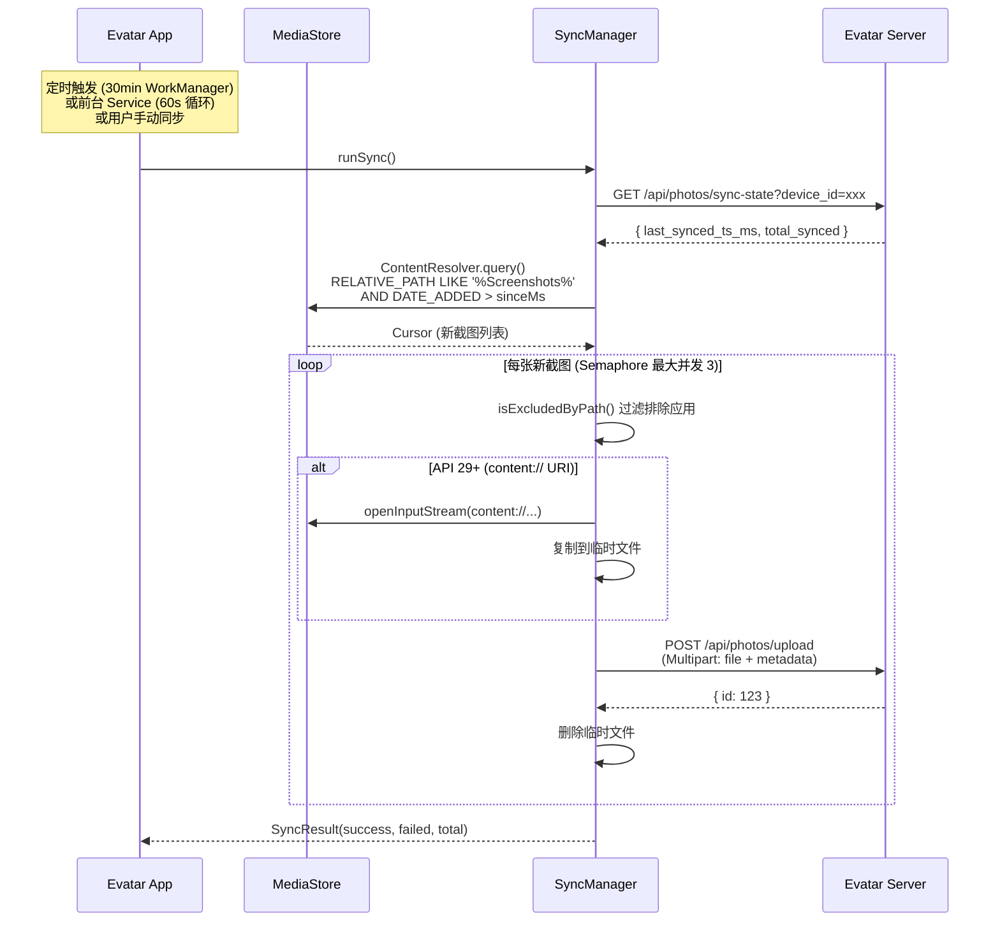
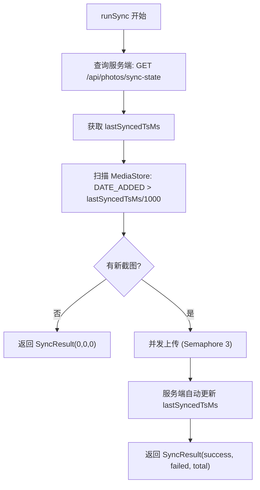

# 同步机制

Evatar 的同步机制负责将设备截图自动检测并上传到后端服务。整个同步流程由 `SyncManager` 协调，通过 `WorkScheduler`（WorkManager 定时任务）和 `SyncService`（前台 Service 持续循环）两种方式触发。

## 整体流程



## MediaStore 扫描 (scanMediaStoreSince)

### 核心实现

`SyncManager.scanMediaStoreSince()` 通过 `ContentResolver.query()` 查询系统 MediaStore 中的截图文件：

```kotlin
private fun scanMediaStoreSince(sinceMs: Long): List<MediaStorePhoto> {
    // API 29+ 不使用已废弃的 DATA 列
    val useDataColumn = Build.VERSION.SDK_INT < Build.VERSION_CODES.Q

    val projection = if (useDataColumn) {
        arrayOf(_ID, DISPLAY_NAME, DATA, SIZE, DATE_ADDED, MIME_TYPE, RELATIVE_PATH)
    } else {
        arrayOf(_ID, DISPLAY_NAME, SIZE, DATE_ADDED, MIME_TYPE, RELATIVE_PATH)
    }

    // 过滤条件: 截图目录 + 时间范围
    val parts = mutableListOf(
        "($RELATIVE_PATH LIKE ? OR $DISPLAY_NAME LIKE ?)"  // "%Screenshots%" / "%screenshot%"
    )
    if (sinceMs > 0) {
        parts.add("$DATE_ADDED > ?")  // sinceMs / 1000 (秒)
    }

    contentResolver.query(
        EXTERNAL_CONTENT_URI, projection,
        parts.joinToString(" AND "), args.toTypedArray(),
        "$DATE_ADDED ASC"  // 按时间升序
    )?.use { cursor -> /* 遍历结果 */ }
}
```

### API 29+ content:// URI 处理

Android 10 (API 29) 引入了 Scoped Storage，MediaStore 不再返回文件绝对路径（`DATA` 列已废弃），而是返回 `content://` URI：

```kotlin
// API 29+: 通过 ContentUris 构建 content:// URI
val path = ContentUris.withAppendedId(
    MediaStore.Images.Media.EXTERNAL_CONTENT_URI, id
).toString()
// 结果: "content://media/external/images/media/12345"

// API 26-28: 直接使用 DATA 列的文件路径
val path = cursor.getString(dataCol)
// 结果: "/storage/emulated/0/Pictures/Screenshots/Screenshot_2024.png"
```

### 查询条件

| 条件 | SQL | 说明 |
|------|-----|------|
| 截图目录 | `RELATIVE_PATH LIKE '%Screenshots%'` | 匹配所有 Screenshots 子目录 |
| 文件名 | `DISPLAY_NAME LIKE '%screenshot%'` | 匹配包含 screenshot 的文件名 |
| 时间范围 | `DATE_ADDED > sinceMs/1000` | 仅查询指定时间之后的文件 |
| 排序 | `DATE_ADDED ASC` | 按时间升序，保证最早的照片先上传 |

### 数据模型

```kotlin
data class MediaStorePhoto(
    val id: Long,           // MediaStore _ID
    val filePath: String,   // API 29+: content:// URI, 旧 API: 绝对路径
    val displayName: String, // 文件名, 如 "Screenshot_20240605.png"
    val fileSize: Long,     // 文件大小 (字节)
    val timestamp: Long,    // DATE_ADDED * 1000 (毫秒)
    val mimeType: String,   // MIME 类型, 如 "image/png"
)
```

## 应用排除过滤 (AppExclusionManager)

`AppExclusionManager` 管理需要排除的应用列表，避免上传系统应用的截图：

### 默认排除列表

```kotlin
private val DEFAULT_EXCLUSIONS = setOf(
    "com.android.settings",   // 系统设置
    "com.android.camera",     // 相机
    "com.android.systemui"    // 系统 UI
)
```

### 过滤逻辑

排除判断基于截图的 `RELATIVE_PATH`（相对路径），因为某些应用的截图会保存在以包名命名的子目录中：

```kotlin
// SyncManager.kt
private fun isExcludedByPath(relativePath: String): Boolean {
    val exclusions = exclusionManager.getExclusions()
    // 例如: "Pictures/com.android.settings/" 包含 "com.android.settings"
    return exclusions.any { excluded ->
        relativePath.contains(excluded, ignoreCase = true)
    }
}
```

### 持久化存储

使用 `SharedPreferences` 存储排除列表：

```kotlin
class AppExclusionManager(context: Context) {
    private val prefs = context.getSharedPreferences("app_exclusion_prefs", MODE_PRIVATE)

    fun getExclusions(): Set<String> {
        val saved = prefs.getStringSet("excluded_apps", null)
        return if (saved == null) {
            saveExclusions(DEFAULT_EXCLUSIONS)  // 首次访问时初始化
            DEFAULT_EXCLUSIONS
        } else saved
    }

    fun addExclusion(packageName: String) { /* 添加到 Set 并保存 */ }
    fun removeExclusion(packageName: String) { /* 从 Set 移除并保存 */ }
}
```

## 并发上传

### Semaphore 并发控制

`SyncManager` 使用 `kotlinx.coroutines.sync.Semaphore` 限制最大并发上传数为 3：

```kotlin
companion object {
    private const val MAX_CONCURRENT = 3
}

suspend fun runSync(): SyncResult = coroutineScope {
    val newPhotos = scanMediaStoreSince(sinceMs)
    val semaphore = Semaphore(MAX_CONCURRENT)
    val successCount = AtomicInteger(0)
    val failCount = AtomicInteger(0)

    newPhotos.map { photo ->
        async {
            ensureActive()  // 检查协程是否已取消
            semaphore.withPermit {
                val ok = uploadOne(photo)
                if (ok) successCount.incrementAndGet()
                else failCount.incrementAndGet()
            }
        }
    }.awaitAll()

    SyncResult(successCount.get(), failCount.get(), newPhotos.size)
}
```

### content:// URI 上传处理

API 29+ 的 `content://` URI 无法直接作为文件上传，需要先复制到临时文件：

```kotlin
private suspend fun uploadOne(photo: MediaStorePhoto): Boolean {
    val uploadPath = if (photo.filePath.startsWith("content://")) {
        // 复制 content:// URI 到临时文件
        val tmpFile = File(appContext.cacheDir, "upload_${photo.id}_${photo.displayName}")
        appContext.contentResolver.openInputStream(Uri.parse(photo.filePath))?.use { input ->
            tmpFile.outputStream().use { output -> input.copyTo(output) }
        } ?: return false
        tmpFile.absolutePath
    } else {
        photo.filePath
    }

    return try {
        apiClient.uploadPhoto(
            filePath = uploadPath,
            deviceId = deviceId,
            localMediaStoreId = photo.id,
            displayName = photo.displayName,
            timestamp = photo.timestamp,
            mimeType = photo.mimeType,
        ).isSuccess
    } finally {
        // 无论成功失败都清理临时文件
        if (uploadPath != photo.filePath) {
            try { File(uploadPath).delete() } catch (_: Exception) {}
        }
    }
}
```

### 上传请求格式

使用 `MultipartBody` 构建 multipart/form-data 请求：

```kotlin
val body = MultipartBody.Builder().setType(MultipartBody.FORM)
    .addFormDataPart("file", displayName, file.asRequestBody(mimeType))
    .addFormDataPart("device_id", deviceId)
    .addFormDataPart("device_name", deviceName)        // "Google Pixel 7"
    .addFormDataPart("source_type", "screenshot")
    .addFormDataPart("local_media_store_id", id.toString())
    .addFormDataPart("original_timestamp", timestamp.toString())
    .addFormDataPart("mime_type", mimeType)
    .build()

val request = Request.Builder()
    .url("${getServerUrl()}/api/photos/upload")
    .post(body)
    .build()
```

## 服务端同步状态 (Cursor-Based Sync)

采用 **服务端驱动的时间戳** 方案实现增量同步：

### 同步状态数据

```kotlin
data class SyncState(
    val lastSyncedTsMs: Long = 0,  // 最后同步的时间戳 (毫秒)
    val totalSynced: Int = 0       // 已同步总数
)
```

### 同步流程



### Onboarding 中的同步范围设置

在引导流程中，用户选择同步范围后，会先在服务端设置 `sinceMs`：

```kotlin
// OnboardingScreen.kt
val sinceMs = if (selectedDays == 0) 0L
else System.currentTimeMillis() - selectedDays * 24 * 60 * 60 * 1000L

// 在服务端设置同步状态
apiClient.setSyncSince(syncManager.deviceId, sinceMs)

// 使用 sinceMsOverride 直接执行同步 (跳过服务端查询)
syncManager.runSync(sinceMsOverride = sinceMs)
```

`sinceMsOverride` 参数用于在 Onboarding 阶段直接指定起始时间，因为此时服务端的同步状态可能尚未设置。

## WorkManager 定时同步

### WorkScheduler 调度器

```kotlin
object WorkScheduler {
    private const val UNIQUE_WORK_NAME = "evatar_sync"

    fun schedulePeriodicSync(context: Context) {
        val constraints = Constraints.Builder()
            .setRequiredNetworkType(NetworkType.CONNECTED)  // 需要网络连接
            .build()

        val request = PeriodicWorkRequestBuilder<SyncWorker>(30, TimeUnit.MINUTES)
            .setConstraints(constraints)
            .build()

        WorkManager.getInstance(context).enqueueUniquePeriodicWork(
            UNIQUE_WORK_NAME,
            ExistingPeriodicWorkPolicy.KEEP,  // 已存在则保留现有任务
            request
        )
    }
}
```

| 配置项 | 值 | 说明 |
|--------|-----|------|
| 周期 | 30 分钟 | `PeriodicWorkRequestBuilder<SyncWorker>(30, TimeUnit.MINUTES)` |
| 网络约束 | `NetworkType.CONNECTED` | 仅在有网络时执行 |
| 唯一性策略 | `ExistingPeriodicWorkPolicy.KEEP` | 避免重复注册 |
| 任务名称 | `"evatar_sync"` | 唯一标识，用于取消和查询 |

### SyncWorker 实现

```kotlin
class SyncWorker(appContext: Context, workerParams: WorkerParameters)
    : CoroutineWorker(appContext, workerParams) {

    override suspend fun doWork(): Result {
        val syncManager = SyncManager(applicationContext)

        // 1. 检查服务器连接
        if (!syncManager.apiClient.checkHealth()) {
            return Result.retry()  // 连不上服务器，稍后重试
        }

        // 2. 执行同步
        val result = syncManager.runSync()

        // 3. 判断结果
        return when {
            result.failed > 0 && result.success == 0 -> Result.retry()  // 全部失败，重试
            else -> Result.success()  // 部分或全部成功
        }
    }
}
```

### WorkScheduler 状态检查

`WorkScheduler` 使用 SharedPreferences 标志位快速检查同步任务是否已注册：

```kotlin
fun isScheduled(context: Context): Boolean {
    return context.getSharedPreferences("evatar_prefs", MODE_PRIVATE)
        .getBoolean("sync_scheduled", false)
}
```

> 注意：这是一个近似检查，实际 WorkManager 状态需要异步查询。标志位在 `schedulePeriodicSync()` 时设置为 `true`，在 `cancelSync()` 时设置为 `false`。

## 前台 Service 持续同步 (SyncService)

### 用途

`SyncService` 是一个前台 Service，以 60 秒间隔持续执行同步循环，适合需要实时同步的场景。

### 实现

```kotlin
class SyncService : LifecycleService() {
    companion object {
        private const val SYNC_INTERVAL_MS = 60_000L  // 60 秒
        private const val NOTIFICATION_ID = 1001
    }

    override fun onStartCommand(intent: Intent?, flags: Int, startId: Int): Int {
        startForeground(NOTIFICATION_ID, buildNotification("正在同步..."))

        syncJob = lifecycleScope.launch(Dispatchers.IO) {
            while (isActive) {
                try {
                    if (syncManager.apiClient.checkHealth()) {
                        val result = syncManager.runSync { synced, failed, total ->
                            updateNotification("已同步 $synced/$total")
                        }
                        updateNotification("同步完成: ${result.success}/${result.total}")
                    } else {
                        updateNotification("等待服务端连接...")
                    }
                } catch (e: Exception) {
                    updateNotification("同步异常")
                }
                delay(SYNC_INTERVAL_MS)  // 等待 60 秒后再次同步
            }
        }

        return START_STICKY  // 被系统杀死后自动重启
    }
}
```

### 通知渠道

`SyncService` 使用 `evatar_sync` 通知渠道，在 `EvatarApp.onCreate()` 中创建：

```kotlin
// EvatarApp.kt
val syncChannel = NotificationChannel(
    CHANNEL_SYNC,           // "evatar_sync"
    "同步服务",              // 用户可见名称
    NotificationManager.IMPORTANCE_LOW  // 低优先级，不发声
)
```

### SyncService vs WorkScheduler 对比

| 特性 | SyncService | WorkScheduler (SyncWorker) |
|------|------------|---------------------------|
| 执行频率 | 每 60 秒 | 每 30 分钟 |
| 前台通知 | 有，显示同步进度 | 无 |
| 电池消耗 | 较高 (常驻) | 较低 (系统调度) |
| 可靠性 | START_STICKY 自动重启 | WorkManager 保证执行 |
| 适用场景 | 实时同步需求 | 常规后台同步 |
| 网络约束 | 无 (自行检查) | `NetworkType.CONNECTED` |
| 生命周期 | 跟随 Service 生命周期 | 系统管理，应用退出后仍可执行 |

## 手动同步

用户可以在设置页面手动触发同步：

```kotlin
// SettingsViewModel.kt
fun manualSync() {
    viewModelScope.launch {
        _state.value = _state.value.copy(isSyncing = true)
        val result = syncManager.runSync()
        val message = when {
            result.total == 0 -> "已是最新，无需同步"
            result.success > 0 && result.failed == 0 -> "同步完成: ${result.success} 张新截图"
            result.success > 0 && result.failed > 0 -> "同步完成: ${result.success} 成功, ${result.failed} 失败"
            else -> "同步失败: ${result.failed} 张上传失败"
        }
        _state.value = _state.value.copy(lastResult = result, lastSyncMessage = message, isSyncing = false)
    }
}
```

设置页面还会显示上次同步的统计信息：

```
┌─────────────────────────────┐
│   12       0       12       │  ← MiniStat 组件
│  已同步   错误    总数      │
│ 同步完成: 12 张新截图       │  ← lastSyncMessage
│ [手动同步] [保活悬浮窗]     │
└─────────────────────────────┘
```

## 设备标识

每个设备通过 `SyncManager.deviceId` 唯一标识：

```kotlin
val deviceId: String by lazy {
    "${Build.MANUFACTURER}_${Build.MODEL}_${
        Settings.Secure.getString(appContext.contentResolver, Settings.Secure.ANDROID_ID)
    }"
}
// 示例: "Google_Pixel 7_a1b2c3d4e5f6"
```

`deviceId` 用于：
- 查询/设置服务端同步状态 (`/api/photos/sync-state?device_id=xxx`)
- 上传照片时标识来源设备
- 推送注册时标识设备

## 进度回调

`runSync()` 支持可选的进度回调参数：

```kotlin
suspend fun runSync(
    sinceMsOverride: Long? = null,
    onProgress: (synced: Int, failed: Int, total: Int) -> Unit = { _, _, _ -> }
): SyncResult
```

在 Onboarding 和 SyncService 中用于实时更新进度：

```kotlin
// OnboardingScreen.kt
syncManager.runSync(sinceMsOverride = sinceMs) { synced, failed, total ->
    syncDone = synced + failed
    syncTotal = total
    syncProgress = "已同步 $synced/$total"
}

// SyncService.kt
syncManager.runSync { synced, failed, total ->
    updateNotification("已同步 $synced/$total${if (failed > 0) " ($failed 失败)" else ""}")
}
```

## 错误处理

### 上传失败重试

`ApiClient.uploadPhoto()` 内置重试逻辑，与 `executeWithRetry` 类似：

```kotlin
for (attempt in 0 until MAX_RETRIES) {
    try {
        return execute(request) { resp ->
            if (resp.isSuccessful) Result.success(json.optInt("id", -1))
            else Result.failure(Exception("HTTP ${resp.code}"))
        }
    } catch (e: SocketTimeoutException) { /* retry */ }
      catch (e: ConnectException) { /* retry */ }
    delay(RETRY_DELAYS[attempt])  // 1s, 2s, 4s
}
```

### SyncWorker 失败策略

```kotlin
override suspend fun doWork(): Result {
    return try {
        val result = syncManager.runSync()
        if (result.failed > 0 && result.success == 0) Result.retry()
        else Result.success()
    } catch (e: Exception) {
        Result.retry()  // 异常时重试
    }
}
```

### 临时文件清理

无论上传成功或失败，都会清理 `content://` URI 复制产生的临时文件：

```kotlin
return try {
    apiClient.uploadPhoto(filePath = uploadPath, /* ... */)
} finally {
    if (uploadPath != photo.filePath) {
        try { File(uploadPath).delete() } catch (_: Exception) {}
    }
}
```
