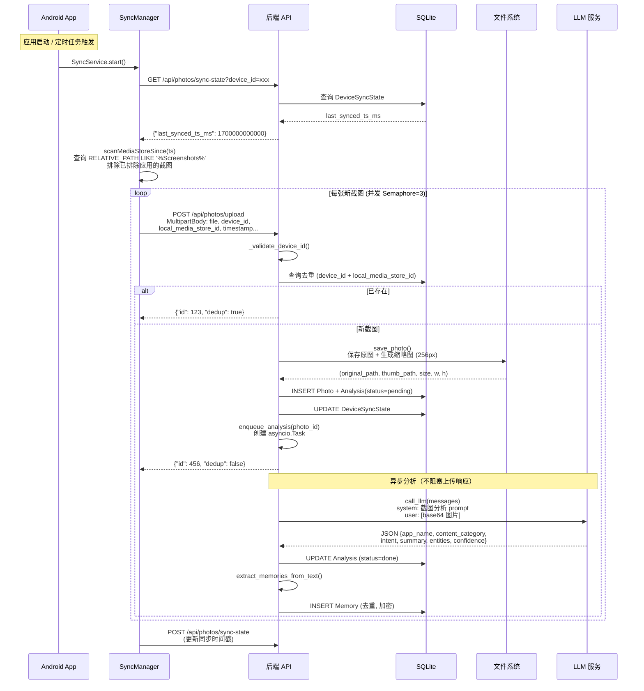
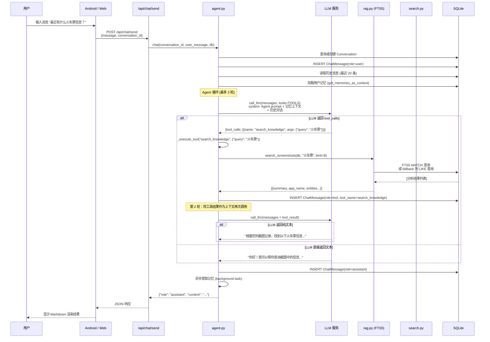
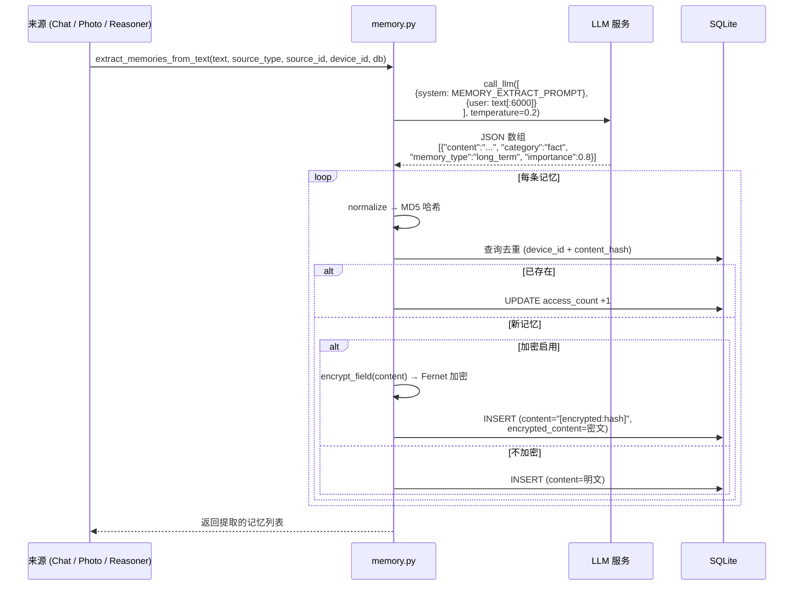
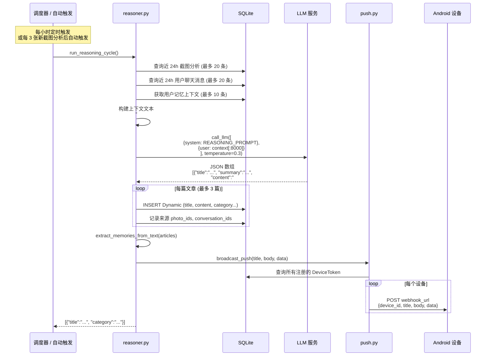
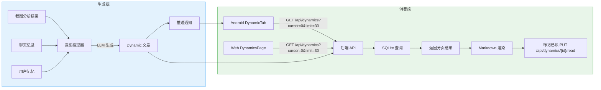
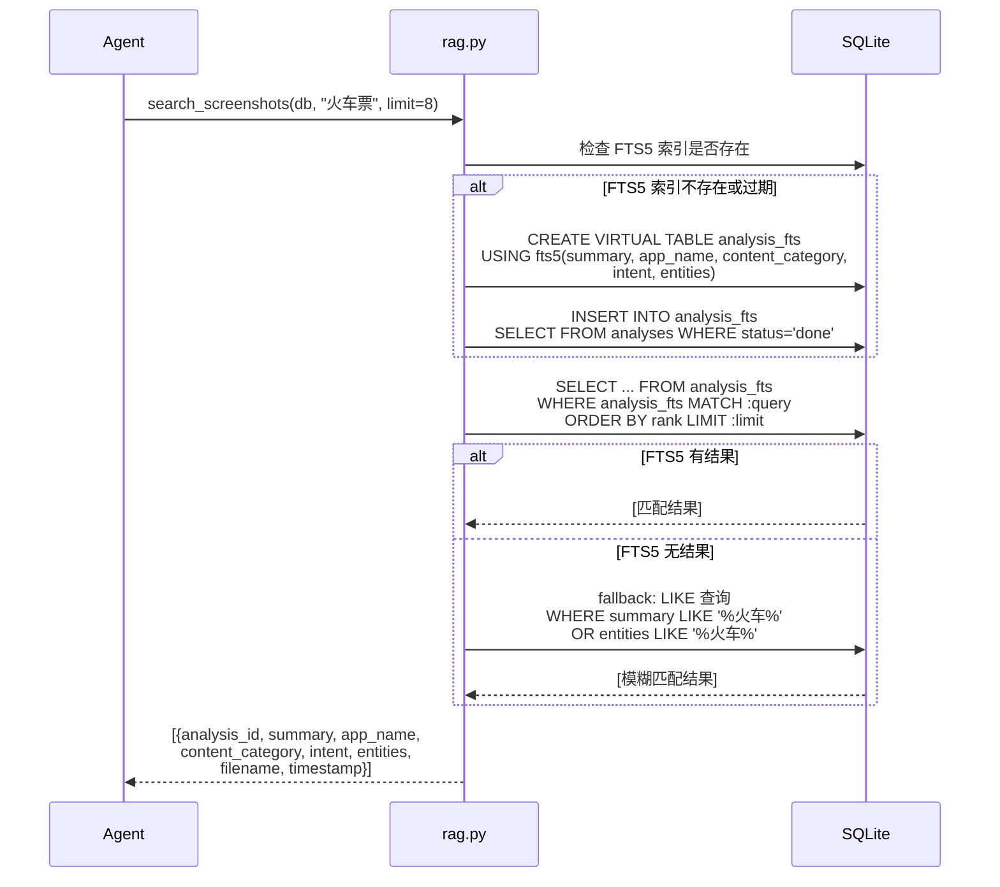

# 数据流

本文详细描述 Evatar 各核心功能的数据流转过程，帮助开发者理解请求从客户端到存储层的完整路径。

---

## 截图同步流程

截图同步是 Evatar 最基础的功能。Android 端扫描设备上的截图文件，上传到后端，后端自动触发 LLM 分析。



### 关键实现细节

**MediaStore 查询条件**（`SyncManager.scanMediaStoreSince()`）：

```kotlin
// 筛选 Screenshots 目录中的图片
"(${RELATIVE_PATH} LIKE ? OR ${DISPLAY_NAME} LIKE ?)"
// 参数: "%Screenshots%", "%screenshot%"

// 按时间范围筛选
"${DATE_ADDED} > ?"  // sinceMs / 1000
```

**去重机制**（`api/photos.py`）：

```python
# 基于 device_id + local_media_store_id 唯一约束
existing = db.query(Photo).filter(
    Photo.device_id == device_id,
    Photo.local_media_store_id == local_media_store_id,
).first()
```

**分析流水线**（`services/pipeline.py`）：

```python
# LLM Vision 请求
messages = [
    {"role": "system", "content": SYSTEM_PROMPT},  # 截图分析 JSON 格式指令
    {"role": "user", "content": [
        {"type": "text", "text": "请分析这张手机截图："},
        {"type": "image_url", "image_url": {"url": f"data:{mime};base64,{b64}"}},
    ]},
]
result = await call_llm(messages)  # 解析为结构化 JSON
```

---

## 聊天消息流程

聊天系统基于 Agent 架构，支持多轮对话和工具调用。



### Agent 工具列表

| 工具名 | 功能 | 实现 |
|--------|------|------|
| `search_knowledge` | 单关键词搜索截图知识库 | FTS5 全文检索，fallback 到 LIKE 模糊匹配 |
| `search_multi` | 多关键词同时搜索，合并去重 | 多次调用 `search_screenshots`，按 analysis_id 去重 |
| `get_recent` | 获取最近 N 条截图分析结果 | 按 original_timestamp DESC 排序 |
| `web_search` | 搜索互联网 | Tavily API 优先，Brave Search 备选 |

### Agent 循环机制

```python
# services/agent.py
for round_num in range(settings.agent_max_rounds):  # 默认 3 轮
    response = await call_llm(full_messages, tools=TOOLS)
    if not response["tool_calls"]:
        # LLM 返回纯文本，结束循环
        return {"role": "assistant", "content": response["content"]}

    # 执行工具调用，将结果追加到 history
    for tc in response["tool_calls"]:
        result = await _execute_tool(tc["function"]["name"], args, db)
        history.append({"role": "tool", "content": json.dumps(result)})
```

---

## 记忆提取流程

记忆系统从三个来源提取用户信息：聊天对话、截图分析、意图推理文章。



### 记忆类型

| memory_type | 有效期 | 说明 |
|-------------|--------|------|
| `short_term` | 48 小时后自动过期 | 临时信息，如即时聊天中的待办事项 |
| `long_term` | 永不过期（但会衰减） | 人名、公司、偏好等持久信息 |

### 记忆分类

| category | 说明 | 举例 |
|----------|------|------|
| `fact` | 事实信息 | "用户在北京工作" |
| `people` | 人物信息 | "张三是项目经理" |
| `project` | 项目信息 | "参与 XX 招标项目" |
| `finance` | 财务信息 | "工资 15000 元" |
| `schedule` | 日程安排 | "12月20日项目截止" |
| `preference` | 偏好 | "喜欢高铁出行" |
| `interest` | 兴趣 | "关注 AI 技术" |
| `habit` | 习惯 | "每天早上查看股票" |

### 记忆衰减机制

```python
# services/memory.py - decay_memories()
# 每 24 小时运行一次

# 1. 删除过期的短期记忆
deleted = db.query(Memory).filter(Memory.expires_at < now).delete()

# 2. 降低 7 天未访问的长期记忆的重要性
stale = db.query(Memory).filter(
    Memory.memory_type == "long_term",
    Memory.last_accessed < week_ago,
).all()
for m in stale:
    m.importance = max(0.1, m.importance * 0.9)  # 每次衰减 10%，最低 0.1
```

---

## 意图推理流程

意图推理器（`services/reasoner.py`）是 Evatar 的"后台思考"模块，每小时运行一次，分析用户近期活动并生成结构化笔记。



### 推理输入来源

| 来源 | 查询条件 | 数量限制 |
|------|----------|----------|
| 截图分析 | `Analysis.status=done AND Photo.created_at >= 24h ago` | 最多 20 条 |
| 聊天消息 | `ChatMessage.role=user AND created_at >= 24h ago` | 最多 20 条 |
| 用户记忆 | `Memory.importance DESC, Memory.last_accessed DESC` | 最多 10 条 |

### 笔记分类

| category | 说明 | 使用场景 |
|----------|------|----------|
| `insight` | 洞察 | 趋势分析、模式识别 |
| `reminder` | 提醒 | 有时间约束的事项 |
| `report` | 报告 | 综合性的活动汇总 |
| `note` | 笔记 | 知识整理、信息归档 |

---

## 动态生成与消费流程

动态笔记的生成（后端推理器）和消费（客户端浏览）形成完整的数据闭环。



### 游标分页

动态列表使用游标分页（cursor-based pagination），而非传统的 offset 分页：

```python
# api/dynamics.py
# cursor 是最后一条记录的 ID
# 返回 next_cursor 用于请求下一页
items = db.query(Dynamic).filter(Dynamic.id < cursor).order_by(desc(Dynamic.id)).limit(limit)
```

Android 端通过 `DynamicViewModel` 实现无限滚动加载，每次滚动到底部时自动请求下一页。

---

## RAG 检索流程

当用户在聊天中提问时，Agent 通过 RAG（Retrieval-Augmented Generation）从截图知识库中检索相关信息。



### FTS5 索引维护

```python
# 索引构建策略
1. 首次查询时自动构建索引
2. 后续查询时检查索引是否过期（FTS 行数 < analyses 行数）
3. 过期时重建：创建临时表 → 填充数据 → 原子替换
```

### 查询安全处理

```python
def _sanitize_fts_query(query: str) -> str:
    """移除 FTS5 特殊字符，防止语法注入"""
    tokens = query.split()
    clean = [re.sub(r'[^\w\s一-鿿]', '', t) for t in tokens[:10]]
    return " OR ".join(t for t in clean if t)
```
