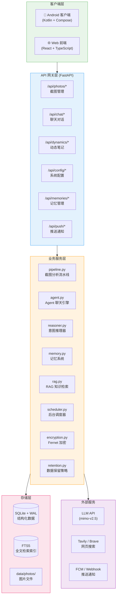
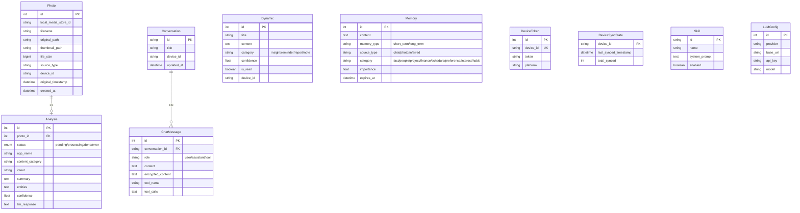

# 架构概览

Evatar 采用前后端分离的三层架构，由 **Android 客户端**、**Python 后端** 和 **React Web 前端** 组成，通过 REST API 通信。

---

## 系统架构图

---

## 核心组件说明

### 后端服务层

后端基于 **FastAPI** 框架，使用 **SQLAlchemy** ORM 操作 **SQLite** 数据库。核心模块如下：

| 模块 | 文件 | 职责 |
|------|------|------|
| **应用入口** | `main.py` | FastAPI 应用初始化、CORS、认证中间件、限流中间件 |
| **配置管理** | `config.py` | Pydantic Settings，环境变量前缀 `EVATAR_` |
| **数据模型** | `models.py` | SQLAlchemy 声明式模型，定义所有表结构 |
| **截图分析流水线** | `services/pipeline.py` | 接收 photo_id，调用 LLM Vision API 分析截图，提取结构化信息 |
| **Agent 聊天引擎** | `services/agent.py` | 多轮对话，工具调用循环（最多 3 轮），注入用户记忆 |
| **意图推理器** | `services/reasoner.py` | 后台定时分析近期活动，生成结构化笔记文章 |
| **记忆系统** | `services/memory.py` | 短期记忆（48h 过期）和长期记忆（永久），LLM 提取 + 去重 + 衰减 |
| **RAG 检索** | `services/rag.py` | FTS5 全文检索 + 关键词模糊匹配，搜索截图分析结果 |
| **LLM 调用** | `services/llm.py` | 共享 httpx.AsyncClient，支持 Vision 多模态和 Tool Calling |
| **后台调度器** | `services/scheduler.py` | 每小时推理、每天记忆衰减、每天数据清理 |
| **推送通知** | `services/push.py` | 广播推送到所有注册设备（FCM / Webhook） |
| **数据加密** | `services/encryption.py` | Fernet 对称加密，自动密钥管理，支持密钥轮换 |
| **数据保留** | `services/retention.py` | 按天数清理过期数据（照片、分析、聊天、动态） |
| **网页搜索** | `services/search.py` | Tavily API 优先，Brave Search 备选 |
| **文件存储** | `services/storage.py` | 保存原图和缩略图 |

### 数据模型

### API 路由

| 路由前缀 | 文件 | 主要端点 |
|----------|------|----------|
| `/api/photos` | `api/photos.py` | `POST /upload`、`POST /upload-batch`、`GET /` (列表)、`GET /{id}`、`GET /{id}/image`、`GET /sync-state` |
| `/api/chat` | `api/chat.py` | `POST /send`、`POST /send-with-file`、`GET /conversations`、`GET /conversations/{id}` |
| `/api/dynamics` | `api/dynamics.py` | `GET /` (游标分页)、`GET /{id}`、`PUT /{id}/read`、`POST /trigger` |
| `/api/memories` | `api/memories.py` | `GET /`、`GET /stats` |
| `/api/config` | `api/config.py` | `GET /llm`、`PUT /llm`、`GET /llm/presets` |
| `/api/skills` | `api/skills.py` | `GET /`、`GET /{id}` |
| `/api/push` | `api/push.py` | `POST /register`、`POST /test` |
| `/api/health` | `main.py` | `GET /` — 返回 `{"status": "ok"}` |

---

## 中间件

### 认证中间件

当设置了 `EVATAR_API_KEY` 时，除 `/` 和 `/api/health` 外的所有请求需要在 `Authorization` 头中携带 `Bearer <key>`。使用 `hmac.compare_digest` 进行安全比较。

### 限流中间件

对以下高频端点实施 IP 级限流（每分钟 10 次）：
- `/api/chat/send`
- `/api/chat/send-with-file`
- `/api/dynamics/trigger`

---

## Android 客户端架构

Android 客户端采用 **MVVM** 模式，使用 Jetpack Compose 构建 UI：

| 组件 | 文件 | 职责 |
|------|------|------|
| **MainActivity** | `MainActivity.kt` | 应用入口，权限请求，主题/语言切换，引导流程判断 |
| **AppNavigation** | `ui/AppNavigation.kt` | 底部导航栏：动态 / 聊天 / 设置 三个 Tab |
| **OnboardingScreen** | `ui/screens/OnboardingScreen.kt` | 首次使用引导：服务器配置 → 同步范围 → 同步执行 |
| **ChatTab** | `ui/screens/ChatTab.kt` | 聊天界面，支持 Markdown 渲染和文件附件 |
| **DynamicTab** | `ui/screens/DynamicTab.kt` | 动态笔记列表，游标分页 + 无限滚动 |
| **SettingsTab** | `ui/screens/SettingsTab.kt` | 设置页面：主题、语言、服务器配置 |
| **SyncManager** | `sync/SyncManager.kt` | 截图扫描（MediaStore）与并发上传（Semaphore(3)） |
| **SyncWorker** | `sync/SyncWorker.kt` | WorkManager CoroutineWorker，后台定时同步 |
| **SyncService** | `sync/SyncService.kt` | 前台 Service，保持同步任务持续运行 |
| **ApiClient** | `network/ApiClient.kt` | OkHttp 单例，重试逻辑（最多 3 次，指数退避） |
| **ChatViewModel** | `viewmodel/ChatViewModel.kt` | 聊天状态管理 |
| **DynamicViewModel** | `viewmodel/DynamicViewModel.kt` | 动态笔记状态管理 |

---

## 后台任务

后端内置了一个调度器（`services/scheduler.py`），通过 `asyncio.create_task` 运行：

| 任务 | 间隔 | 说明 |
|------|------|------|
| **意图推理** | 1 小时 | 收集近期截图、聊天、记忆，调用 LLM 生成笔记文章 |
| **记忆衰减** | 24 小时 | 删除过期短期记忆，降低长期记忆的重要性值 |
| **数据清理** | 24 小时 | 按 `EVATAR_RETENTION_DAYS`（默认 30 天）清理过期数据 |

此外，每完成 3 张截图分析（`_REASONING_TRIGGER_EVERY = 3`），会自动触发一次推理周期。
