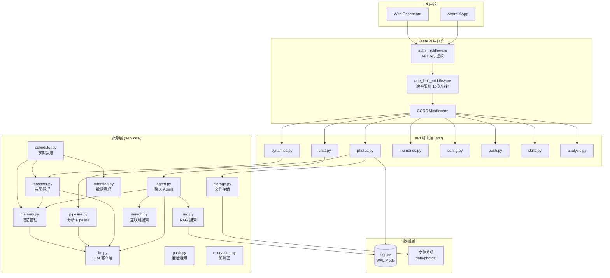
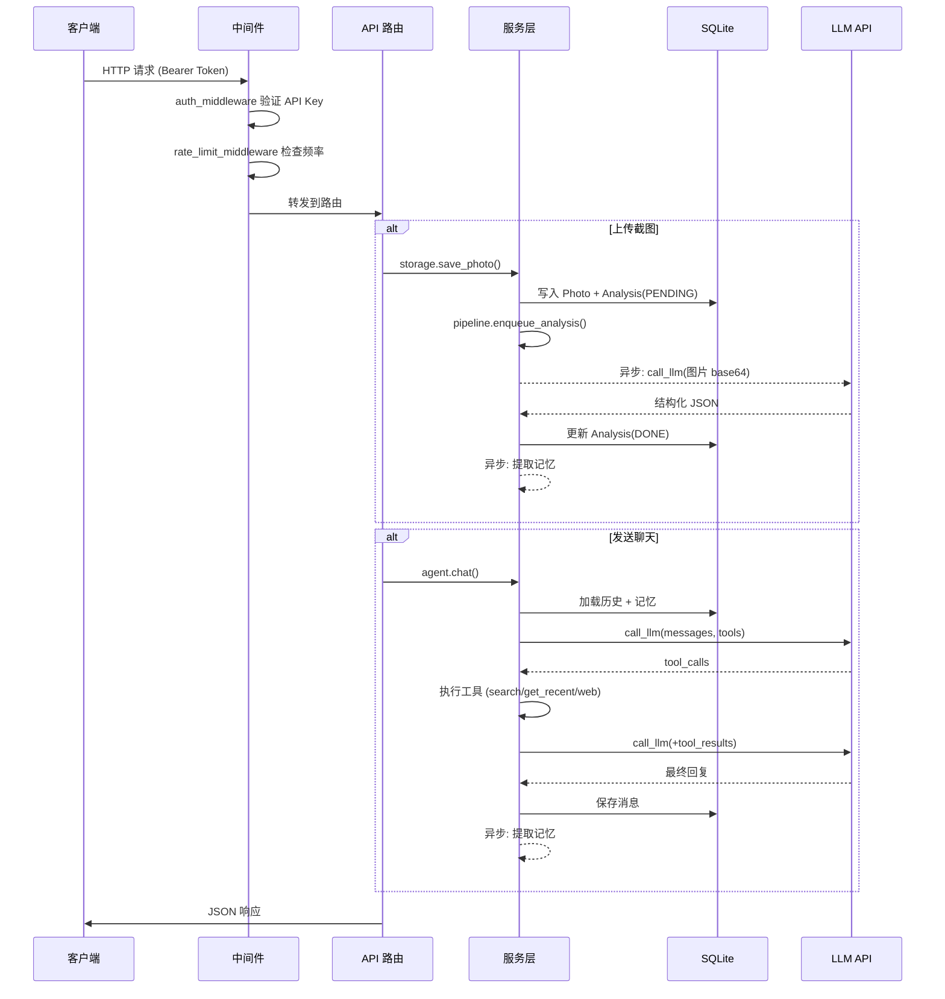

# 后端概览

Evatar 后端是一个基于 **FastAPI** + **SQLAlchemy** + **SQLite** 的 Python Web 服务，负责截图同步、AI 分析、聊天助手、动态生成、记忆管理和推送通知等核心功能。

## 项目结构

```
backend/
├── main.py                  # FastAPI 应用入口，中间件注册，lifespan 管理
├── config.py                # Settings 配置类 (Pydantic BaseSettings)
├── models.py                # SQLAlchemy 数据模型定义，数据库初始化
├── api/                     # API 路由层 (请求处理)
│   ├── __init__.py
│   ├── photos.py            # 截图上传、列表、详情、删除、同步状态
│   ├── analysis.py          # 分析列表、重新处理、统计
│   ├── chat.py              # 聊天发送、对话管理
│   ├── dynamics.py          # 动态列表、标记已读、置顶、手动触发
│   ├── memories.py          # 记忆列表、统计
│   ├── config.py            # LLM 配置管理、预设方案、SSRF 防护
│   ├── push.py              # 推送设备注册、列表、测试
│   └── skills.py            # 技能 & MCP 服务器管理
├── services/                # 业务逻辑层
│   ├── __init__.py
│   ├── agent.py             # 聊天 Agent (工具调用循环、记忆注入)
│   ├── llm.py               # LLM HTTP 客户端 (共享 httpx.AsyncClient)
│   ├── memory.py            # 记忆提取、检索、衰减
│   ├── pipeline.py          # 截图分析 Pipeline (异步任务、重试)
│   ├── rag.py               # RAG 搜索 (FTS5 + 关键词回退)
│   ├── reasoner.py          # 后台意图推理 (文章生成)
│   ├── push.py              # 推送通知服务 (Webhook)
│   ├── search.py            # 互联网搜索 (Tavily / Brave)
│   ├── storage.py           # 文件存储 & 缩略图生成
│   ├── encryption.py        # Fernet 加解密服务
│   ├── retention.py         # 数据过期清理
│   ├── scheduler.py         # 后台定时任务调度器
│   └── utils.py             # 通用工具函数 (strip_code_fences, format_llm_error)
└── tests/                   # 测试
    ├── __init__.py
    ├── conftest.py
    ├── test_api.py
    └── test_services.py
```

## 分层架构



## FastAPI 路由机制

每个 API 模块使用 `APIRouter` 定义路由，通过 `prefix` 指定路径前缀，在 `main.py` 中统一注册：

```python
# api/photos.py
router = APIRouter(prefix="/api/photos", tags=["photos"])

@router.get("")
async def list_photos(...):
    ...

@router.post("/upload")
async def upload_photo(...):
    ...
```

```python
# main.py — 注册所有路由
app.include_router(photos_router)
app.include_router(analysis_router)
app.include_router(config_router)
app.include_router(chat_router)
app.include_router(skills_router)
app.include_router(dynamics_router)
app.include_router(memories_router)
app.include_router(push_router)
```

所有 API 路由函数通过 `Depends(get_db)` 注入 SQLAlchemy Session，确保每个请求拥有独立的数据库会话。

## 数据库会话管理

使用 SQLAlchemy 的 `sessionmaker` 配合 FastAPI 的依赖注入机制：

```python
# models.py
engine = create_engine(
    settings.db_url,
    echo=False,
    connect_args={"check_same_thread": False},
    poolclass=StaticPool,  # SQLite 需要 StaticPool
)
SessionLocal = sessionmaker(bind=engine, expire_on_commit=False)

def get_db():
    db = SessionLocal()
    try:
        yield db        # FastAPI 依赖注入：请求期间持有 session
    finally:
        db.close()       # 请求结束后自动关闭
```

关键设计：

| 设计决策 | 说明 |
|----------|------|
| **StaticPool** | SQLite 单连接池，避免多连接竞争 |
| **WAL 模式** | 通过 `PRAGMA journal_mode=WAL` + `busy_timeout=5000` 提升并发读写性能 |
| **expire_on_commit=False** | commit 后仍可访问已加载的属性 |
| **独立会话** | Background tasks 中使用独立的 `SessionLocal()` 会话，避免与请求会话冲突 |

## 中间件

### 认证中间件

所有请求（除 `/` 和 `/api/health`）需要在 `Authorization` 头携带 `Bearer <API_KEY>`。使用 `hmac.compare_digest` 防止时序攻击：

```python
@app.middleware("http")
async def auth_middleware(request: Request, call_next):
    if settings.api_key and request.url.path not in EXEMPT_PATHS:
        auth = request.headers.get("Authorization", "")
        key_from_header = auth.removeprefix("Bearer ").strip()
        if not hmac.compare_digest(key_from_header, settings.api_key):
            raise HTTPException(status_code=401, detail="Invalid or missing API key")
    return await call_next(request)
```

### 速率限制中间件

对聊天和动态生成接口限制 **每分钟 10 次**（按客户端 IP 维护滑动窗口）：

```python
_RATE_LIMITED_PATHS = {
    "/api/chat/send",
    "/api/chat/send-with-file",
    "/api/dynamics/trigger",
}
```

## 后台任务

### 定时调度器 (scheduler.py)

在 `lifespan` 中启动的异步任务，每 60 秒检查一次是否到达触发时间：

| 任务 | 间隔 | 说明 |
|------|------|------|
| **意图推理** (`run_reasoning_cycle`) | 1 小时 | 分析最近 24h 的截图和聊天，生成动态文章 |
| **记忆衰减** (`decay_memories`) | 24 小时 | 删除过期短期记忆(48h)，降低长期记忆重要度 |
| **数据清理** (`cleanup_old_data`) | 24 小时 | 按 `retention_days` 配置清理旧数据和文件 |

```python
async def _scheduler_loop():
    while _running:
        now = datetime.now(timezone.utc).replace(tzinfo=None)
        if (now - last_reasoning).total_seconds() >= REASONING_INTERVAL:
            await run_reasoning_cycle()
        if (now - last_decay).total_seconds() >= MEMORY_DECAY_INTERVAL:
            decay_memories(db)
        if (now - last_retention).total_seconds() >= RETENTION_INTERVAL:
            cleanup_old_data(db)
        await asyncio.sleep(60)  # 每分钟检查
```

### 分析 Pipeline (pipeline.py)

截图上传后异步执行 LLM 分析：

1. `enqueue_analysis(photo_id)` 创建异步任务，通过 `asyncio.Task` 跟踪
2. `_safe_process()` 包含 **3 次重试**（指数退避 2s/4s），不可恢复错误 (`FileNotFoundError`, `ValueError` 等) 直接跳过
3. 分析完成后自动调用 `memory.extract_memories_from_text()` 提取记忆
4. 每完成 3 次分析自动触发一次 `reasoner.run_reasoning_cycle()`

## 请求流程图



## 技术栈

| 组件 | 技术 | 说明 |
|------|------|------|
| Web 框架 | FastAPI | 异步 Python Web 框架 |
| ORM | SQLAlchemy 2.x | 声明式模型 + sessionmaker |
| 数据库 | SQLite (WAL) | 轻量级，适合单机部署 |
| HTTP 客户端 | httpx (async) | 模块级单例，180s 超时 |
| 图像处理 | Pillow | 缩略图生成、图片缩放 |
| 加密 | cryptography (Fernet) | 对称加密敏感字段 |
| 配置 | pydantic-settings | `EVATAR_` 前缀环境变量 |
