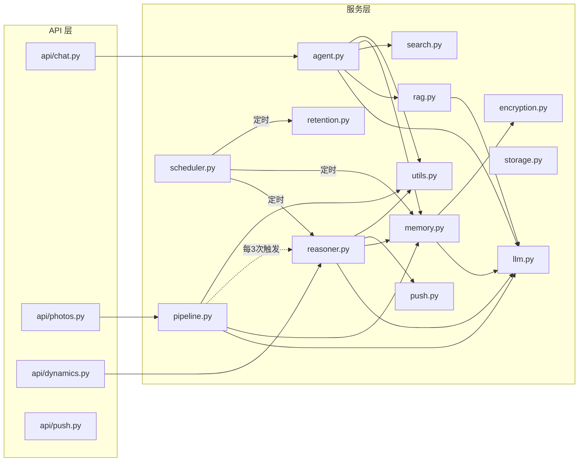

# 服务层

所有业务逻辑封装在 `services/` 目录下，各模块职责清晰，通过函数调用协作。

## 服务调用关系



---

## agent.py — 聊天 Agent

核心聊天服务，实现 LLM 工具调用循环和记忆注入。

### 主要函数

#### `chat(conversation_id, user_message, db, skill_prompt, file_info)`

处理用户消息并返回助手回复。完整的 Agent 循环：

```python
async def chat(
    conversation_id: str,
    user_message: str,
    db: Session,
    skill_prompt: str | None = None,
    file_info: dict | None = None,
) -> dict:
    """Process a user message and return the assistant response."""
    # 1. 检查 LLM 配置
    config_check = check_llm_config()
    if not config_check["ok"]:
        return {"role": "assistant", "content": f"⚠️ {config_check['error']}", ...}

    # 2. 保存用户消息到数据库
    user_msg = ChatMessage(conversation_id=conversation_id, role="user", content=user_message)
    db.add(user_msg)
    db.commit()

    # 3. 构建历史消息
    history = _build_history(db, conversation_id)

    # 4. 多模态：如果附带图片，替换最后一条用户消息为多模态格式
    if file_info and file_info.get("base64"):
        user_content = [
            {"type": "text", "text": user_message or "请分析这张图片"},
            {"type": "image_url", "image_url": {"url": f"data:{mime};base64,{b64}"}},
        ]

    # 5. Agent 循环 (最多 agent_max_rounds=3 轮)
    for round_num in range(settings.agent_max_rounds):
        # 注入系统提示 + 技能指令 + 用户记忆
        system_content = SYSTEM_PROMPT
        if skill_prompt and round_num == 0:
            system_content += f"\n\n## 当前技能指令\n{skill_prompt}"
        memories_ctx = get_memories_as_context(db, conv.device_id, limit=8)
        if memories_ctx:
            system_content += f"\n\n{memories_ctx}"

        # 调用 LLM
        response = await call_llm(full_messages, tools=TOOLS)

        if not tool_calls:
            # 无工具调用 → 返回最终回复
            # 异步提取记忆
            asyncio.create_task(_extract_memories_async(turn_text, ...))
            return {"role": "assistant", "content": assistant_content, "tool_calls": []}

        # 执行工具调用
        for tc in tool_calls:
            result = await _execute_tool(func_name, args, db)
            # 将工具结果追加到历史
    return {"role": "assistant", "content": "抱歉，处理超时，请重试。", ...}
```

### 工具定义

Agent 注册了 4 个工具供 LLM 调用：

| 工具名 | 功能 | 参数 |
|--------|------|------|
| `search_knowledge` | 单关键词搜索截图知识库 | `query: string` |
| `search_multi` | 多关键词同时搜索，合并去重 | `queries: string[]` |
| `get_recent` | 获取最近 N 条截图分析 | `limit: integer` |
| `web_search` | 搜索互联网 | `query: string` |

### 系统提示词

```python
SYSTEM_PROMPT = """你是 Evatar，一个智能个人助手。你拥有用户的手机截图知识库...

## 工具使用策略
### search_knowledge — 单关键词搜索
### search_multi — 多关键词同时搜索（推荐）
### get_recent — 获取最近截图
### web_search — 搜索互联网

## 搜索策略
1. 用户问题具体 → search_knowledge 用核心词
2. 用户问题宽泛 → search_multi 用多个相关词
3. 用户问"最近" → get_recent 先看近期内容
4. 第一次搜不到 → 换词重试"""
```

### 关键设计

- **记忆注入**：每次对话第一轮将用户记忆注入 system prompt
- **异步记忆提取**：对话结束后异步提取记忆，使用独立 DB session 和信号量（最多 2 并发）
- **历史限制**：默认加载最近 20 条消息

---

## llm.py — LLM 服务

共享的 LLM HTTP 客户端，所有 LLM 调用通过此模块。

### 主要函数

#### `call_llm(messages, tools, max_tokens, temperature)`

```python
async def call_llm(
    messages: list[dict],
    tools: list[dict] | None = None,
    max_tokens: int | None = None,
    temperature: float | None = None,
) -> dict:
    """Shared LLM call. Returns {"content": str, "tool_calls": list}."""
    llm = _get_llm_config()  # 从 DB 读取（60s 缓存）
    payload = {
        "model": llm["model"],
        "messages": messages,
        "max_tokens": max_tokens or llm["max_tokens"],
        "temperature": temperature if temperature is not None else llm["temperature"],
    }
    if tools:
        payload["tools"] = tools

    client = _get_client()  # 模块级 httpx.AsyncClient 单例
    resp = await client.post(f"{llm['base_url']}/chat/completions", ...)
    message = data["choices"][0]["message"]
    content = message.get("content") or message.get("reasoning_content") or ""
    return {"content": content, "tool_calls": normalized_calls}
```

#### `_get_llm_config()`

带 60 秒 TTL 缓存的配置读取。优先从数据库读取 `LLMConfig`，回退到环境变量。

```python
_llm_config_cache: dict | None = None
_llm_config_cache_time: float = 0

def _get_llm_config() -> dict:
    if _llm_config_cache and (now - _llm_config_cache_time) < 60:
        return _llm_config_cache
    # 从 DB 读取 LLMConfig(id=1)
    # 回退到 settings.llm_base_url / settings.llm_api_key
```

#### `encode_image_base64(image_path)`

读取图片文件，超过 2048px 自动缩放，返回 `(base64_data, mime_type)`。

#### `check_llm_config()`

检查 LLM 是否正确配置，返回 `{ok: bool, error: str | None}`。

### 截图分析系统提示词

```python
SYSTEM_PROMPT = """你是一个截图分析助手。分析手机截图内容，返回结构化JSON。

严格按此JSON格式返回：
{
  "app_name": "应用名称",
  "content_category": "chat / webpage / notification / ...",
  "intent": "reminder / research / reference / note / ignore",
  "summary": "中文摘要",
  "entities": [{"type": "...", "value": "..."}],
  "confidence": 0.0到1.0
}"""
```

---

## memory.py — 记忆服务

管理 Agent 记忆的提取、检索和衰减。

### 记忆提取

#### `extract_memories_from_text(text, source_type, source_id, device_id, db)`

使用 LLM 从文本中提取结构化记忆：

```python
MEMORY_EXTRACT_PROMPT = """Extract memories from the content below. Return ONLY a JSON array.

Format:
[{"content":"memory text","category":"fact|people|project|finance|schedule|preference|interest|habit",
  "memory_type":"short_term|long_term","importance":0.5}]

Rules:
- Names/companies → long_term, people
- Money/payments → long_term, finance
- Dates/deadlines → long_term, schedule"""

async def extract_memories_from_text(...):
    result = await call_llm([...], temperature=0.2, max_tokens=2048)
    entries = json.loads(content)
    for entry in entries:
        # 去重：MD5(normalized_content) 检查 content_hash
        existing = db.query(Memory).filter(
            Memory.device_id == device_id,
            Memory.content_hash == content_hash,
        ).first()
        if existing:
            existing.access_count += 1
            continue
        # 如果启用加密，存储加密内容
        if is_encryption_enabled():
            enc_content = encrypt_field(mem_content)
            mem_content = f"[encrypted:{content_hash}]"
        # short_term 48h 过期，long_term 永不过期
```

### 记忆检索

#### `get_relevant_memories(db, device_id, limit)`

按 `importance` 降序 + `last_accessed` 降序获取未过期记忆。

#### `get_memories_as_context(db, device_id, limit)`

将记忆格式化为 Agent system prompt 的上下文段落：

```
## 用户记忆
- 📌 [people] 张三是用户的同事
- ⏱️ [schedule] 明天下午2点有会议
- 📌 [finance] 用户经常关注 NVDA 和 TSLA 股票
```

### 记忆衰减

#### `decay_memories(db)`

```python
def decay_memories(db: Session):
    # 1. 删除过期的短期记忆
    deleted = db.query(Memory).filter(Memory.expires_at < now).delete()

    # 2. 7天未访问的长期记忆，重要度 *0.9（最低 0.1）
    stale = db.query(Memory).filter(
        Memory.memory_type == "long_term",
        Memory.last_accessed < week_ago,
    ).all()
    for m in stale:
        m.importance = max(0.1, m.importance * 0.9)
```

---

## pipeline.py — 分析 Pipeline

截图上传后异步执行 LLM 分析的完整流程。

### 核心流程

```python
async def process_photo(photo_id: int):
    # 1. 检查幂等性：已完成则跳过
    if analysis.status == AnalysisStatus.DONE:
        return

    # 2. 编码图片为 base64
    b64, mime = encode_image_base64(photo.original_path)

    # 3. 调用 LLM 分析
    messages = [
        {"role": "system", "content": SYSTEM_PROMPT},
        {"role": "user", "content": [
            {"type": "text", "text": "请分析这张手机截图："},
            {"type": "image_url", "image_url": {"url": f"data:{mime};base64,{b64}"}},
        ]},
    ]
    result = await call_llm(messages)

    # 4. 解析 JSON 响应，写入 Analysis 记录
    parsed = json.loads(strip_code_fences(content))
    analysis.app_name = parsed.get("app_name")
    analysis.status = AnalysisStatus.DONE

    # 5. 提取记忆（低相关性截图跳过）
    if not (relevance == "low" and confidence < 0.3):
        await extract_memories_from_text(mem_text, "photo", ...)
```

### 任务调度与重试

```python
def enqueue_analysis(photo_id: int):
    """创建异步任务并跟踪"""
    task = loop.create_task(_safe_process(photo_id))
    _running_tasks.add(task)
    task.add_done_callback(_on_analysis_done)

async def _safe_process(photo_id: int):
    """3次重试，指数退避，不可恢复错误直接跳过"""
    for attempt in range(3):
        try:
            await process_photo(photo_id)
            return
        except _UNRECOVERABLE:  # FileNotFoundError, ValueError 等
            return
        except Exception:
            await asyncio.sleep(2 ** attempt)  # 2s, 4s
```

### 自动推理触发

```python
def _on_analysis_done(task):
    _analysis_counter += 1
    if _analysis_counter >= 3:  # 每 3 次分析触发一次
        asyncio.create_task(_trigger_reasoning())
```

---

## rag.py — RAG 搜索

截图知识库搜索服务，支持 FTS5 全文搜索和关键词 LIKE 回退。

### 搜索策略

```python
def search_screenshots(db, query, limit=10):
    """优先 FTS5，回退到关键词搜索"""
    results = _fts_search(db, query, limit)
    if results:
        return results
    return _keyword_search(db, query, limit)
```

### FTS5 全文搜索

```python
def _fts_search(db, query, limit):
    # 自动构建/重建 FTS 索引
    check = db.execute(text("SELECT name FROM sqlite_master WHERE type='table' AND name='analysis_fts'"))
    if not check:
        _build_fts_index(db)

    # 清理特殊字符，构建 OR 查询
    fts_query = _sanitize_fts_query(query)  # "股票 12306" → "股票 OR 12306"

    rows = db.execute(text("""
        SELECT a.id, a.summary, a.app_name, a.content_category, a.intent,
               a.entities, p.filename, p.original_timestamp
        FROM analysis_fts
        JOIN analyses a ON a.id = analysis_fts.rowid
        JOIN photos p ON p.id = a.photo_id
        WHERE analysis_fts MATCH :query
        ORDER BY rank
        LIMIT :limit
    """), {"query": fts_query, "limit": limit}).fetchall()
```

### FTS 索引构建

```python
def _build_fts_index(db):
    """使用临时表 + 交换策略，避免构建失败时丢失旧索引"""
    rebuild_db.execute(text("""
        CREATE VIRTUAL TABLE analysis_fts_tmp USING fts5(
            summary, app_name, content_category, intent, entities,
            content='analyses', content_rowid='id'
        )
    """))
    rebuild_db.execute(text("""
        INSERT INTO analysis_fts_tmp(rowid, summary, app_name, content_category, intent, entities)
        SELECT id, summary, app_name, content_category, intent, entities
        FROM analyses WHERE status = 'done'
    """))
    # DROP old → RENAME tmp
```

### 关键词搜索回退

```python
def _keyword_search(db, query, limit):
    """LIKE 模糊匹配，多个关键词用 AND 连接"""
    conditions = [
        "(a.summary LIKE :kw0 OR a.app_name LIKE :kw0 OR a.entities LIKE :kw0)"
        for i, kw in enumerate(keywords)
    ]
    where_clause = " AND ".join(conditions)
```

---

## reasoner.py — 意图推理

后台"思考"模块，分析用户近期活动并生成文章/笔记。

### `run_reasoning_cycle(device_id)`

```python
async def run_reasoning_cycle(device_id=None):
    # 1. 收集最近 24h 的截图分析 (最多 20 条)
    recent_analyses = db.query(Analysis, Photo).filter(...).limit(20).all()

    # 2. 收集最近的聊天记录 (最多 20 条)
    recent_chats = db.query(ChatMessage).filter(...).limit(20).all()

    # 3. 收集用户记忆
    memories_context = get_memories_as_context(db, device_id, limit=10)

    # 4. 构建上下文，调用 LLM
    result = await call_llm([
        {"role": "system", "content": REASONING_PROMPT},
        {"role": "user", "content": full_context[:8000]},
    ], temperature=0.3, max_tokens=4096)

    # 5. 解析并保存动态（最多 3 篇/次）
    articles = json.loads(content)
    for article in articles[:3]:
        dynamic = Dynamic(title=..., content=..., category=...)
        db.add(dynamic)

    # 6. 从生成的文章中提取记忆
    await extract_memories_from_text(articles_text, "inferred", "reasoner", ...)

    # 7. 广播推送通知
    await broadcast_push(title="Evatar 新笔记", body=f"为你生成了 {n} 篇笔记")
```

### 推理提示词

```python
REASONING_PROMPT = """你是一个智能个人助手的"意图推理"模块。

## 输入：截图分析 + 聊天记录 + 记忆

## 任务：识别
- 新兴主题/兴趣
- 时间敏感事项
- 模式识别
- 知识整理

## 输出：JSON 数组，每篇包含 title, summary, content(Markdown), category, confidence

## 规则
- 没有价值内容时返回 []
- 每次最多 3 篇"""
```

---

## push.py — 推送通知

通过 Webhook 发送推送通知。

### `broadcast_push(title, body, data)`

```python
async def broadcast_push(title, body, data=None) -> int:
    """广播到所有已注册设备"""
    devices = db.query(DeviceToken).all()
    success = 0
    for device in devices:
        ok = await _send_to_device(device, title, body, data)
        if ok:
            success += 1
    return success
```

### `_send_to_device(device, title, body, data)`

```python
async def _send_to_device(device, title, body, data):
    """通过 Webhook 发送，payload 包含设备信息和 FCM token"""
    payload = {
        "device_id": device.device_id,
        "token": device.token,
        "title": title,
        "body": body,
        "data": data or {},
    }
    resp = await client.post(webhook_url, json=payload)
```

如果 `push_webhook_url` 未配置，仅记录日志不实际发送。

---

## search.py — 互联网搜索

支持 Tavily 和 Brave Search 两种搜索 API。

```python
async def web_search(query, num_results=5) -> list[dict]:
    if settings.tavily_api_key:
        return await _tavily_search(query, num_results)
    if settings.brave_api_key:
        return await _brave_search(query, num_results)
    return [{"title": "搜索未配置", "snippet": "请配置 Tavily 或 Brave Search API Key", "url": ""}]
```

返回格式：`[{"title": str, "url": str, "snippet": str}]`

---

## storage.py — 文件存储

### `save_photo(file_bytes, original_filename)`

```python
def save_photo(file_bytes, original_filename):
    # 1. 按日期创建目录: data/photos/2024-01-15/
    day_dir = settings.photos_dir / today
    day_dir.mkdir(parents=True, exist_ok=True)

    # 2. 生成 UUID 文件名，保留原始扩展名
    save_name = f"{uuid.uuid4().hex[:12]}{ext}"
    original_path = str(day_dir / save_name)

    # 3. 路径遍历检查
    if not str(resolved).startswith(str(settings.photos_dir.resolve())):
        raise ValueError("Path traversal detected")

    # 4. 写入原图
    with open(original_path, "wb") as f:
        f.write(file_bytes)

    # 5. 生成缩略图 (最大 512px, JPEG, quality=80)
    _make_thumbnail(img, thumb_path, max_size=512)

    return original_path, thumb_path, file_size, width, height
```

---

## encryption.py — 加解密服务

基于 Fernet 对称加密，用于保护敏感字段（聊天内容、记忆）。

### 关键函数

| 函数 | 说明 |
|------|------|
| `is_encryption_enabled()` | 检查加密是否可用 |
| `encrypt_field(plaintext)` | 加密字符串，返回 base64 密文 |
| `decrypt_field(ciphertext)` | 解密字符串，失败返回 None |
| `rotate_key(old_key, new_key)` | 密钥轮换：重新加密所有 ChatMessage 和 Memory |

### 密钥管理

```python
def _get_or_create_key() -> str:
    key = settings.encryption_key          # 1. 环境变量
    if key: return key
    if _KEY_FILE.exists():                 # 2. 文件存储
        return _KEY_FILE.read_text().strip()
    key = Fernet.generate_key().decode()   # 3. 自动生成
    _KEY_FILE.write_text(key)
    os.chmod(_KEY_FILE, 0o600)             # 仅所有者可读写
    return key
```

---

## retention.py — 数据清理

### `cleanup_old_data(db, days)`

按 `retention_days` 配置清理旧数据：

```python
def cleanup_old_data(db, days=None):
    cutoff = now - timedelta(days=days)

    # 1. 删除旧照片（含磁盘文件）
    old_photos = db.query(Photo).filter(Photo.created_at < cutoff).all()
    for photo in old_photos:
        os.remove(photo.original_path)
        os.remove(photo.thumbnail_path)
        db.delete(photo)

    # 2. 删除孤立分析记录
    # 3. 删除旧聊天消息
    # 4. 删除空对话
    # 5. 删除旧动态
```

---

## scheduler.py — 定时调度

在 `main.py` 的 `lifespan` 中启动的异步任务。

```python
REASONING_INTERVAL = 3600      # 1 小时
MEMORY_DECAY_INTERVAL = 86400  # 24 小时
RETENTION_INTERVAL = 86400     # 24 小时

async def _scheduler_loop():
    while _running:
        if (now - last_reasoning).total_seconds() >= REASONING_INTERVAL:
            await run_reasoning_cycle()
        if (now - last_decay).total_seconds() >= MEMORY_DECAY_INTERVAL:
            decay_memories(db)
        if (now - last_retention).total_seconds() >= RETENTION_INTERVAL:
            cleanup_old_data(db)
        await asyncio.sleep(60)  # 每分钟检查
```

---

## utils.py — 通用工具

```python
def strip_code_fences(text: str) -> str:
    """移除 LLM 返回的 ```json ... ``` 代码围栏"""

def clamp(value: float, lo: float = 0.0, hi: float = 1.0) -> float:
    """数值截断到 [lo, hi] 范围"""

def truncate(text: str, max_len: int = 500) -> str:
    """文本截断"""

def format_llm_error(e: Exception) -> str:
    """将 HTTP/网络错误格式化为用户友好的中文错误消息"""
    # 401 → "LLM API Key 无效或已过期"
    # 429 → "LLM API 请求频率超限"
    # ConnectError → "无法连接 LLM 服务"
    # Timeout → "LLM 请求超时"
```
