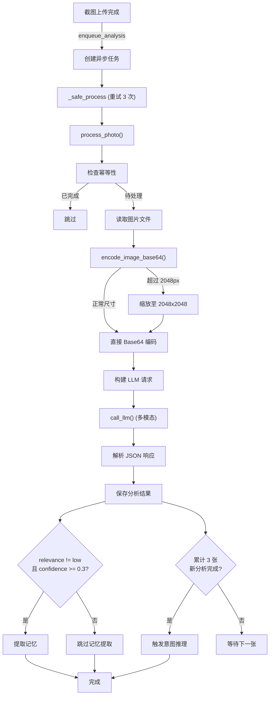
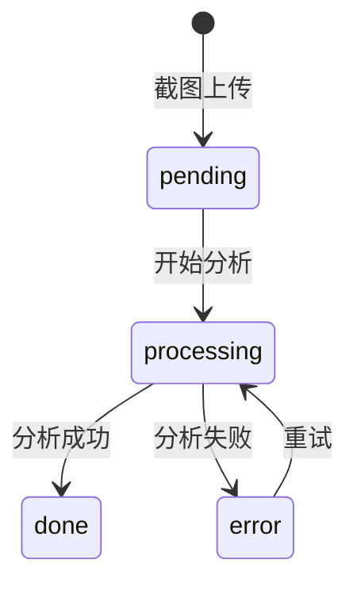

# AI 分析

## 概述

AI 分析是 Evatar 的核心智能能力。每张上传的截图都会自动进入分析管线 (pipeline)，由 LLM 进行多模态分析，提取结构化信息包括应用名称、内容分类、用户意图、摘要、实体和置信度。

## 分析管线流程



## 分析字段

LLM 返回结构化 JSON，包含以下字段：

| 字段 | 类型 | 说明 | 示例 |
|------|------|------|------|
| `app_name` | String | 截图来源应用名称 | "微信", "支付宝", "12306" |
| `content_category` | String | 内容分类 | "chat", "webpage", "finance", "notification" |
| `intent` | String | 用户意图 | "reminder", "research", "reference", "note", "ignore" |
| `relevance` | String | 相关性等级 | "high", "medium", "low" |
| `summary` | String | 中文摘要 (2-3 句话) | "用户在微信中与张三讨论了明天的会议安排" |
| `entities` | Array | 提取的实体列表 | `[{"type":"人名","value":"张三"}, {"type":"日期","value":"明天"}]` |
| `confidence` | Float | 置信度 (0.0-1.0) | 0.85 |

### 内容分类 (content_category)

| 分类 | 说明 |
|------|------|
| `chat` | 聊天记录截图 |
| `webpage` | 网页内容 |
| `notification` | 系统通知 |
| `social_media` | 社交媒体 |
| `finance` | 金融/支付信息 |
| `education` | 教育/学习内容 |
| `shopping` | 购物/电商 |
| `entertainment` | 娱乐内容 |
| `tool` | 工具类应用 |
| `other` | 其他 |

### 意图分类 (intent)

| 意图 | 触发条件 |
|------|---------|
| `reminder` | 包含明确时间/日期/截止时间 |
| `research` | 知识/教程/研报/招标文件 |
| `reference` | 聊天记录中有人名和具体内容、支付/转账信息 |
| `note` | 一般性记录 |
| `ignore` | 锁屏、壁纸、广告、无意义截图 |

### 实体类型 (entities)

LLM 会从截图中尽量多地提取以下类型的实体：

| 实体类型 | 说明 |
|---------|------|
| 人名 | 联系人、发送者、乘车人等 |
| 公司 | 企业、机构名称 |
| 金额 | 价格、支付金额、工资 |
| 日期 | 各种日期表达 |
| 时间 | 各种时间表达 |
| 地点 | 地点、地址 |
| 车次 | 火车车次号 |
| 航班 | 航班号 |
| 电话 | 电话号码 |
| 链接 | URL |
| 股票 | 股票代码/名称 |
| 项目 | 项目名称 |

## LLM System Prompt

分析使用的 System Prompt 定义在 `services/llm.py` 中：

```python
SYSTEM_PROMPT = """你是一个截图分析助手。分析手机截图内容，返回结构化JSON。

严格按此JSON格式返回，不要返回其他内容：
{
  "app_name": "应用名称",
  "content_category": "chat / webpage / notification / ...",
  "intent": "reminder / research / reference / note / ignore",
  "relevance": "high / medium / low",
  "summary": "用中文总结截图核心内容，2-3句话",
  "entities": [
    {"type": "人名/公司/金额/...", "value": "具体值"}
  ],
  "confidence": 0.0到1.0
}
"""
```

## 相关性过滤

分析完成后，系统会根据 `relevance` 和 `confidence` 判断是否值得提取记忆：

```python
# services/pipeline.py
relevance = parsed.get("relevance", "high")
confidence = parsed.get("confidence", 1)
if not (relevance == "low" and confidence < 0.3):
    # 提取记忆
    await extract_memories_from_text(mem_text, "photo", str(photo_id), ...)
```

低相关性截图（如锁屏、壁纸、广告）会被标记为 `relevance=low` 且 `confidence<0.3`，这些截图仍会保存分析结果，但不会触发记忆提取，减少噪声。

## 图片处理

上传的图片在发送给 LLM 前会进行预处理：

```python
# services/llm.py - encode_image_base64()
img = Image.open(image_path)
if img.width > 2048 or img.height > 2048:
    img.thumbnail((2048, 2048), Image.Resampling.LANCZOS)
    # 重新编码为 JPEG/PNG
    img.save(buf, format=save_fmt, quality=85)
    b64 = base64.b64encode(buf.getvalue()).decode("utf-8")
```

- 超过 2048px 的图片会被缩放至 2048x2048 以内
- 使用 LANCZOS 重采样算法保持质量
- JPEG 质量设为 85

## 记忆提取

分析完成后，如果截图不是低相关性，系统会自动从分析结果中提取记忆：

```python
mem_text = f"截图应用:{parsed.get('app_name','')} 分类:{parsed.get('content_category','')} "
           f"摘要:{parsed.get('summary','')} 实体:{parsed.get('entities','')}"
await extract_memories_from_text(mem_text, "photo", str(photo_id), photo.device_id, db)
```

## 重试机制

分析任务使用指数退避重试，最多 3 次：

```python
# services/pipeline.py - _safe_process()
for attempt in range(3):
    try:
        await process_photo(photo_id)
        return
    except _UNRECOVERABLE as e:
        # 不可恢复错误直接放弃
        return
    except Exception as e:
        if attempt < 2:
            wait = 2 ** attempt  # 1s, 2s
            await asyncio.sleep(wait)
```

不可恢复的错误（如 `FileNotFoundError`、`ValueError`）会直接放弃重试。

## 意图推理触发

每累计完成 3 张截图的分析，系统会自动触发一次意图推理周期：

```python
# services/pipeline.py
_REASONING_TRIGGER_EVERY = 3

def _on_analysis_done(task):
    with _counter_lock:
        global _analysis_counter
        _analysis_counter += 1
        if _analysis_counter >= _REASONING_TRIGGER_EVERY:
            _analysis_counter = 0
            trigger = True
    if trigger:
        asyncio.create_task(_trigger_reasoning())
```

## 幂等性

分析任务是幂等的，已完成的截图不会重复分析：

```python
if analysis.status == AnalysisStatus.DONE:
    logger.info(f"Photo {photo_id} already analyzed, skipping")
    return
```

## 错误处理

分析失败时，错误信息会被记录到数据库中：

```python
analysis.status = AnalysisStatus.ERROR
analysis.error_message = error_msg[:500]
analysis.completed_at = datetime.now(timezone.utc)
```

LLM 调用返回的错误会经过格式化处理，提取有意义的错误信息：

```python
error_msg = format_llm_error(e)
```

## 分析状态流转



| 状态 | 说明 |
|------|------|
| `pending` | 等待分析 |
| `processing` | 正在分析中 |
| `done` | 分析完成 |
| `error` | 分析失败 (可重试) |
