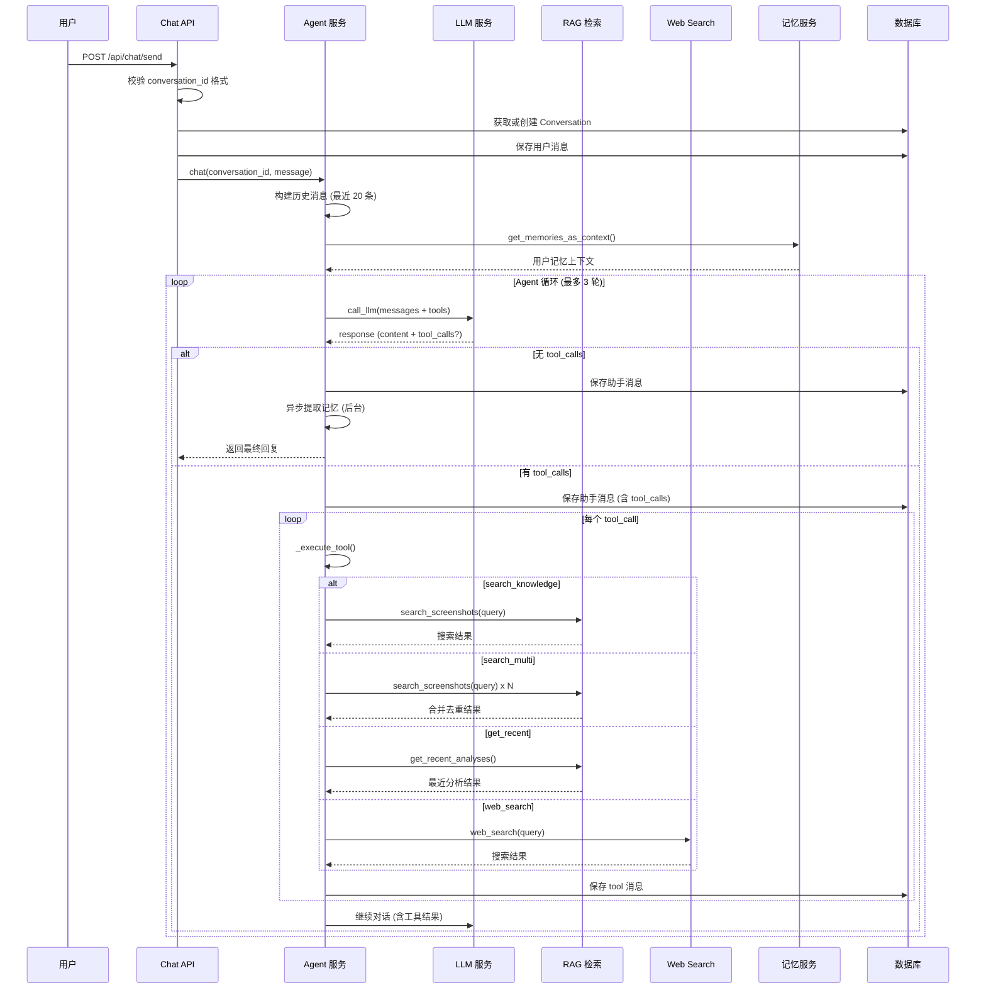
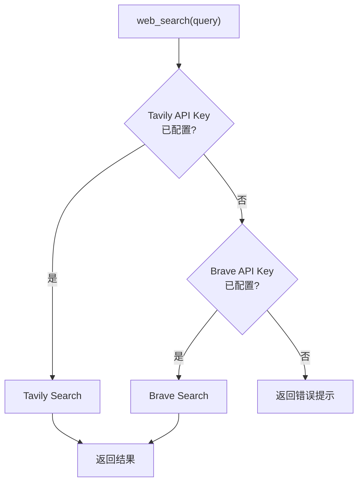

# AI 聊天助手

## 概述

Evatar 的 AI 聊天助手是一个基于 LLM 的 Agent 系统，具备工具调用 (Tool Calling) 能力。它能够搜索用户的截图知识库、获取最近截图、联网搜索互联网，以及利用记忆系统为用户提供个性化的回答。

## Agent 循环



## 可用工具

Agent 配备 4 个工具，用于扩展其知识获取能力：

### search_knowledge — 单关键词搜索

搜索用户截图知识库，使用单个核心关键词：

```json
{
  "type": "function",
  "function": {
    "name": "search_knowledge",
    "parameters": {
      "type": "object",
      "properties": {
        "query": {"type": "string", "description": "搜索关键词，用空格分隔多个词"}
      },
      "required": ["query"]
    }
  }
}
```

搜索策略：如果第一次没搜到，换同义词重试（如 "股票" -> "股价" -> "行情" -> "金融"）。

### search_multi — 多关键词同时搜索

一次传入多个相关关键词，自动合并去重返回：

```json
{
  "type": "function",
  "function": {
    "name": "search_multi",
    "parameters": {
      "type": "object",
      "properties": {
        "queries": {
          "type": "array",
          "items": {"type": "string"},
          "description": "搜索关键词列表"
        }
      },
      "required": ["queries"]
    }
  }
}
```

适合用户问题涉及多个主题时使用，例如：
- "出行" -> `["火车", "高铁", "导航", "12306", "机票"]`
- "财务" -> `["支付", "捐赠", "转账", "银行", "红包"]`

每个关键词最多搜索 5 条结果，最终合并去重返回最多 12 条。

### get_recent — 获取最近截图

返回最近 N 条截图分析结果，无需搜索词：

```json
{
  "type": "function",
  "function": {
    "name": "get_recent",
    "parameters": {
      "type": "object",
      "properties": {
        "limit": {"type": "integer", "description": "返回数量，默认10，最大20"}
      }
    }
  }
}
```

适合 "我最近截了什么"、"帮我整理最近的内容" 等宽泛问题。

### web_search — 搜索互联网

搜索互联网获取实时信息：

```json
{
  "type": "function",
  "function": {
    "name": "web_search",
    "parameters": {
      "type": "object",
      "properties": {
        "query": {"type": "string", "description": "搜索查询"}
      },
      "required": ["query"]
    }
  }
}
```

## RAG 检索实现

### FTS5 全文搜索

首选使用 SQLite FTS5 全文搜索引擎，对截图分析结果建立索引：

```python
# services/rag.py
CREATE VIRTUAL TABLE analysis_fts USING fts5(
    summary, app_name, content_category, intent, entities,
    content='analyses', content_rowid='id'
)
```

索引包含 5 个字段：摘要、应用名、内容分类、意图和实体。搜索时使用 FTS5 MATCH 语法：

```python
rows = db.execute(text("""
    SELECT a.id, a.summary, a.app_name, a.content_category, a.intent,
           a.entities, p.filename, p.original_timestamp
    FROM analysis_fts
    JOIN analyses a ON a.id = analysis_fts.rowid
    JOIN photos p ON p.id = a.photo_id
    WHERE analysis_fts MATCH :query
    ORDER BY rank
    LIMIT :limit
"""), {"query": fts_query, "limit": limit})
```

### 查询清洗

FTS5 查询会经过清洗，移除特殊字符防止语法错误：

```python
_FTS_SPECIAL = re.compile(r'[^\w\s一-鿿]')

def _sanitize_fts_query(query: str) -> str:
    tokens = query.split()
    clean = []
    for t in tokens[:10]:
        t = _FTS_SPECIAL.sub("", t)
        if t:
            clean.append(t)
    return " OR ".join(clean)
```

### 关键词回退搜索

当 FTS5 不可用或索引过期时，回退到 LIKE 关键词搜索：

```python
def _keyword_search(db, query, limit):
    keywords = query.split()[:5]
    conditions = []
    for i, kw in enumerate(keywords):
        conditions.append(
            f"(a.summary LIKE :kw{i} OR a.app_name LIKE :kw{i} OR a.entities LIKE :kw{i})"
        )
    # AND 组合所有关键词
    where_clause = " AND ".join(conditions)
```

### FTS 索引自动维护

系统会自动检测 FTS 索引是否过期（行数少于已完成的分析数量），并在查询时自动重建：

```python
fts_count = db.execute(text("SELECT count(*) FROM analysis_fts")).scalar()
analysis_count = db.execute(text("SELECT count(*) FROM analyses WHERE status = 'done'")).scalar()
if fts_count < analysis_count:
    _build_fts_index(db)
```

## Web Search 实现

Web Search 支持两个搜索引擎，按优先级使用：



| 搜索引擎 | API 端点 | 超时 | 返回字段 |
|---------|----------|------|---------|
| Tavily | `https://api.tavily.com/search` | 15s | title, url, content |
| Brave | `https://api.search.brave.com/res/v1/web/search` | 15s | title, url, description |

## 记忆注入

Agent 在第一轮对话时会自动加载用户记忆作为上下文：

```python
# services/agent.py - chat()
if round_num == 0:
    from services.memory import get_memories_as_context
    memories_ctx = get_memories_as_context(db, conv.device_id or "", limit=8)
    if memories_ctx:
        system_content += f"\n\n{memories_ctx}"
```

记忆以 `## 用户记忆` 标题注入 System Prompt，格式如下：

```
## 用户记忆
- [long_term] [people] 用户的同事叫张三
- [long_term] [finance] 用户持有 NVDA 股票
- [short_term] [schedule] 下周三有项目评审会议
```

## 文件附件

支持多模态对话，用户可以发送图片或其他文件作为附件：

```python
# api/chat.py - send_message_with_file()
if file and file.filename:
    file_bytes = await file.read()
    if len(file_bytes) > 20 * 1024 * 1024:  # 20MB 限制
        raise HTTPException(status_code=413, detail="File too large")
    file_info = {
        "filename": file.filename,
        "mime": file.content_type,
        "size": len(file_bytes),
        "base64": base64.b64encode(file_bytes).decode(),
    }
```

图片附件会被转换为多模态消息格式：

```python
if mime.startswith("image/"):
    user_content = [
        {"type": "text", "text": user_message or "请分析这张图片"},
        {"type": "image_url", "image_url": {"url": f"data:{mime};base64,{b64}"}},
    ]
```

非图片文件则以文本形式附加：

```python
else:
    user_content = f"{user_message}\n\n[附件: {file_info['filename']} ({file_info['size']} bytes)]"
```

## 技能系统

技能 (Skill) 允许为 Agent 注入额外的 System Prompt 指令，实现特定任务的定制化：

### 内置技能

| ID | 名称 | 描述 |
|----|------|------|
| `summarize` | 总结截图 | 分析最近截图，生成摘要笔记 |
| `reminders` | 提取提醒 | 从截图中提取所有提醒事项 |
| `research` | 深度研究 | 对截图主题进行深入研究 |
| `stock` | 股票分析 | 整理截图中的股票和金融信息 |

### 技能注入方式

```python
# services/agent.py
system_content = SYSTEM_PROMPT
if skill_prompt and round_num == 0:
    system_content += f"\n\n## 当前技能指令\n{skill_prompt}"
```

技能的 System Prompt 仅在第一轮对话中注入。

## 错误处理

### LLM 配置检查

对话前先检查 LLM 是否已配置：

```python
config_check = check_llm_config()
if not config_check["ok"]:
    return {
        "content": f"警告: {config_check['error']}",
        "error_type": "llm_not_configured",
    }
```

### LLM 调用错误

LLM 调用失败时返回用户友好的错误消息：

```python
except Exception as e:
    error_msg = format_llm_error(e)
    return {
        "content": f"警告: {error_msg}",
        "error_type": "llm_error",
    }
```

### Android 端错误映射

Android 端将网络错误映射为用户友好的中文提示：

```kotlin
// ApiClient.kt
is java.net.SocketTimeoutException -> ChatResult(
    errorMessage = "请求超时，AI 可能正在处理大量内容"
)
is java.net.ConnectException -> ChatResult(
    errorMessage = "无法连接服务端: ${lastException?.message}"
)
```

### 超时保护

Agent 循环最多执行 3 轮，超时后返回友好提示：

```python
for round_num in range(settings.agent_max_rounds):  # 默认 3
    ...
return {"content": "抱歉，处理超时，请重试。", "tool_calls": []}
```

## 对话管理

### 会话管理

| 操作 | API | 说明 |
|------|-----|------|
| 创建/继续对话 | `POST /api/chat/send` | conversation_id 可选，自动生成 16 位 hex |
| 带附件对话 | `POST /api/chat/send-with-file` | 支持图片和其他文件 |
| 列出会话 | `GET /api/chat/conversations` | 按更新时间倒序，含消息数和最后消息预览 |
| 获取会话详情 | `GET /api/chat/conversations/{id}` | 包含完整消息历史 |
| 获取增量消息 | `GET /api/chat/conversations/{id}/messages?after_id=N` | 仅返回指定 ID 之后的消息 |
| 删除会话 | `DELETE /api/chat/conversations/{id}` | 级联删除所有消息 |

### conversation_id 格式

会话 ID 为 1-64 位小写十六进制字符串：

```python
_CONV_ID_RE = re.compile(r'^[a-f0-9]{1,64}$')
```

### 历史消息限制

Agent 构建对话历史时，最多取最近 20 条消息：

```python
limit = settings.agent_history_limit  # 默认 20
messages = db.query(ChatMessage)
    .filter(ChatMessage.conversation_id == conversation_id)
    .order_by(ChatMessage.created_at.desc())
    .limit(limit)
    .all()
messages.reverse()  # 恢复时间顺序
```

### 后台记忆提取

每轮对话结束后，系统会在后台异步提取记忆，使用独立的数据库会话：

```python
# 使用信号量限制并发数为 2
_memory_semaphore = asyncio.Semaphore(2)

async def _extract_memories_async(text, conversation_id, device_id):
    async with _memory_semaphore:
        db = SessionLocal()
        try:
            await extract_memories_from_text(text, "chat", conversation_id, device_id, db)
        finally:
            db.close()
```

## System Prompt

Agent 的 System Prompt 定义了其行为准则：

```
你是 Evatar，一个智能个人助手。你拥有用户的手机截图知识库。

## 工具使用策略
### search_knowledge — 用核心关键词搜索
### search_multi — 一次传入多个相关关键词（推荐）
### get_recent — 获取最近截图（无需搜索词）
### web_search — 搜索互联网

## 搜索策略
1. 用户问题具体 -> search_knowledge 用核心词
2. 用户问题宽泛 -> search_multi 用多个相关词
3. 用户问"最近" -> get_recent 先看近期内容
4. 第一次搜不到 -> 换词重试
5. 找到部分信息 -> 告诉用户找到了什么

## 回答风格
- 用中文回答，简洁有条理
- 用 Markdown 表格整理结构化数据
- 引用截图中的具体信息
```
