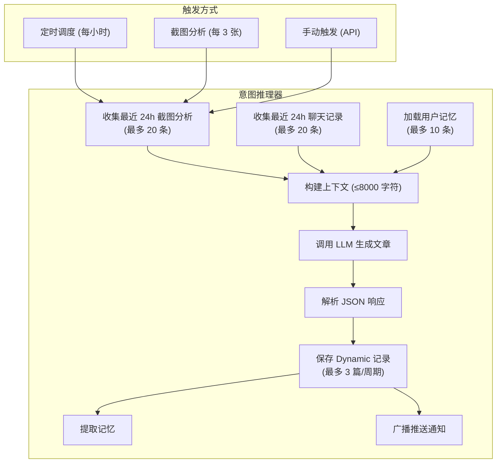

# 动态系统

## 概述

动态 (Dynamics) 是由后台意图推理器 (Intent Reasoner) 自动生成的文章和笔记。推理器定期分析用户近期的截图、聊天记录和记忆，识别模式和趋势，生成有价值的结构化内容。动态系统支持游标分页、本地缓存、未读标记和推送通知。

## 生成流程



## 推理器工作原理

### 上下文收集

推理器从三个来源收集上下文信息：

```python
# services/reasoner.py - run_reasoning_cycle()

# 1. 最近 24 小时的截图分析结果
recent_analyses = db.query(Analysis, Photo)
    .filter(Analysis.status == "done", Photo.created_at >= since)
    .order_by(desc(Photo.created_at))
    .limit(20).all()

# 2. 最近 24 小时的用户聊天消息
recent_chats = db.query(ChatMessage)
    .filter(ChatMessage.role == "user", ChatMessage.created_at >= since)
    .order_by(desc(ChatMessage.created_at))
    .limit(20).all()

# 3. 用户记忆
memories_context = get_memories_as_context(db, device_id, limit=10)
```

### 上下文格式

收集的信息会被格式化为结构化文本：

```
## 用户近期截图分析
- [01-15 14:30] 应用:微信 分类:chat 意图:reference
  摘要:用户与张三讨论明天的项目评审
  实体:[{"type":"人名","value":"张三"},{"type":"日期","value":"明天"}]

## 用户近期聊天
- 帮我看看最近有什么股票信息

## 用户记忆
- [people] 用户的同事叫张三
- [finance] 用户持有 NVDA 股票
```

上下文总长度限制为 8000 字符，避免超出 LLM 上下文窗口。

### LLM 推理

推理器使用专用的 System Prompt 指导 LLM 生成文章：

```python
REASONING_PROMPT = """你是一个智能个人助手的"意图推理"模块。

## 你的任务
分析这些信息，识别：
- 新兴主题/兴趣：用户最近在关注什么
- 时间敏感事项：即将到来的事件、截止日期
- 模式识别：反复出现的行为或关注点
- 有价值的知识整理：将零散信息整合成结构化笔记

## 输出格式
返回 JSON 数组，每个元素是一篇文章：
[{
  "title": "文章标题",
  "summary": "一句话摘要",
  "content": "Markdown 格式的完整文章",
  "category": "insight / reminder / report / note",
  "confidence": 0.0 到 1.0
}]
"""
```

### 调用参数

```python
result = await call_llm([
    {"role": "system", "content": REASONING_PROMPT},
    {"role": "user", "content": full_context[:8000]},
], temperature=0.3, max_tokens=4096)
```

- temperature 设为 0.3（比分析的 0.1 稍高），允许一定的创造性
- 每个推理周期最多生成 3 篇文章

## 文章分类

| 分类 | 说明 | 触发条件 |
|------|------|---------|
| `insight` | 洞察/趋势分析 | 识别到用户关注的新兴主题或反复模式 |
| `reminder` | 提醒/时间敏感 | 有时间约束的事项，如截止日期、即将到来的事件 |
| `report` | 综合报告 | 多个主题的综合分析 |
| `note` | 知识整理/笔记 | 将零散信息整合成结构化笔记 |

## 触发机制

### 定时触发

后台调度器每小时执行一次推理周期：

```python
# services/scheduler.py
REASONING_INTERVAL = 3600  # 1 小时

async def _scheduler_loop():
    while _running:
        now = datetime.now(timezone.utc)
        if (now - last_reasoning).total_seconds() >= REASONING_INTERVAL:
            results = await run_reasoning_cycle()
            last_reasoning = now
        await asyncio.sleep(60)  # 每分钟检查一次
```

### 截图分析触发

每累计完成 3 张截图分析，自动触发一次推理：

```python
# services/pipeline.py
_ANALYSIS_COUNTER = 0
_REASONING_TRIGGER_EVERY = 3

def _on_analysis_done(task):
    with _counter_lock:
        global _analysis_counter
        _analysis_counter += 1
        if _analysis_counter >= _REASONING_TRIGGER_EVERY:
            _analysis_counter = 0
            asyncio.create_task(_trigger_reasoning())
```

### 手动触发

通过 API 可以手动触发推理周期：

```
POST /api/dynamics/trigger?device_id=xxx
```

## 游标分页

动态列表使用游标分页 (Cursor Pagination) 实现高效的无限滚动：

```python
# api/dynamics.py
def list_dynamics(cursor: int = 0, limit: int = 30, category: str = None, ...):
    query = db.query(Dynamic)

    if cursor > 0:
        cursor_item = db.query(Dynamic).filter(Dynamic.id == cursor).first()
        if cursor_item:
            # 游标之后的项目 + 置顶项目
            query = query.filter(
                (Dynamic.is_pinned == True) |
                (Dynamic.created_at < cursor_item.created_at)
            )

    query = query.order_by(desc(Dynamic.is_pinned), desc(Dynamic.created_at))
    items = query.limit(limit + 1).all()  # 多取一条判断是否有更多

    has_more = len(items) > limit
    if has_more:
        items = items[:limit]

    return {
        "items": [_dynamic_to_dict(d) for d in items],
        "next_cursor": items[-1].id if items else None,
        "has_more": has_more,
    }
```

分页响应格式：

```json
{
  "items": [...],
  "next_cursor": 42,
  "has_more": true
}
```

首次请求 `cursor=0`，后续请求传入 `next_cursor` 的值。

## 本地缓存

Android 端使用 SharedPreferences 缓存动态列表，实现首屏秒开：

```kotlin
// DynamicViewModel.kt
init {
    loadFromCache()  // 先从缓存加载
    refresh()        // 再从服务端刷新
}
```

缓存策略：
- 最多缓存 100 条动态
- 缓存内容包含完整数据（标题、摘要、正文、分类等）
- 刷新时比较 hashCode，仅在数据变化时更新 UI 和缓存

```kotlin
private fun saveToCache(items: List<UiDynamic>) {
    val jsonArray = JSONArray()
    for (item in items.take(100)) {
        jsonArray.put(JSONObject().apply {
            put("id", item.id)
            put("title", item.title)
            // ... 其他字段
        })
    }
    prefs.edit().putString("cached_items", jsonArray.toString()).apply()
}
```

## 未读标记

### 未读统计

```python
# GET /api/dynamics/stats
def dynamics_stats(device_id=None):
    counts = db.query(Dynamic.category, func.count(Dynamic.id))
        .filter(Dynamic.is_read == False)
        .group_by(Dynamic.category).all()

    return {
        "total_unread": sum(counts.values()),
        "by_category": dict(counts),
    }
```

### 标记已读

```python
# PUT /api/dynamics/{id}/read
def mark_read(dynamic_id):
    d.is_read = True

# PUT /api/dynamics/read-all
def mark_all_read(device_id=None):
    query.update({Dynamic.is_read: True})
```

Android 端在本地维护未读计数，标记已读后立即更新 UI：

```kotlin
fun markAsRead(itemId: Int) {
    viewModelScope.launch {
        val success = apiClient.markDynamicAsRead(itemId)
        if (success) {
            val updatedItems = _state.value.items.map { item ->
                if (item.id == itemId) item.copy(isRead = true) else item
            }
            _state.value = _state.value.copy(
                items = updatedItems,
                unreadCounts = computeUnreadCounts(updatedItems),
            )
        }
    }
}
```

## 推送通知

推理器生成新文章后，会自动广播推送通知到所有注册设备：

```python
# services/reasoner.py
if saved:
    titles = "、".join(s["title"] for s in saved[:3])
    await broadcast_push(
        title="Evatar 新笔记",
        body=f"为你生成了 {len(saved)} 篇笔记：{titles}",
        data={"count": len(saved), "type": "new_dynamics"},
    )
```

## API 端点

| 方法 | 路径 | 说明 |
|------|------|------|
| `GET` | `/api/dynamics` | 列出动态 (游标分页) |
| `GET` | `/api/dynamics/stats` | 获取未读统计 |
| `GET` | `/api/dynamics/{id}` | 获取动态详情 (含正文) |
| `PUT` | `/api/dynamics/{id}/read` | 标记单条已读 |
| `PUT` | `/api/dynamics/read-all` | 全部标记已读 |
| `PUT` | `/api/dynamics/{id}/pin` | 切换置顶状态 |
| `DELETE` | `/api/dynamics/{id}` | 删除动态 |
| `POST` | `/api/dynamics/trigger` | 手动触发推理 |
