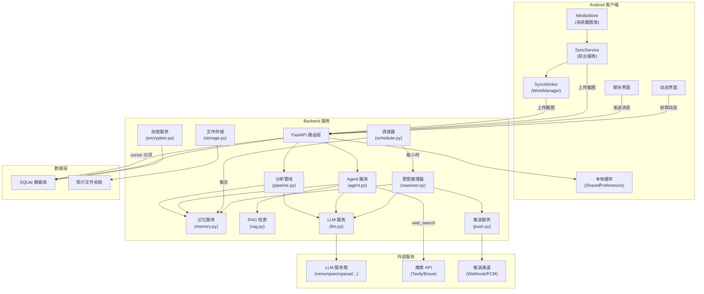
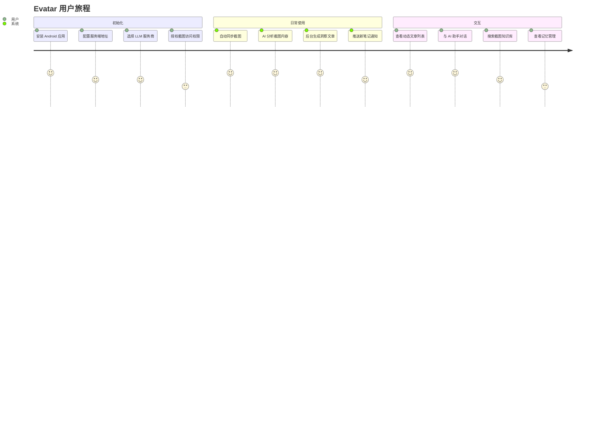
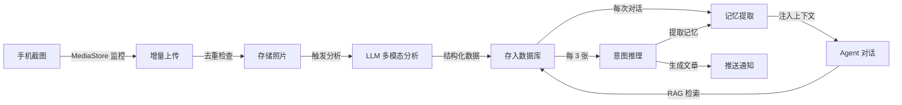

# 功能概览

Evatar 是一个智能个人助手系统，通过同步手机截图、AI 分析、记忆系统和意图推理，为用户提供个性化的信息整理与知识管理服务。

## 功能矩阵

| 功能模块 | 描述 | 状态 | 平台 |
|---------|------|------|------|
| [截图同步](./screenshot-sync) | Android 端自动监控 MediaStore，增量上传截图到服务端 | 已实现 | Android + Backend |
| [AI 分析](./ai-analysis) | LLM 多模态分析截图内容，提取结构化信息 | 已实现 | Backend |
| [AI 聊天助手](./chat-agent) | 基于 RAG 的智能对话，支持工具调用和联网搜索 | 已实现 | Android + Backend |
| [动态系统](./dynamics) | 后台意图推理引擎，自动生成洞察文章和提醒 | 已实现 | Android + Backend |
| [记忆系统](./memory) | 短期/长期记忆管理，自动提取、衰减和去重 | 已实现 | Backend |
| [推送通知](./push-notifications) | 多设备广播推送，支持 Webhook 和 FCM | 已实现 | Android + Backend |
| [安全机制](./security) | API 认证、SSRF 防护、加密存储、速率限制 | 已实现 | Backend |

## 系统架构

## 用户旅程

## 核心数据流

## 技术栈

| 层级 | 技术 |
|------|------|
| Android 客户端 | Kotlin, Jetpack Compose, WorkManager, OkHttp |
| Backend 框架 | FastAPI (Python 3.11) |
| 数据库 | SQLite + WAL 模式, SQLAlchemy ORM |
| 全文搜索 | SQLite FTS5 |
| LLM 集成 | OpenAI-compatible API (httpx) |
| 加密 | cryptography.Fernet (AES-128-CBC) |
| 文件处理 | Pillow (缩略图, 图片压缩) |
| 推送通道 | Webhook (FCM HTTP v1 预留) |

## LLM 服务商预设

系统内置 7 个 LLM 服务商预设，可在设置页面一键切换：

| 预设名称 | Provider | Base URL | 模型 | 上下文窗口 |
|---------|----------|----------|------|-----------|
| mimo | mimo | `https://token-plan-cn.xiaomimimo.com/v1` | mimo-v2.5 | 1,048,576 |
| qwen | qwen | `https://dashscope.aliyuncs.com/compatible-mode/v1` | qwen-vl-max | 131,072 |
| openai | openai | `https://api.openai.com/v1` | gpt-4o | 128,000 |
| claude | claude | `https://api.anthropic.com/v1` | claude-sonnet-4-20250514 | 200,000 |
| glm | glm | `https://open.bigmodel.cn/api/paas/v4` | glm-4v | 128,000 |
| kimi | kimi | `https://api.moonshot.cn/v1` | moonshot-v1-128k-vision-preview | 128,000 |
| deepseek | deepseek | `https://api.deepseek.com/v1` | deepseek-chat | 65,536 |

## API 路由总览

| 路由模块 | 前缀 | 说明 |
|---------|------|------|
| photos | `/api/photos` | 截图上传、同步状态、设备管理 |
| analysis | `/api/analysis` | 分析任务管理 |
| chat | `/api/chat` | 对话、消息、会话管理 |
| dynamics | `/api/dynamics` | 动态文章 CRUD、统计 |
| memories | `/api/memories` | 记忆管理、统计 |
| push | `/api/push` | 设备注册、推送广播 |
| config | `/api/config` | LLM 配置、预设管理 |
| skills | `/api/skills` | 技能管理、MCP Server |
