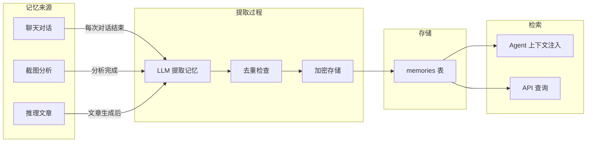

# 记忆系统

## 概述

记忆系统是 Evatar Agent 的核心能力之一。它从聊天对话、截图分析和推理文章中自动提取重要信息，分为短期记忆 (48 小时过期) 和长期记忆 (永久保存)。记忆会自动注入 Agent 的对话上下文，使助手能够记住用户的偏好、习惯、人际关系和重要事项。

## 记忆类型

| 类型 | 说明 | 过期策略 |
|------|------|---------|
| `short_term` | 短期记忆，临时性信息 | 48 小时后自动过期删除 |
| `long_term` | 长期记忆，持久性信息 | 永不过期，但会衰减 |

## 记忆分类

| 分类 | 说明 | 示例 |
|------|------|------|
| `people` | 人物信息 | "用户的同事叫张三" |
| `finance` | 金融/支付信息 | "用户持有 NVDA 股票" |
| `schedule` | 日程/时间安排 | "下周三有项目评审会议" |
| `project` | 项目/工作信息 | "用户正在参与地铁工程招标项目" |
| `preference` | 偏好设置 | "用户喜欢用 Markdown 记笔记" |
| `interest` | 兴趣爱好 | "用户关注人工智能和机器学习" |
| `habit` | 行为习惯 | "用户习惯晚上 10 点截图整理" |
| `fact` | 一般事实 | 默认分类 |

## 记忆来源



## 记忆提取

### 提取时机

| 触发场景 | 来源类型 | 说明 |
|---------|---------|------|
| Agent 对话结束 | `chat` | 每轮对话结束后，后台异步提取 |
| 截图分析完成 | `photo` | 非低相关性截图分析后提取 |
| 推理文章生成 | `inferred` | 意图推理器生成文章后提取 |

### 提取 Prompt

记忆提取使用专门的 LLM Prompt：

```python
MEMORY_EXTRACT_PROMPT = """Extract memories from the content below. Return ONLY a JSON array.

Format:
[{"content":"memory text","category":"fact|people|project|finance|schedule|preference|interest|habit","memory_type":"short_term|long_term","importance":0.5}]

Rules:
- Names/companies -> long_term, people
- Money/payments -> long_term, finance
- Dates/deadlines -> long_term, schedule
- Project info -> long_term, project
- Only return [] if truly no info
- Return ONLY the JSON array, nothing else."""
```

### 提取实现

```python
# services/memory.py - extract_memories_from_text()
async def extract_memories_from_text(text, source_type, source_id, device_id, db):
    result = await call_llm([
        {"role": "system", "content": MEMORY_EXTRACT_PROMPT},
        {"role": "user", "content": text[:6000]},
    ], temperature=0.2, max_tokens=2048)

    # 解析 JSON 数组
    entries = json.loads(content)

    for entry in entries:
        # 去重检查
        normalized = entry["content"].lower().strip().rstrip("。").rstrip(".")
        content_hash = hashlib.md5(normalized.encode("utf-8")).hexdigest()

        existing = db.query(Memory).filter(
            Memory.device_id == device_id,
            Memory.content_hash == content_hash,
        ).first()

        if existing:
            existing.access_count += 1  # 已存在则增加访问计数
            continue

        # 保存新记忆
        memory = Memory(
            content=entry["content"],
            content_hash=content_hash,
            memory_type=entry.get("memory_type", "short_term"),
            source_type=source_type,
            source_id=source_id,
            category=entry.get("category", "fact"),
            importance=entry.get("importance", 0.5),
            device_id=device_id,
            expires_at=now + timedelta(hours=48) if short_term else None,
        )
        db.add(memory)
```

## 内容哈希去重

记忆使用 MD5 哈希进行去重，避免重复存储相同或相似的记忆：

```python
# 归一化处理
normalized = entry["content"].lower().strip().rstrip("。").rstrip(".")
content_hash = hashlib.md5(normalized.encode("utf-8")).hexdigest()
```

去重规则：
1. 转小写
2. 去除首尾空白
3. 去除末尾句号
4. 计算 MD5 哈希
5. 按 `device_id + content_hash` 查询是否已存在

已存在的记忆不会重复创建，而是增加 `access_count` 和更新 `last_accessed`。

## 记忆检索

### 获取相关记忆

```python
# services/memory.py - get_relevant_memories()
def get_relevant_memories(db, device_id, limit=10):
    now = datetime.now(timezone.utc)
    memories = db.query(Memory)
        .filter(Memory.device_id == device_id)
        .filter(
            (Memory.expires_at.is_(None)) | (Memory.expires_at >= now),  # 未过期
        )
        .order_by(desc(Memory.importance), desc(Memory.last_accessed))
        .limit(limit)
        .all()
```

检索策略：
- 过滤已过期的短期记忆
- 按 `importance` 降序排列
- 相同重要性按 `last_accessed` 降序
- 默认返回最多 10 条

### Agent 上下文注入

记忆被格式化为结构化文本注入 Agent 的 System Prompt：

```python
def get_memories_as_context(db, device_id, limit=8):
    memories = get_relevant_memories(db, device_id, limit)
    lines = ["## 用户记忆"]
    for m in memories:
        tag = "long_term" if m["memory_type"] == "long_term" else "short_term"
        lines.append(f"- [{tag}] [{m['category']}] {m['content']}")
    return "\n".join(lines)
```

注入到 Agent 的 System Prompt 中：

```
## 用户记忆
- [long_term] [people] 用户的同事叫张三
- [long_term] [finance] 用户持有 NVDA 股票
- [short_term] [schedule] 下周三有项目评审会议
```

## 记忆衰减

系统每天执行一次记忆衰减任务：

```python
# services/memory.py - decay_memories()
def decay_memories(db):
    now = datetime.now(timezone.utc)

    # 1. 删除已过期的短期记忆
    deleted = db.query(Memory).filter(
        Memory.expires_at.isnot(None),
        Memory.expires_at < now,
    ).delete()

    # 2. 衰减 7 天未访问的长期记忆
    week_ago = now - timedelta(days=7)
    stale = db.query(Memory).filter(
        Memory.memory_type == "long_term",
        Memory.last_accessed < week_ago,
    ).all()
    for m in stale:
        m.importance = max(0.1, m.importance * 0.9)  # 衰减 10%，最低 0.1

    db.commit()
```

衰减规则：
- 短期记忆：48 小时后自动删除
- 长期记忆：7 天未访问则 importance 乘以 0.9
- importance 最低不会低于 0.1，确保记忆不会完全消失
- 每次访问会刷新 `last_accessed` 和增加 `access_count`

## 加密支持

如果启用了加密，记忆内容会被 Fernet 加密存储：

```python
# services/memory.py
if is_encryption_enabled():
    enc_content = encrypt_field(mem_content)
    mem_content = f"[encrypted:{content_hash}]"  # 明文字段替换为占位符
```

存储结构：
- `content`: 加密时存储占位符 `[encrypted:hash]`，未加密时存储明文
- `encrypted_content`: Fernet 加密后的密文

读取时通过 `display_content` 属性自动解密：

```python
@property
def display_content(self) -> str:
    if self.encrypted_content:
        return decrypt_field(self.encrypted_content) or ""
    return self.content
```

## 数据模型

```python
class Memory(Base):
    __tablename__ = "memories"
    __table_args__ = (
        UniqueConstraint("device_id", "content", name="uq_memory_device_content"),
        Index("ix_memories_device_type", "device_id", "memory_type"),
        Index("ix_memories_expires", "expires_at"),
    )

    id = Column(Integer, primary_key=True)
    content = Column(Text, nullable=False)
    encrypted_content = Column(Text, nullable=True)
    content_hash = Column(String(32), index=True)       # MD5 去重哈希
    memory_type = Column(String(32))                      # short_term / long_term
    source_type = Column(String(32))                      # chat / photo / inferred
    source_id = Column(String(128))                       # conversation_id 或 photo_id
    category = Column(String(64), default="fact")         # 分类
    importance = Column(Float, default=0.5)                # 重要性 0-1
    access_count = Column(Integer, default=0)              # 访问计数
    device_id = Column(String(256))
    created_at = Column(DateTime)
    last_accessed = Column(DateTime)
    expires_at = Column(DateTime, nullable=True)           # null = 永不过期
```

## API 端点

| 方法 | 路径 | 说明 |
|------|------|------|
| `GET` | `/api/memories` | 分页查询记忆列表 |
| `GET` | `/api/memories/stats` | 获取记忆统计 (总数、类型分布、分类分布) |
| `DELETE` | `/api/memories/{id}` | 删除指定记忆 |

查询参数：
- `page`: 页码 (默认 1)
- `page_size`: 每页数量 (默认 50，最大 200)
- `memory_type`: 按类型过滤 (short_term / long_term)
- `category`: 按分类过滤
- `device_id`: 按设备过滤

## 调度配置

| 任务 | 间隔 | 说明 |
|------|------|------|
| 记忆衰减 | 24 小时 | 删除过期短期记忆，衰减长期记忆 |
| 数据保留清理 | 24 小时 | 删除超过保留期 (默认 30 天) 的旧数据 |
