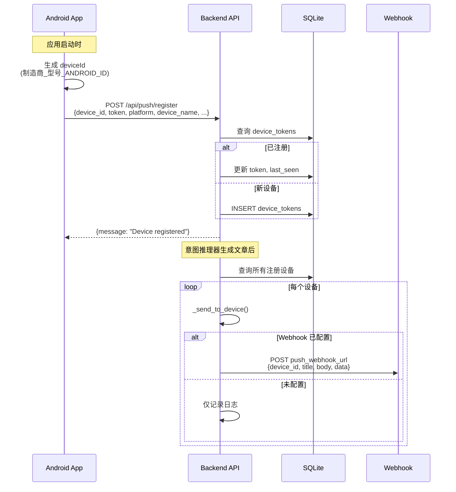

# 推送通知

## 概述

Evatar 的推送通知系统支持向所有注册设备广播消息。当意图推理器生成新文章时，系统会自动向所有设备推送通知。当前实现使用 Webhook 模式，FCM HTTP v1 作为预留扩展点。

## 设备注册流程



## 推送触发时机

| 触发场景 | 推送标题 | 推送内容 |
|---------|---------|---------|
| 意图推理生成文章 | "Evatar 新笔记" | "为你生成了 N 篇笔记：标题1、标题2" |
| 手动广播 | 自定义 | 自定义 |
| 测试推送 | "Evatar 测试通知" | "这是一条测试推送通知。" |

### 推理器触发推送

```python
# services/reasoner.py
if saved:
    titles = "、".join(s["title"] for s in saved[:3])
    await broadcast_push(
        title="Evatar 新笔记",
        body=f"为你生成了 {len(saved)} 篇笔记：{titles}",
        data={"count": len(saved), "type": "new_dynamics"},
    )
```

## 推送服务实现

### 广播推送

向所有注册设备发送通知：

```python
# services/push.py - broadcast_push()
async def broadcast_push(title: str, body: str, data: dict = None) -> int:
    db = SessionLocal()
    devices = db.query(DeviceToken).all()
    if not devices:
        return 0

    success = 0
    for device in devices:
        ok = await _send_to_device(device, title, body, data)
        if ok:
            success += 1

    return success
```

### 单设备推送

向指定设备发送通知：

```python
# services/push.py - send_push()
async def send_push(device_id: str, title: str, body: str, data: dict = None) -> bool:
    db = SessionLocal()
    device = db.query(DeviceToken).filter(DeviceToken.device_id == device_id).first()
    if not device:
        return False
    return await _send_to_device(device, title, body, data)
```

### 推送通道

```python
# services/push.py - _send_to_device()
async def _send_to_device(device, title, body, data):
    webhook_url = settings.push_webhook_url
    if not webhook_url:
        # 未配置 Webhook，仅记录日志
        logger.info(f"Push webhook not configured, logging: device={device.device_id}")
        return True

    payload = {
        "device_id": device.device_id,
        "device_name": device.device_name or device.device_id,
        "platform": device.platform,
        "token": device.token,
        "title": title,
        "body": body,
        "data": data or {},
    }

    async with httpx.AsyncClient(timeout=30.0) as client:
        resp = await client.post(webhook_url, json=payload)
        resp.raise_for_status()
    return True
```

## 设备数据模型

```python
class DeviceToken(Base):
    __tablename__ = "device_tokens"

    id = Column(Integer, primary_key=True)
    device_id = Column(String(256), unique=True)
    token = Column(String(1024))              # FCM token 或推送端点
    platform = Column(String(32), default="android")
    device_name = Column(String(256))         # 如 "Xiaomi 2312DRAABC"
    device_model = Column(String(256))
    app_version = Column(String(32))
    last_seen = Column(DateTime)
    created_at = Column(DateTime)
```

## Web Dashboard 设备管理

### 设备列表

```python
# GET /api/push/devices
def list_devices():
    devices = db.query(DeviceToken).order_by(DeviceToken.last_seen.desc()).all()
    return {"devices": [
        {
            "id": d.id,
            "device_id": d.device_id,
            "device_name": d.device_name or d.device_id,
            "device_model": d.device_model,
            "platform": d.platform,
            "app_version": d.app_version,
            "last_seen": d.last_seen.isoformat() if d.last_seen else None,
            "created_at": d.created_at.isoformat() if d.created_at else None,
        }
        for d in devices
    ]}
```

### 删除设备

```python
# DELETE /api/push/devices/{device_id}
def remove_device(device_id):
    device = db.query(DeviceToken).filter(DeviceToken.device_id == device_id).first()
    if not device:
        raise HTTPException(status_code=404, detail="Device not found")
    db.delete(device)
```

## 配置项

| 环境变量 | 说明 | 默认值 |
|---------|------|--------|
| `EVATAR_PUSH_WEBHOOK_URL` | Webhook 推送 URL | 空 (仅记录日志) |
| `EVATAR_FCM_PROJECT_ID` | FCM 项目 ID (预留) | 空 |
| `EVATAR_FCM_CREDENTIALS_JSON` | FCM 服务账号 JSON (预留) | 空 |

### Webhook Payload 格式

```json
{
  "device_id": "Xiaomi_2312DRAABC_abc123",
  "device_name": "Xiaomi 2312DRAABC",
  "platform": "android",
  "token": "device_id_or_fcm_token",
  "title": "Evatar 新笔记",
  "body": "为你生成了 2 篇笔记：股票分析、出行提醒",
  "data": {
    "count": 2,
    "type": "new_dynamics"
  }
}
```

## FCM 预留

Android 端当前使用 `deviceId` 作为推送 token 的占位符，FCM 集成需要：

1. 添加 `google-services.json` 配置文件
2. 实现 `FirebaseMessagingService` 获取真实 FCM token
3. 将真实 token 传递给 `/api/push/register`

```kotlin
// ApiClient.kt - registerDevice()
val body = JSONObject().apply {
    put("device_id", deviceId)
    // TODO: Replace with actual FCM token once Firebase is integrated
    put("token", deviceId)  // 当前使用 deviceId 作为占位符
    put("platform", "android")
    put("device_name", deviceName)
    put("device_model", Build.MODEL)
    put("app_version", appVersion)
}
```

## API 端点

| 方法 | 路径 | 说明 |
|------|------|------|
| `POST` | `/api/push/register` | 注册/更新设备 |
| `GET` | `/api/push/devices` | 列出所有注册设备 |
| `DELETE` | `/api/push/devices/{device_id}` | 删除设备 |
| `POST` | `/api/push/test` | 向指定设备发送测试推送 |
| `POST` | `/api/push/broadcast` | 向所有设备广播消息 |
