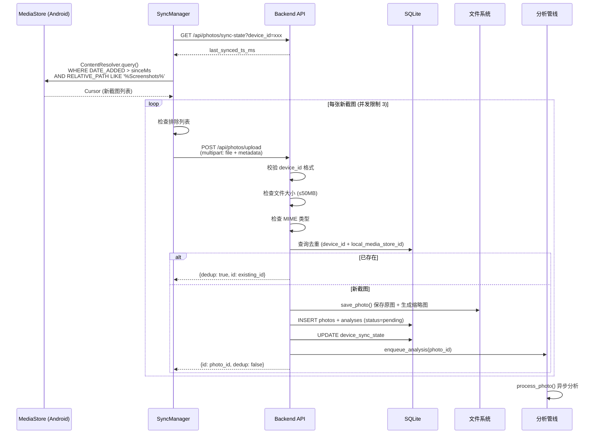

# 截图同步

## 概述

截图同步是 Evatar 的核心入口功能。Android 端通过监控系统 MediaStore 自动发现新截图，经过增量比对后上传到后端服务，后端负责存储文件、生成缩略图，并自动触发 AI 分析管线。

## 同步流程



## Android 端实现

### MediaStore 查询

Android 端通过 `ContentResolver` 查询系统 MediaStore，筛选截图文件：

```kotlin
// SyncManager.scanMediaStoreSince()
val projection = arrayOf(
    MediaStore.Images.Media._ID,
    MediaStore.Images.Media.DISPLAY_NAME,
    MediaStore.Images.Media.SIZE,
    MediaStore.Images.Media.DATE_ADDED,
    MediaStore.Images.Media.MIME_TYPE,
    MediaStore.Images.Media.RELATIVE_PATH,
)

// 过滤条件：路径或文件名包含 "Screenshot"
val parts = mutableListOf(
    "(${MediaStore.Images.Media.RELATIVE_PATH} LIKE ? OR " +
    "${MediaStore.Images.Media.DISPLAY_NAME} LIKE ?)"
)
val args = mutableListOf("%Screenshots%", "%screenshot%")

// 增量条件：只查询上次同步时间之后的新截图
if (sinceMs > 0) {
    parts.add("${MediaStore.Images.Media.DATE_ADDED} > ?")
    args.add((sinceMs / 1000).toString())
}
```

### content:// URI 兼容

Android API 29+ 引入 Scoped Storage，文件路径变为 `content://` URI，无法直接用 `java.io.File` 读取。SyncManager 会先将内容复制到临时文件：

```kotlin
// SyncManager.uploadOne()
val uploadPath = if (photo.filePath.startsWith("content://")) {
    val tmpFile = File(appContext.cacheDir, "upload_${photo.id}_${photo.displayName}")
    appContext.contentResolver.openInputStream(Uri.parse(photo.filePath))?.use { input ->
        tmpFile.outputStream().use { output -> input.copyTo(output) }
    }
    tmpFile.absolutePath
} else {
    photo.filePath
}
```

### 同步调度

系统提供两种同步调度方式：

| 方式 | 机制 | 间隔 | 说明 |
|------|------|------|------|
| 前台服务 | `SyncService` (LifecycleService) | 60 秒 | 常驻后台，显示持久通知 |
| WorkManager | `SyncWorker` (CoroutineWorker) | 30 分钟 | 由系统调度，需网络连接 |

```kotlin
// WorkScheduler.kt
val request = PeriodicWorkRequestBuilder<SyncWorker>(30, TimeUnit.MINUTES)
    .setConstraints(Constraints.Builder()
        .setRequiredNetworkType(NetworkType.CONNECTED)
        .build())
    .build()
```

### 应用排除

用户可以排除特定应用的截图不参与同步。SyncManager 通过 `AppExclusionManager` 检查截图的 `RELATIVE_PATH` 是否包含排除的包名：

```kotlin
private fun isExcludedByPath(relativePath: String): Boolean {
    val exclusions = exclusionManager.getExclusions()
    return exclusions.any { excluded ->
        relativePath.contains(excluded, ignoreCase = true)
    }
}
```

### 并发上传

上传使用 Kotlin Coroutines 的 `Semaphore` 限制并发数为 3，避免同时上传过多文件导致内存溢出：

```kotlin
val semaphore = Semaphore(MAX_CONCURRENT) // MAX_CONCURRENT = 3
coroutineScope {
    newPhotos.map { photo ->
        async {
            semaphore.withPermit {
                uploadOne(photo)
            }
        }
    }.awaitAll()
}
```

## 后端实现

### 去重机制

后端使用 `device_id` + `local_media_store_id` 组合作为唯一约束，避免同一设备的同一截图被重复上传：

```python
# models.py
class Photo(Base):
    __table_args__ = (
        UniqueConstraint("device_id", "local_media_store_id", name="uq_device_local_id"),
    )
```

上传时先查询是否已存在：

```python
# api/photos.py - _save_upload()
existing = db.query(Photo).filter(
    Photo.device_id == device_id,
    Photo.local_media_store_id == local_media_store_id,
).first()
if existing:
    return {"id": existing.id, "filename": existing.filename, "dedup": True}
```

为处理并发写入的竞态条件，还增加了 `IntegrityError` 捕获：

```python
try:
    db.flush()
except IntegrityError:
    db.rollback()
    existing = db.query(Photo).filter(...)
    if existing:
        return {"id": existing.id, "filename": existing.filename, "dedup": True}
```

### 上传元数据

每张截图上传时携带以下元数据：

| 字段 | 类型 | 说明 |
|------|------|------|
| file | Binary | 截图文件内容 |
| device_id | String | 设备标识 (格式: `制造商_型号_ANDROID_ID`) |
| device_name | String | 设备名称 (如 "Xiaomi 2312DRAABC") |
| source_type | String | 来源类型，默认 "screenshot" |
| local_media_store_id | String | MediaStore 中的 `_ID` |
| original_timestamp | String | 截图时间戳 (毫秒) |
| mime_type | String | MIME 类型 (image/jpeg 等) |

### 文件存储

文件按日期分目录存储，原图和缩略图在同一目录下：

```
data/photos/
  2024-01-15/
    a1b2c3d4e5f6.jpg          # 原图
    a1b2c3d4e5f6_thumb.jpg    # 缩略图 (512px)
  2024-01-16/
    ...
```

```python
# services/storage.py
def save_photo(file_bytes, original_filename):
    today = datetime.now(timezone.utc).strftime("%Y-%m-%d")
    day_dir = settings.photos_dir / today
    uid = uuid.uuid4().hex[:12]
    # 保存原图
    original_path = str(day_dir / f"{uid}{ext}")
    # 生成缩略图 (最大 512px, JPEG quality=80)
    _make_thumbnail(img, thumb_path, max_size=512)
```

### 同步状态管理

服务端为每个设备维护同步状态 (`DeviceSyncState`)，记录最后同步时间戳和累计同步数量：

```python
# models.py
class DeviceSyncState(Base):
    device_id = Column(String(256), primary_key=True)
    device_name = Column(String(256))
    last_synced_timestamp = Column(DateTime)  # 最后同步的截图原始时间
    last_sync_time = Column(DateTime)         # 最后一次同步操作时间
    total_synced = Column(Integer, default=0)
```

Android 端在每次同步前先查询服务端的 `last_synced_ts_ms`，然后只查询 MediaStore 中该时间之后的新截图，实现增量同步。

### device_id 格式

`device_id` 由 Android 端生成，格式为 `制造商_型号_ANDROID_ID`，服务端通过正则校验：

```python
_DEVICE_ID_RE = re.compile(r'^[a-zA-Z0-9_.\-]{1,256}$')
```

### 批量上传

支持一次上传最多 50 张截图，元数据通过逗号分隔的字符串传递：

```
POST /api/photos/upload-batch
  - device_id: string
  - files: File[] (最多 50 个)
  - timestamps: "ts1,ts2,ts3"
  - local_ids: "id1,id2,id3"
  - mime_types: "image/jpeg,image/png,image/jpeg"
```

## API 端点

| 方法 | 路径 | 说明 |
|------|------|------|
| `POST` | `/api/photos/upload` | 上传单张截图 |
| `POST` | `/api/photos/upload-batch` | 批量上传截图 (≤50) |
| `GET` | `/api/photos/sync-state` | 查询设备同步状态 |
| `POST` | `/api/photos/sync-state` | 设置同步起始时间 |
| `GET` | `/api/photos` | 分页查询截图列表 |
| `GET` | `/api/photos/{id}` | 获取截图详情及分析结果 |
| `GET` | `/api/photos/{id}/image` | 获取原图文件 |
| `GET` | `/api/photos/{id}/thumbnail` | 获取缩略图文件 |
| `GET` | `/api/photos/devices` | 列出所有同步设备 |
| `DELETE` | `/api/photos/{id}` | 删除截图及文件 |
