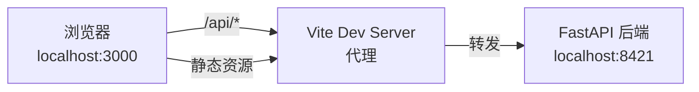

# 前端概览

Web 前端基于 **React 19** + **TypeScript** + **Vite** + **Tailwind CSS 4** 构建，提供截图管理、AI 聊天、动态浏览和系统设置等 Web 界面。

## 技术选型

| 技术 | 用途 | 版本 |
|------|------|------|
| React | UI 框架 | 19.x |
| TypeScript | 类型安全 | 6.x |
| Vite | 开发服务器与构建 | 8.x |
| Tailwind CSS | 原子化 CSS 框架 | 4.x |
| Axios | HTTP 请求 | 1.x |
| i18next | 国际化 | 26.x |
| react-i18next | React i18n 集成 | 17.x |
| react-markdown | Markdown 渲染 | 10.x |
| lucide-react | 图标库 | 1.x |

## 项目结构

```
frontend/
├── vite.config.ts           # Vite 配置（代理、插件）
├── package.json             # 依赖和脚本
├── tsconfig.json            # TypeScript 配置
├── src/
│   ├── index.css            # 全局样式（CSS 变量、设计系统）
│   ├── api/
│   │   └── client.ts        # API 客户端封装（Axios + TypeScript 类型）
│   ├── i18n/
│   │   ├── index.ts         # i18next 初始化
│   │   └── locales/
│   │       ├── zh-CN.json   # 中文翻译
│   │       └── en.json      # 英文翻译
│   └── (页面组件)
└── public/
```

## Vite 代理配置

开发模式下，Vite 将 `/api` 请求代理到后端服务：

```typescript
// vite.config.ts
export default defineConfig({
  plugins: [react(), tailwindcss()],
  server: {
    port: 3000,
    proxy: {
      '/api': {
        target: 'http://localhost:8421',  // 后端地址
        changeOrigin: true,
      },
    },
  },
})
```

前端开发服务器运行在 `localhost:3000`，所有 `/api/*` 请求自动转发到后端 `localhost:8421`。



## API 客户端

`src/api/client.ts` 封装了所有后端 API 调用，使用 Axios 实例统一管理：

```typescript
import axios from 'axios';

const api = axios.create({
  baseURL: '/api',
  timeout: 60000,
});
```

### 组织方式

API 按功能模块分组，每个函数对应一个后端端点：

```typescript
// ── Photos ──
export const getPhotos = (page = 1, pageSize = 20, status?: string) =>
  api.get<PaginatedResponse<Photo>>('/photos', { params: { page, page_size: pageSize, status } });

export const getPhoto = (id: number) => api.get<PhotoDetail>(`/photos/${id}`);
export const deletePhoto = (id: number) => api.delete(`/photos/${id}`);

// ── Chat ──
export const getConversations = (deviceId?: string) =>
  api.get<{ conversations: Conversation[] }>('/chat/conversations', { ... });

// ── Dynamics ──
export const getDynamics = (cursor = 0, limit = 30, category?: string) =>
  api.get<{ items: DynamicItem[]; next_cursor: number | null; has_more: boolean }>('/dynamics', { ... });
```

### TypeScript 类型定义

所有 API 响应都有对应的 TypeScript 接口：

```typescript
export interface Photo {
  id: number;
  filename: string;
  file_size: number;
  width: number;
  height: number;
  mime_type: string;
  source_type: string;
  device_id: string;
  device_name: string;
  original_timestamp: string | null;
  created_at: string;
  analysis_status: string;
  intent: string;
  summary: string;
}

export interface ChatMessage {
  id: number;
  role: 'user' | 'assistant' | 'system' | 'tool';
  content: string;
  tool_name?: string;
  tool_calls?: string;
  created_at: string;
}

export interface DynamicItem {
  id: number;
  title: string;
  summary: string;
  content: string;
  category: string;
  confidence: number;
  is_read: boolean;
  is_pinned: boolean;
  device_id: string | null;
  created_at: string;
}
```

## 国际化 (i18n)

使用 `i18next` + `react-i18next` 实现多语言支持：

```typescript
// src/i18n/index.ts
import i18n from 'i18next';
import { initReactI18next } from 'react-i18next';
import LanguageDetector from 'i18next-browser-languagedetector';

import zhCN from './locales/zh-CN.json';
import en from './locales/en.json';

i18n
  .use(LanguageDetector)      // 自动检测浏览器语言
  .use(initReactI18next)
  .init({
    resources: {
      'zh-CN': { translation: zhCN },
      en: { translation: en },
    },
    fallbackLng: 'zh-CN',     // 默认中文
    detection: {
      order: ['localStorage', 'navigator'],  // 优先读取本地存储
      caches: ['localStorage'],              // 用户选择保存到 localStorage
    },
  });
```

### 支持的语言

| 语言代码 | 语言 | 翻译文件 |
|----------|------|----------|
| `zh-CN` | 简体中文（默认） | `locales/zh-CN.json` |
| `en` | English | `locales/en.json` |

### 翻译结构

翻译文件按页面/功能模块组织：

```json
{
  "app": { "name": "Evatar", "subtitle": "截图同步 & AI 分析" },
  "nav": { "dashboard": "仪表盘", "photos": "照片", "chat": "AI 助手", "dynamics": "动态", "settings": "设置" },
  "dashboard": { "title": "仪表盘", "total_photos": "总照片数", "analyzed": "已分析", ... },
  "photos": { "title": "照片列表", "all": "全部", "pending": "待处理", ... },
  "chat": { "title": "AI 助手", "new_chat": "新对话", "placeholder": "输入消息...", ... },
  "dynamic": { "title": "动态", "trigger": "生成", "empty": "暂无动态", ... },
  "settings": { "title": "设置", "provider": "服务商", "save": "保存配置", ... },
  "presets": { "mimo": "小米 MiMo", "qwen": "通义千问", "openai": "OpenAI ChatGPT", ... }
}
```

## 主题系统 (深色/浅色)

使用 CSS 自定义属性 (CSS Variables) 实现主题切换，支持深色（默认）和浅色两种模式。

### 设计 Token

```css
/* src/index.css — 深色主题（默认 :root） */
:root {
  --bg-void: #0d0d1a;
  --bg-primary: #141425;
  --bg-secondary: #1c1c32;
  --bg-tertiary: #252542;
  --bg-elevated: #2a2a4a;

  --glass-bg: rgba(28, 28, 50, 0.65);
  --glass-border: rgba(240, 165, 0, 0.08);

  --text-primary: #e8e0d4;
  --text-secondary: #a09888;
  --text-muted: #6a6258;
  --text-accent: #f0a500;

  --amber: #f0a500;
  --coral: #e85d75;
  --teal: #00d9a6;
  --blue: #5b8def;

  --border: rgba(255, 255, 255, 0.06);
  --border-accent: rgba(240, 165, 0, 0.2);

  --font-display: 'Instrument Serif', Georgia, serif;
  --font-body: 'DM Sans', system-ui, sans-serif;
  --font-mono: 'JetBrains Mono', 'Fira Code', monospace;

  --radius-sm: 8px;
  --radius-md: 12px;
  --radius-lg: 20px;
}
```

```css
/* 浅色主题 */
.light {
  --bg-void: #f5f0eb;
  --bg-primary: #faf7f2;
  --bg-secondary: #ffffff;
  --text-primary: #1a1510;
  --text-secondary: #6b5e50;
  --amber: #c88500;
  /* ... */
}
```

### 主题切换机制

通过在 `<body>` 或根元素上添加 `.light` class 切换主题。默认为深色主题（CSS 变量定义在 `:root`）。

### 设计风格

- **配色方案**：琥珀色 (amber) 为主色调，珊瑚红 (coral) 和青色 (teal) 为辅助色
- **玻璃态效果**：`backdrop-filter: blur(24px) saturate(180%)` 毛玻璃背景
- **噪点纹理**：SVG fractalNoise 覆盖层，增加质感
- **渐变网格背景**：多层 radial-gradient 叠加
- **动画**：fade-up、fade-in、slide-in-right，支持 stagger 延迟

### 通用组件样式

```css
/* 玻璃态卡片 */
.glass {
  background: var(--glass-bg);
  backdrop-filter: blur(24px) saturate(180%);
  border: 1px solid var(--glass-border);
  box-shadow: var(--shadow-sm), inset 0 1px 0 var(--glass-highlight);
}

/* 标准卡片 */
.card {
  background: var(--bg-secondary);
  border: 1px solid var(--border);
  border-radius: var(--radius-lg);
  box-shadow: var(--shadow-sm);
  transition: box-shadow 0.3s ease, border-color 0.3s ease;
}

/* 按钮样式 */
.btn-primary { background: var(--amber); color: #0d0d1a; }
.btn-ghost { background: transparent; border: 1px solid var(--border); }
.btn-danger { background: var(--coral-dim); color: var(--coral); }

/* 输入框 */
.input {
  background: var(--bg-tertiary);
  border: 1px solid var(--border);
  border-radius: var(--radius-md);
}
.input:focus { border-color: var(--amber); box-shadow: 0 0 0 3px var(--amber-dim); }
```

### Chat Markdown 样式

聊天消息中的 Markdown 渲染使用专用样式类 `.chat-markdown`：

```css
.chat-markdown table { border-collapse: collapse; width: 100%; }
.chat-markdown th { background: var(--bg-tertiary); font-weight: 600; }
.chat-markdown blockquote { border-left: 2px solid var(--amber); font-style: italic; }
.chat-markdown pre { background: var(--bg-void); border: 1px solid var(--border); }
.chat-markdown code { font-family: var(--font-mono); background: var(--bg-tertiary); }
```

## 构建与开发

```bash
# 安装依赖
npm install

# 开发模式（localhost:3000，自动代理到后端）
npm run dev

# 生产构建
npm run build

# 预览生产构建
npm run preview
```
