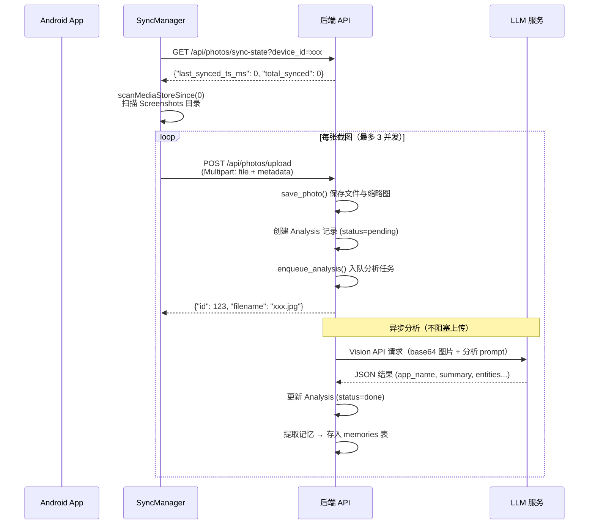

# 第一次运行

本文引导你完成 Evatar 的首次运行，从启动后端到在 Web 仪表盘中查看 AI 分析结果。

---

## 第 1 步：启动后端并验证健康检查

```bash
cd backend
source .venv/bin/activate

# 以开发模式启动（无需 API Key 认证）
EVATAR_DEV_MODE=true python -m uvicorn main:app --host 0.0.0.0 --port 8421 --reload
```

等待出现 `Application startup complete` 后，验证健康检查接口：

```bash
curl http://localhost:8421/api/health
```

**期望输出：**

```json
{"status": "ok"}
```

同时可以验证根路径：

```bash
curl http://localhost:8421/
```

**期望输出：**

```json
{"name": "Evatar", "version": "0.3.0", "status": "running"}
```

:::note
后端首次启动时会自动创建 SQLite 数据库文件 `backend/data/evatar.db`，启用 WAL 模式以提升并发读写性能。日志中会显示 `Database initialized at ...`。
:::

---

## 第 2 步：设置 LLM API Key

AI 分析和聊天功能需要配置 LLM 服务。有两种配置方式：

### 方式一：通过 Web 界面配置（推荐）

1. 打开浏览器访问 `http://localhost:3000`
2. 进入 **Settings** 页面
3. 在 LLM 配置区域选择服务商预设（如 `mimo`）
4. 填入 API Key 并保存

配置会存入数据库的 `llm_config` 表，后端使用 60 秒 TTL 缓存读取。

### 方式二：通过环境变量配置

```bash
EVATAR_LLM_API_KEY=your-api-key-here
EVATAR_LLM_BASE_URL=https://token-plan-cn.xiaomimimo.com/v1
EVATAR_LLM_MODEL=mimo-v2.5
```

### 验证 LLM 配置

```bash
curl http://localhost:8421/api/config/llm
```

**期望输出（api_key_set 应为 true）：**

```json
{
  "provider": "mimo",
  "base_url": "https://token-plan-cn.xiaomimimo.com/v1",
  "api_key_set": true,
  "model": "mimo-v2.5",
  "max_context_tokens": 1048576,
  "temperature": 0.1
}
```

---

## 第 3 步：启动前端并打开浏览器

```bash
cd frontend
pnpm install
pnpm dev
```

打开浏览器访问 `http://localhost:3000`，你将看到 Evatar 的 Web 界面，包含以下页面：

| 页面 | 说明 |
|------|------|
| **Dashboard** | 数据总览：截图总数、分析状态分布、意图分类统计 |
| **Photos** | 截图列表：支持按状态筛选、分页浏览、查看详情和缩略图 |
| **Chat** | 智能助手：多轮对话、工具调用（搜索知识库、网页搜索等） |
| **Dynamics** | 动态笔记：后台推理器生成的结构化文章 |
| **Settings** | 系统配置：LLM 设置、数据管理、推送通知配置 |

:::tip
界面默认为深色模式，可通过左下角的太阳/月亮图标切换主题，通过语言图标切换中英文。
:::

---

## 第 4 步：构建并安装 Android APK

```bash
cd android

# 构建 Debug APK
./gradlew assembleDebug
```

构建完成后，APK 位于：

```
android/app/build/outputs/apk/debug/app-debug.apk
```

安装到设备：

```bash
# 通过 ADB 安装
adb install app/build/outputs/apk/debug/app-debug.apk
```

:::info
`build.gradle.kts` 中 `applicationId = "com.evatar.app"`，`minSdk = 26`（Android 8.0），`targetSdk = 34`（Android 14）。
:::

---

## 第 5 步：在 App 中配置服务器 URL

打开 Evatar App，进入引导流程（`OnboardingScreen`）：

### 5.1 欢迎页

显示 Evatar 标志和简介，点击 **"开始配置"** 进入下一步。

### 5.2 服务器配置

- 输入后端地址，例如：`http://192.168.0.107:8421`
- 点击 **"测试连接"** 按钮
- App 调用 `GET /api/health` 验证连接
- 显示绿色对勾表示连接成功

**常见问题：**
- 地址必须以 `http://` 或 `https://` 开头
- 确保手机和电脑在同一局域网
- 检查电脑防火墙是否放行了 8421 端口

### 5.3 同步范围选择

选择要同步的截图时间范围：

| 选项 | 说明 |
|------|------|
| 最近 1 天 | 仅同步昨天以来的截图 |
| 最近 3 天 | 默认推荐 |
| 最近 7 天 | 一周内的截图 |
| 最近 30 天 | 一个月内的截图 |
| 全部截图 | 同步所有截图（可能较多） |

### 5.4 开始同步

App 自动执行以下操作：
1. 调用 `POST /api/push/register` 注册设备
2. 调用 `POST /api/photos/sync-state` 设置同步起始时间
3. `SyncManager.runSync()` 扫描 `MediaStore` 并上传截图
4. 显示进度条和已同步数量

---

## 第 6 步：首次截图同步

同步过程中，Android 端的 `SyncManager` 执行以下逻辑：



上传接口 `POST /api/photos/upload` 接收的字段：

| 字段 | 类型 | 说明 |
|------|------|------|
| `file` | File | 图片文件（最大 50MB） |
| `device_id` | String | 设备标识（如 `Xiaomi_2312DRAABC_abc123`） |
| `device_name` | String | 设备名称（如 `Xiaomi 2312DRAABC`） |
| `source_type` | String | 来源类型，默认 `screenshot` |
| `local_media_store_id` | String | MediaStore 中的 ID，用于去重 |
| `original_timestamp` | String | 拍摄时间戳（毫秒） |
| `mime_type` | String | MIME 类型，默认 `image/jpeg` |

---

## 第 7 步：在 Web 仪表盘查看分析结果

同步完成后，在浏览器中打开 `http://localhost:3000`：

### Dashboard 页面

- **截图总数**：显示已同步的截图数量
- **分析状态**：饼图展示 pending / processing / done / error 的分布
- **意图分布**：展示 reminder / research / reference / note / ignore 的占比
- **分类分布**：展示 chat / webpage / notification / finance 等的占比

### Photos 页面

- 浏览所有已同步的截图，支持按分析状态筛选
- 点击截图查看详细信息：
  - 原图和缩略图
  - AI 分析结果（应用名称、内容分类、意图、摘要、实体列表、置信度）
  - 同步时间和设备信息

### Chat 页面

向助手提问，它会自动调用工具搜索截图知识库：

```
用户: 最近有什么值得关注的火车票信息？
助手: [调用 search_knowledge("火车票")]
      根据您的截图记录，找到以下相关信息：
      - 12月15日 12306 购票截图：G1234 北京南→上海虹桥...
```

---

## 常见问题

### 后端启动失败：`No module named 'fastapi'`

确认已激活虚拟环境并安装依赖：

```bash
source .venv/bin/activate
pip install -r requirements.txt
```

### Android 连接服务器失败

1. 确认后端正在运行：`curl http://localhost:8421/api/health`
2. 确认手机和电脑在同一 WiFi 网络
3. 使用电脑的局域网 IP（而非 `localhost`）：`http://192.168.x.x:8421`
4. 检查防火墙设置

### LLM 分析返回错误

检查 LLM API Key 是否正确配置：

```bash
curl http://localhost:8421/api/config/llm
# 确认 api_key_set: true
```

### 前端显示空白

确认 Vite 开发服务器正在运行，且后端端口为 8421（Vite proxy 配置在 `vite.config.ts` 中）。

---

## 下一步

- **[架构概览](../architecture/index.md)** — 深入了解系统设计
- **[数据流](../architecture/data-flow.md)** — 各核心功能的数据流转
- **[技术栈](../architecture/tech-stack.md)** — 完整技术选型
