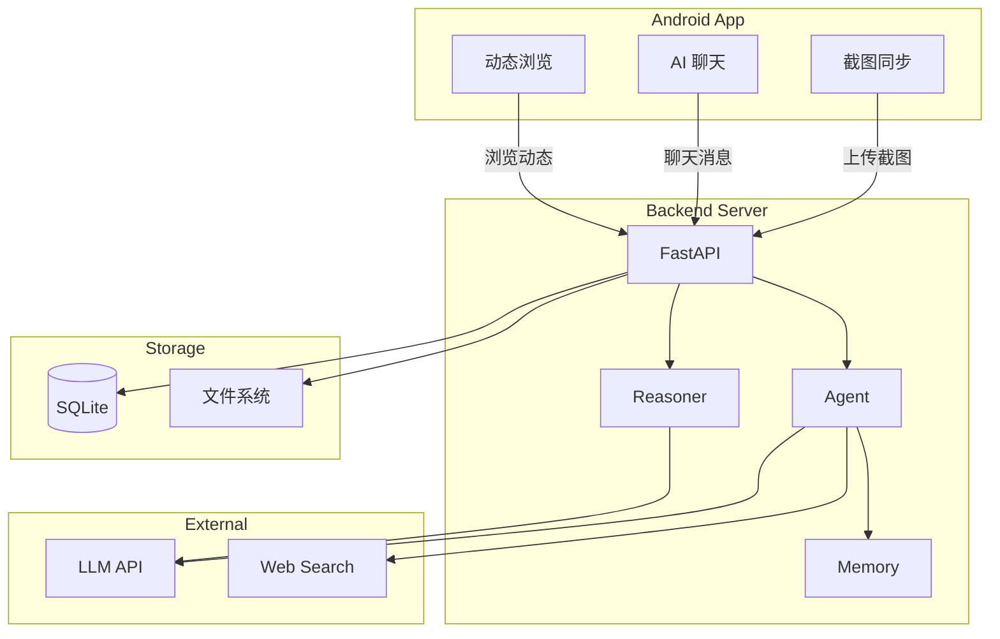

# 📷 Evatar

**截图同步 & AI 分析助手** — 通过手机截图理解你的数字生活，主动为你整理信息。

---

## ✨ 核心功能

| 功能 | 说明 |
|------|------|
| 📱 **截图同步** | Android 后台自动同步截图到服务端，支持增量同步和去重 |
| 🤖 **AI 分析** | 多模态大模型解析截图内容，提取意图、实体、摘要 |
| 💬 **智能助手** | 聊天式 Agent，支持知识库搜索、互联网搜索、文件上传 |
| 📰 **动态笔记** | 后台意图推理器自动生成文章，推送到动态页面 |

---

## 🏗️ 系统架构



---

## 🚀 快速开始

```bash
# 1. 启动后端
cd backend && python3.11 -m venv .venv && source .venv/bin/activate
pip install -r requirements.txt
EVATAR_LLM_API_KEY="your-key" python main.py

# 2. 启动前端
cd frontend && pnpm install && pnpm dev

# 3. 构建 Android
cd android && ./gradlew assembleDebug
adb install app/build/outputs/apk/debug/app-debug.apk
```

详见 [快速开始指南](/getting-started)。

---

## 🛠️ 技术栈

| 层 | 技术 |
|----|------|
| Android | Kotlin, Jetpack Compose, Material3, OkHttp, WorkManager |
| 后端 | Python, FastAPI, SQLAlchemy, SQLite, httpx |
| 前端 | React, TypeScript, Vite, Tailwind CSS |
| AI | 多模态 LLM (MiMo/Qwen/OpenAI/Claude), FTS5 RAG |

---

## 📖 文档导航

| 章节 | 内容 |
|------|------|
| [快速开始](/getting-started) | 环境准备、首次运行 |
| [架构设计](/architecture) | 系统架构、数据流、技术栈 |
| [后端开发](/backend) | API 参考、数据模型、服务层 |
| [Android 开发](/android) | MVVM 架构、页面、同步机制 |
| [前端开发](/frontend) | React 架构、页面说明 |
| [功能特性](/features) | 截图同步、AI 分析、聊天、动态 |
| [部署指南](/deployment) | 开发/生产/Docker 部署 |
| [贡献指南](/contributing) | 代码规范、Git 工作流 |
