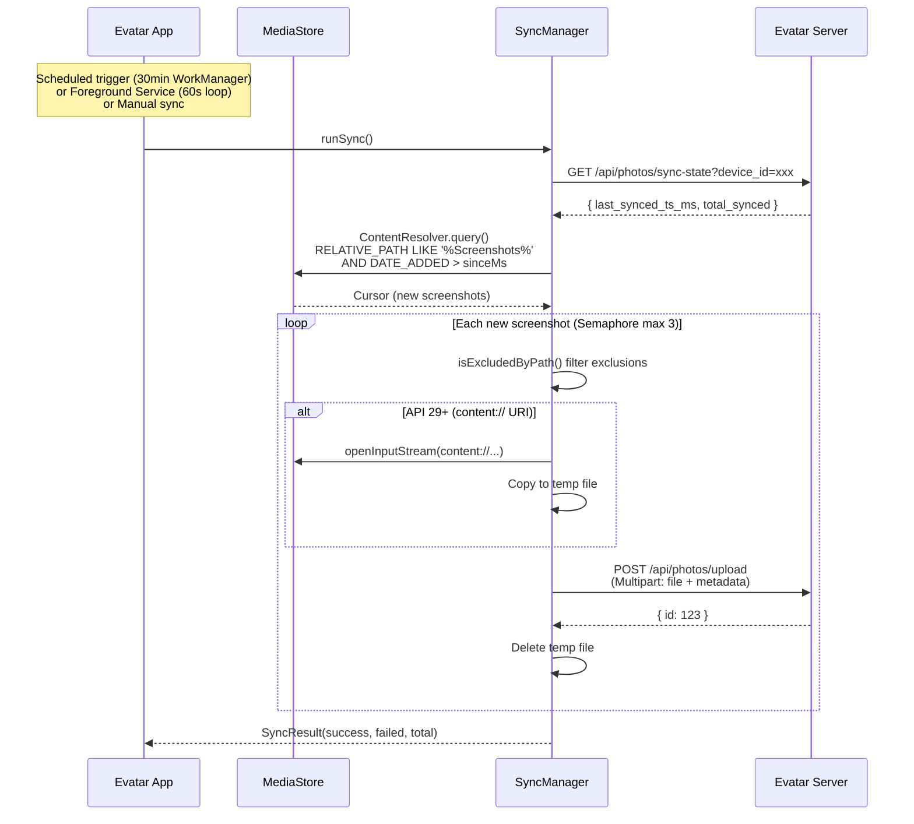

# Sync Mechanism

Evatar's sync mechanism automatically detects and uploads device screenshots to the backend. The entire sync flow is coordinated by `SyncManager`, triggered through `WorkScheduler` (WorkManager scheduled tasks) and `SyncService` (foreground Service continuous loop).

## Overall Flow



## Sync Methods

| Method | Mechanism | Interval | Description |
|--------|-----------|----------|-------------|
| Foreground Service | `SyncService` (LifecycleService) | 60 seconds | Persistent background, shows notification |
| WorkManager | `SyncWorker` (CoroutineWorker) | 30 minutes | System-scheduled, requires network |

## App Exclusion

Users can exclude specific apps' screenshots from sync. `AppExclusionManager` checks the screenshot's `RELATIVE_PATH` against excluded package names.

## Device Identifier

Each device is uniquely identified by `SyncManager.deviceId`:
```
"{MANUFACTURER}_{MODEL}_{ANDROID_ID}"
```
