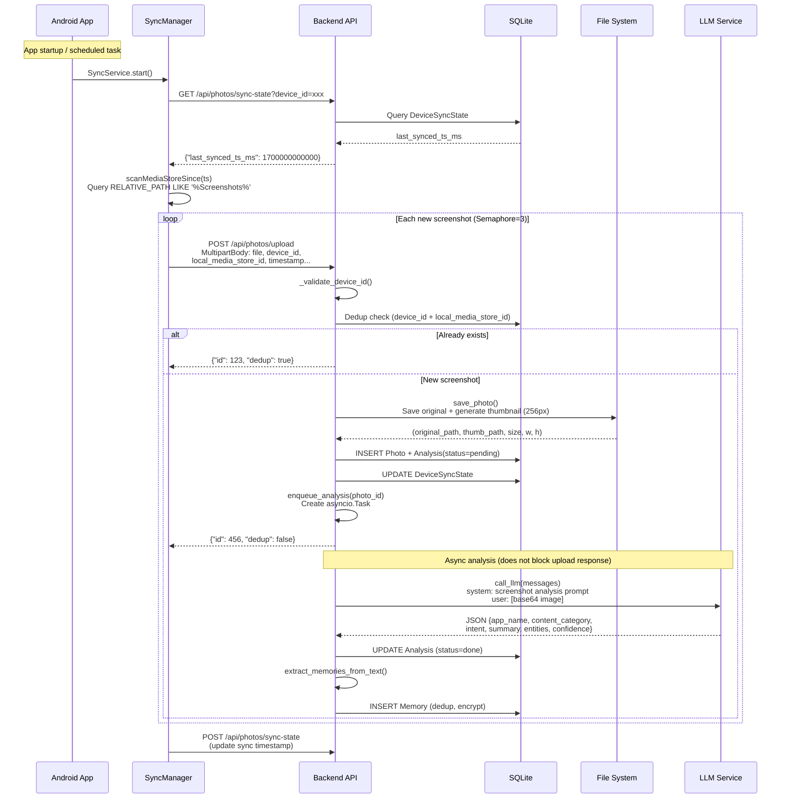
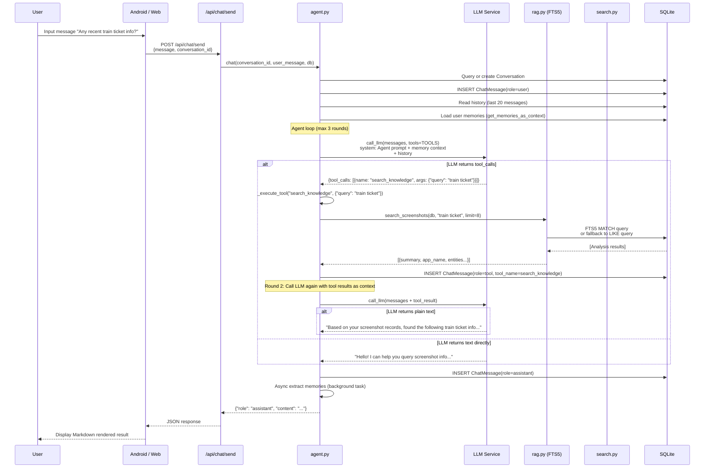
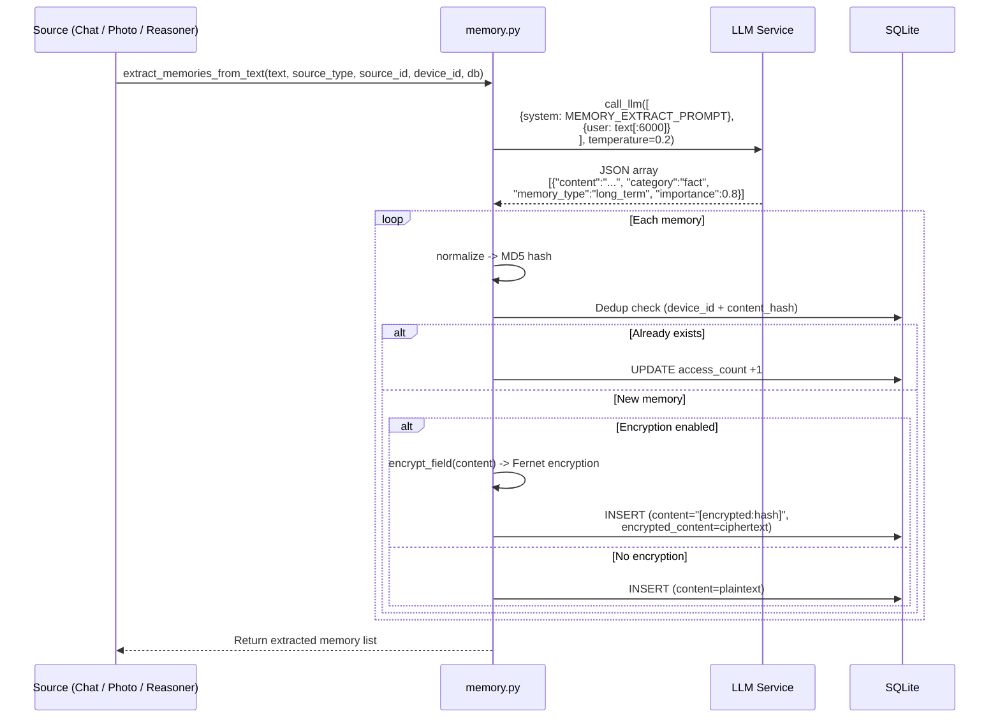
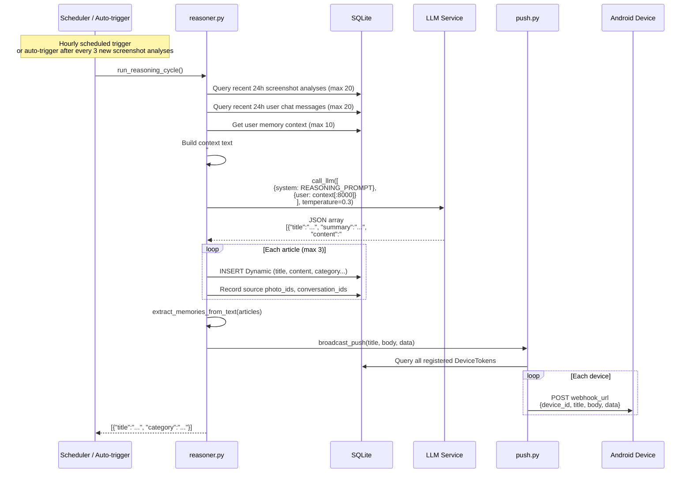
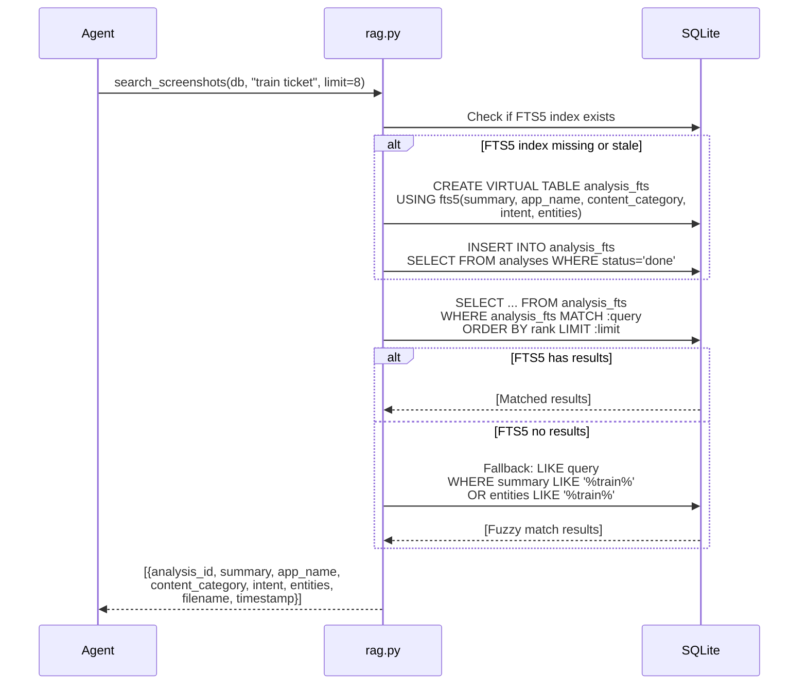

# Data Flow

This document describes the data flow for each core Evatar feature, helping developers understand the complete request path from client to storage.

---

## Screenshot Sync Flow

Screenshot sync is Evatar's most fundamental feature. The Android client scans screenshot files on the device, uploads them to the backend, which automatically triggers LLM analysis.

---

## Chat Message Flow

The chat system is based on the Agent architecture, supporting multi-turn dialogue and tool calling.

---

## Memory Extraction Flow

The memory system extracts user information from three sources: chat conversations, screenshot analysis, and reasoning articles.

---

## Intent Reasoning Flow

The intent reasoner (`services/reasoner.py`) is Evatar's "background thinking" module, running once per hour to analyze recent user activity and generate structured notes.

---

## RAG Retrieval Flow

When users ask questions in chat, the Agent uses RAG (Retrieval-Augmented Generation) to retrieve relevant information from the screenshot knowledge base.

