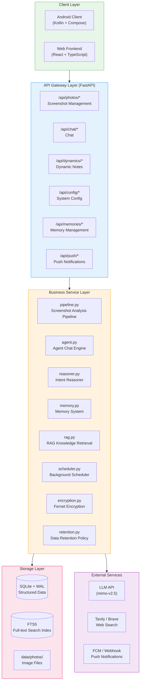

# Architecture Overview

Evatar uses a three-tier architecture with frontend-backend separation, consisting of **Android Client**, **Python Backend**, and **React Web Frontend**, communicating via REST API.

---

## System Architecture

---

## Core Components

### Backend Service Layer

The backend is based on the **FastAPI** framework, using **SQLAlchemy** ORM with **SQLite** database. Core modules:

| Module | File | Responsibility |
|--------|------|---------------|
| **App Entry** | `main.py` | FastAPI app initialization, CORS, auth middleware, rate limiting |
| **Config** | `config.py` | Pydantic Settings, env var prefix `EVATAR_` |
| **Data Models** | `models.py` | SQLAlchemy declarative models, all table definitions |
| **Screenshot Pipeline** | `services/pipeline.py` | Receives photo_id, calls LLM Vision API to analyze screenshots |
| **Agent Chat Engine** | `services/agent.py` | Multi-turn dialogue, tool call loop (max 3 rounds), user memory injection |
| **Intent Reasoner** | `services/reasoner.py` | Background scheduled analysis of recent activity, generates structured notes |
| **Memory System** | `services/memory.py` | Short-term (48h expiry) and long-term (permanent) memory, LLM extraction + dedup + decay |
| **RAG Retrieval** | `services/rag.py` | FTS5 full-text search + keyword fuzzy matching |
| **LLM Client** | `services/llm.py` | Shared httpx.AsyncClient, supports Vision multimodal and Tool Calling |
| **Scheduler** | `services/scheduler.py` | Hourly reasoning, daily memory decay, daily data cleanup |
| **Push Notifications** | `services/push.py` | Broadcast push to all registered devices (FCM / Webhook) |
| **Data Encryption** | `services/encryption.py` | Fernet symmetric encryption, auto key management, key rotation |
| **Data Retention** | `services/retention.py` | Cleanup expired data by day count |
| **Web Search** | `services/search.py` | Tavily API preferred, Brave Search as fallback |
| **File Storage** | `services/storage.py` | Save original images and thumbnails |

### API Routes

| Route Prefix | File | Main Endpoints |
|-------------|------|---------------|
| `/api/photos` | `api/photos.py` | `POST /upload`, `POST /upload-batch`, `GET /` (list), `GET /{id}`, `GET /{id}/image`, `GET /sync-state` |
| `/api/chat` | `api/chat.py` | `POST /send`, `POST /send-with-file`, `GET /conversations`, `GET /conversations/{id}` |
| `/api/dynamics` | `api/dynamics.py` | `GET /` (cursor pagination), `GET /{id}`, `PUT /{id}/read`, `POST /trigger` |
| `/api/memories` | `api/memories.py` | `GET /`, `GET /stats` |
| `/api/config` | `api/config.py` | `GET /llm`, `PUT /llm`, `GET /llm/presets` |
| `/api/skills` | `api/skills.py` | `GET /`, `GET /{id}` |
| `/api/push` | `api/push.py` | `POST /register`, `POST /test` |
| `/api/health` | `main.py` | `GET /` -- returns `{"status": "ok"}` |

---

## Middleware

### Authentication Middleware

When `EVATAR_API_KEY` is set, all requests except `/` and `/api/health` require a `Bearer <key>` in the `Authorization` header. Uses `hmac.compare_digest` for secure comparison.

### Rate Limiting Middleware

IP-level rate limiting (10 requests per minute) on the following high-frequency endpoints:
- `/api/chat/send`
- `/api/chat/send-with-file`
- `/api/dynamics/trigger`

---

## Android Client Architecture

The Android client uses the **MVVM** pattern, built with Jetpack Compose:

| Component | File | Responsibility |
|-----------|------|---------------|
| **MainActivity** | `MainActivity.kt` | App entry, permission requests, theme/language switching, onboarding flow |
| **AppNavigation** | `ui/AppNavigation.kt` | Bottom navigation: Dynamics / Chat / Settings tabs |
| **OnboardingScreen** | `ui/screens/OnboardingScreen.kt` | First-use guide: server config -> sync range -> sync execution |
| **ChatTab** | `ui/screens/ChatTab.kt` | Chat interface, supports Markdown rendering and file attachments |
| **DynamicTab** | `ui/screens/DynamicTab.kt` | Dynamic notes list, cursor pagination + infinite scroll |
| **SettingsTab** | `ui/screens/SettingsTab.kt` | Settings page: theme, language, server config |
| **SyncManager** | `sync/SyncManager.kt` | Screenshot scanning (MediaStore) and concurrent upload (Semaphore(3)) |
| **SyncWorker** | `sync/SyncWorker.kt` | WorkManager CoroutineWorker, background scheduled sync |
| **SyncService** | `sync/SyncService.kt` | Foreground Service, keeps sync task running continuously |
| **ApiClient** | `network/ApiClient.kt` | OkHttp singleton, retry logic (max 3 times, exponential backoff) |
| **ChatViewModel** | `viewmodel/ChatViewModel.kt` | Chat state management |
| **DynamicViewModel** | `viewmodel/DynamicViewModel.kt` | Dynamic notes state management |

---

## Background Tasks

The backend includes a scheduler (`services/scheduler.py`) running via `asyncio.create_task`:

| Task | Interval | Description |
|------|----------|-------------|
| **Intent Reasoning** | 1 hour | Collects recent screenshots, chats, memories, calls LLM to generate note articles |
| **Memory Decay** | 24 hours | Deletes expired short-term memories, reduces long-term memory importance |
| **Data Cleanup** | 24 hours | Cleans expired data per `EVATAR_RETENTION_DAYS` (default 30 days) |

Additionally, every 3 screenshot analyses completed (`_REASONING_TRIGGER_EVERY = 3`), a reasoning cycle is automatically triggered.
