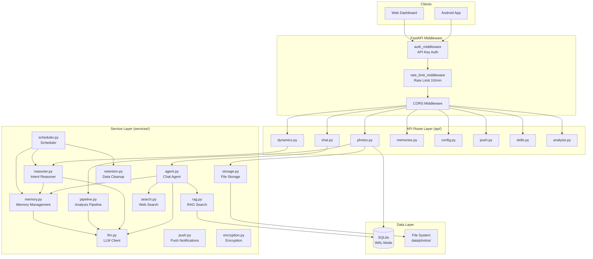

# Backend Overview

Evatar backend is a Python Web service based on **FastAPI** + **SQLAlchemy** + **SQLite**, responsible for screenshot sync, AI analysis, chat assistant, dynamic generation, memory management, and push notifications.

## Project Structure

```
backend/
├── main.py                  # FastAPI app entry, middleware registration, lifespan management
├── config.py                # Settings config class (Pydantic BaseSettings)
├── models.py                # SQLAlchemy data model definitions, database initialization
├── api/                     # API Route Layer (request handling)
│   ├── photos.py            # Screenshot upload, list, detail, delete, sync state
│   ├── analysis.py          # Analysis list, reprocess, stats
│   ├── chat.py              # Chat send, conversation management
│   ├── dynamics.py          # Dynamics list, mark read, pin, manual trigger
│   ├── memories.py          # Memory list, stats
│   ├── config.py            # LLM config management, presets, SSRF protection
│   ├── push.py              # Push device registration, list, test
│   └── skills.py            # Skills & MCP server management
├── services/                # Business Logic Layer
│   ├── agent.py             # Chat Agent (tool call loop, memory injection)
│   ├── llm.py               # LLM HTTP client (shared httpx.AsyncClient)
│   ├── memory.py            # Memory extraction, retrieval, decay
│   ├── pipeline.py          # Screenshot analysis Pipeline (async tasks, retry)
│   ├── rag.py               # RAG search (FTS5 + keyword fallback)
│   ├── reasoner.py          # Background intent reasoning (article generation)
│   ├── push.py              # Push notification service (Webhook)
│   ├── search.py            # Internet search (Tavily / Brave)
│   ├── storage.py           # File storage & thumbnail generation
│   ├── encryption.py        # Fernet encryption service
│   ├── retention.py         # Data expiration cleanup
│   ├── scheduler.py         # Background scheduled task scheduler
│   └── utils.py             # Utility functions
└── tests/                   # Tests
```

## Layered Architecture



## Key Design Decisions

| Design | Description |
|--------|-------------|
| **StaticPool** | SQLite single-connection pool, avoids multi-connection contention |
| **WAL Mode** | Via `PRAGMA journal_mode=WAL` + `busy_timeout=5000` for concurrent read/write |
| **expire_on_commit=False** | Attributes accessible after commit |
| **Independent Sessions** | Background tasks use independent `SessionLocal()` sessions |
