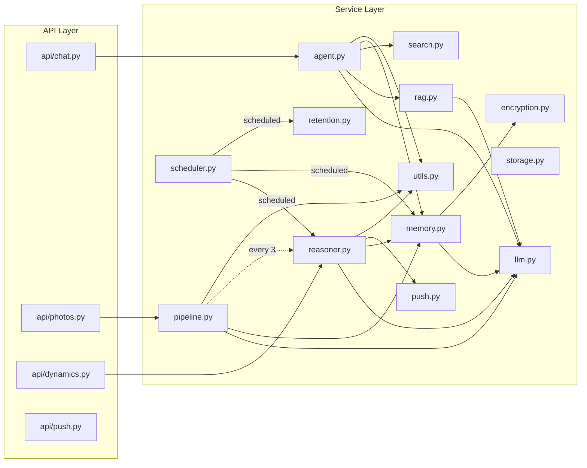

# Service Layer

All business logic is encapsulated in the `services/` directory, with clear responsibilities per module, collaborating through function calls.

## Service Call Relationships

---

## agent.py -- Chat Agent

Core chat service implementing LLM tool call loop and memory injection.

### Available Tools

| Tool | Function | Parameters |
|------|----------|-----------|
| `search_knowledge` | Single keyword search in screenshot knowledge base | `query: string` |
| `search_multi` | Multi-keyword simultaneous search, merge and dedup | `queries: string[]` |
| `get_recent` | Get recent N screenshot analyses | `limit: integer` |
| `web_search` | Search the internet | `query: string` |

### Key Design

- **Memory injection**: First round of each conversation injects user memories into system prompt
- **Async memory extraction**: After conversation ends, asynchronously extracts memories using independent DB session and semaphore (max 2 concurrent)
- **History limit**: Default loads last 20 messages

---

## llm.py -- LLM Service

Shared LLM HTTP client, all LLM calls go through this module.

---

## memory.py -- Memory Service

Manages Agent memory extraction, retrieval, and decay.

### Memory Types

| Type | Expiry | Description |
|------|--------|-------------|
| `short_term` | Auto-expires after 48 hours | Temporary info, e.g., to-do items from instant chat |
| `long_term` | Never expires (but decays) | Names, companies, preferences, etc. |

### Memory Categories

| Category | Description | Example |
|----------|-------------|---------|
| `fact` | General facts | "User works in Beijing" |
| `people` | People info | "Zhang San is a project manager" |
| `project` | Project info | "Working on XX bidding project" |
| `finance` | Financial info | "Salary 15000 yuan" |
| `schedule` | Schedule | "Project deadline Dec 20" |
| `preference` | Preferences | "Prefers high-speed rail" |
| `interest` | Interests | "Follows AI technology" |
| `habit` | Habits | "Checks stocks every morning" |

---

## pipeline.py -- Analysis Pipeline

Async LLM analysis flow after screenshot upload.

### Task Scheduling and Retry

- 3 retries with exponential backoff (2s, 4s)
- Unrecoverable errors (`FileNotFoundError`, `ValueError`) skip directly
- Every 3 analyses completed, automatically triggers reasoning cycle

---

## rag.py -- RAG Search

Screenshot knowledge base search service, supporting FTS5 full-text search and keyword LIKE fallback.

---

## reasoner.py -- Intent Reasoning

Background "thinking" module analyzing recent user activity and generating articles/notes.

---

## push.py -- Push Notifications

Sends push notifications via Webhook.

---

## search.py -- Internet Search

Supports Tavily and Brave Search APIs. Tavily takes priority, Brave as fallback.

---

## storage.py -- File Storage

Saves original images and thumbnails. Files organized by date directory.

---

## encryption.py -- Encryption Service

Fernet symmetric encryption for protecting sensitive fields (chat content, memories).

---

## retention.py -- Data Cleanup

Cleans up expired data by `retention_days` configuration.

---

## scheduler.py -- Scheduled Tasks

Background scheduler running in `main.py` lifespan.

| Task | Interval | Description |
|------|----------|-------------|
| Reasoning | 1 hour | Analyze recent screenshots and chats, generate dynamic articles |
| Memory Decay | 24 hours | Delete expired short-term memories, reduce long-term importance |
| Data Cleanup | 24 hours | Clean old data per `retention_days` config |
