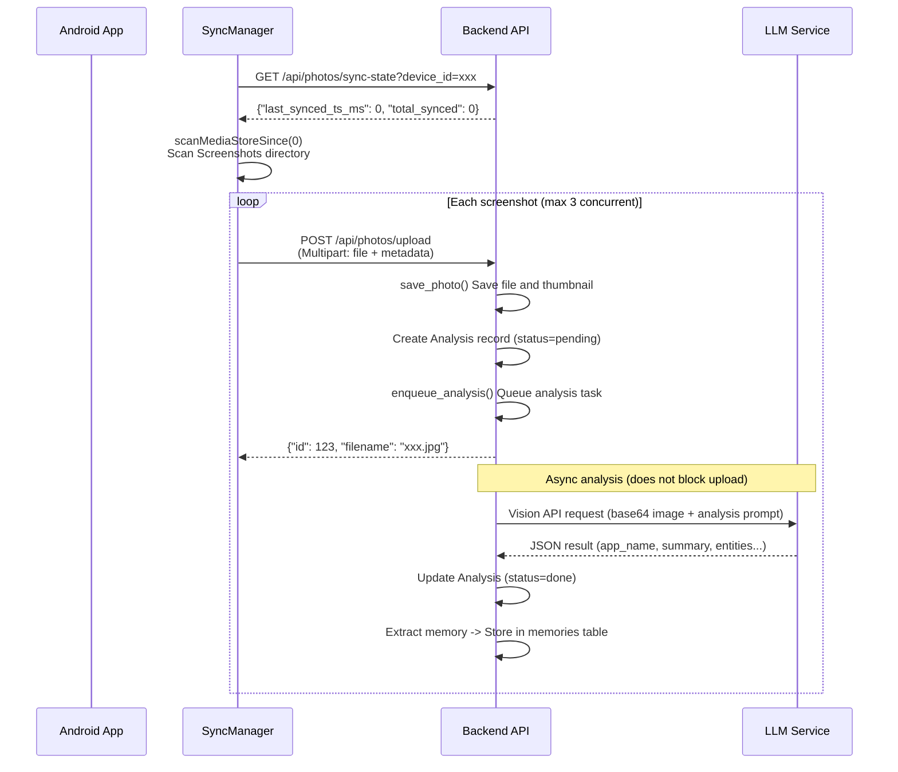

# First Run

This guide walks you through Evatar's first run, from starting the backend to viewing AI analysis results in the Web dashboard.

---

## Step 1: Start the Backend and Verify Health Check

```bash
cd backend
source .venv/bin/activate

# Start in development mode (no API Key authentication needed)
EVATAR_DEV_MODE=true python -m uvicorn main:app --host 0.0.0.0 --port 8421 --reload
```

Wait for `Application startup complete`, then verify the health check endpoint:

```bash
curl http://localhost:8421/api/health
```

**Expected output:**

```json
{"status": "ok"}
```

You can also verify the root path:

```bash
curl http://localhost:8421/
```

**Expected output:**

```json
{"name": "Evatar", "version": "0.3.0", "status": "running"}
```

:::note
On first startup, the backend automatically creates the SQLite database file `backend/data/evatar.db` and enables WAL mode for improved concurrent read/write performance. The log will display `Database initialized at ...`.
:::

---

## Step 2: Set Up LLM API Key

AI analysis and chat features require LLM service configuration. There are two ways to configure:

### Option 1: Via Web Interface (Recommended)

1. Open browser and visit `http://localhost:3000`
2. Go to the **Settings** page
3. In the LLM configuration area, select a provider preset (e.g., `mimo`)
4. Enter the API Key and save

Configuration is stored in the `llm_config` database table, read by the backend with a 60-second TTL cache.

### Option 2: Via Environment Variables

```bash
EVATAR_LLM_API_KEY=your-api-key-here
EVATAR_LLM_BASE_URL=https://token-plan-cn.xiaomimimo.com/v1
EVATAR_LLM_MODEL=mimo-v2.5
```

### Verify LLM Configuration

```bash
curl http://localhost:8421/api/config/llm
```

**Expected output (api_key_set should be true):**

```json
{
  "provider": "mimo",
  "base_url": "https://token-plan-cn.xiaomimimo.com/v1",
  "api_key_set": true,
  "model": "mimo-v2.5",
  "max_context_tokens": 1048576,
  "temperature": 0.1
}
```

---

## Step 3: Start the Frontend and Open Browser

```bash
cd frontend
pnpm install
pnpm dev
```

Open your browser at `http://localhost:3000`. You'll see the Evatar Web interface with the following pages:

| Page | Description |
|------|-------------|
| **Dashboard** | Data overview: screenshot totals, analysis status distribution, intent classification stats |
| **Photos** | Screenshot list: filter by status, paginated browsing, view details and thumbnails |
| **Chat** | Smart assistant: multi-turn dialogue, tool calls (search knowledge base, web search, etc.) |
| **Dynamics** | Dynamic notes: structured articles generated by the background reasoner |
| **Settings** | System configuration: LLM settings, data management, push notification configuration |

:::tip
The interface defaults to dark mode. Toggle themes via the sun/moon icon in the bottom-left corner, and switch languages via the language icon.
:::

---

## Step 4: Build and Install Android APK

```bash
cd android

# Build Debug APK
./gradlew assembleDebug
```

After build completion, the APK is located at:

```
android/app/build/outputs/apk/debug/app-debug.apk
```

Install to device:

```bash
# Install via ADB
adb install app/build/outputs/apk/debug/app-debug.apk
```

:::info
In `build.gradle.kts`: `applicationId = "com.evatar.app"`, `minSdk = 26` (Android 8.0), `targetSdk = 34` (Android 14).
:::

---

## Step 5: Configure Server URL in the App

Open the Evatar app, enter the onboarding flow (`OnboardingScreen`):

### 5.1 Welcome

Displays the Evatar logo and description. Click **"Start Setup"** to proceed.

### 5.2 Server Configuration

- Enter the backend address, e.g.: `http://192.168.0.107:8421`
- Click the **"Test Connection"** button
- The app calls `GET /api/health` to verify connection
- A green checkmark indicates successful connection

**Common issues:**
- Address must start with `http://` or `https://`
- Ensure phone and computer are on the same local network
- Check that the computer's firewall allows port 8421

### 5.3 Sync Range Selection

Select the screenshot time range to sync:

| Option | Description |
|--------|-------------|
| Last 1 day | Only sync screenshots from yesterday |
| Last 3 days | Default recommended |
| Last 7 days | Screenshots within one week |
| Last 30 days | Screenshots within one month |
| All screenshots | Sync all screenshots (may be many) |

### 5.4 Start Sync

The app automatically performs the following:
1. Calls `POST /api/push/register` to register the device
2. Calls `POST /api/photos/sync-state` to set the sync start time
3. `SyncManager.runSync()` scans `MediaStore` and uploads screenshots
4. Displays progress bar and synced count

---

## Step 6: First Screenshot Sync

During sync, the Android `SyncManager` executes the following logic:



Upload endpoint `POST /api/photos/upload` accepts the following fields:

| Field | Type | Description |
|-------|------|-------------|
| `file` | File | Image file (max 50MB) |
| `device_id` | String | Device identifier (e.g., `Xiaomi_2312DRAABC_abc123`) |
| `device_name` | String | Device name (e.g., `Xiaomi 2312DRAABC`) |
| `source_type` | String | Source type, default `screenshot` |
| `local_media_store_id` | String | ID in MediaStore, used for deduplication |
| `original_timestamp` | String | Capture timestamp (milliseconds) |
| `mime_type` | String | MIME type, default `image/jpeg` |

---

## Step 7: View Analysis Results in Web Dashboard

After sync is complete, open `http://localhost:3000` in your browser:

### Dashboard Page

- **Total Screenshots**: Shows the number of synced screenshots
- **Analysis Status**: Pie chart showing distribution of pending / processing / done / error
- **Intent Distribution**: Shows proportions of reminder / research / reference / note / ignore
- **Category Distribution**: Shows proportions of chat / webpage / notification / finance, etc.

### Photos Page

- Browse all synced screenshots, filter by analysis status
- Click a screenshot to view detailed information:
  - Original image and thumbnail
  - AI analysis results (app name, content category, intent, summary, entity list, confidence)
  - Sync time and device information

### Chat Page

Ask the assistant questions, and it will automatically call tools to search the screenshot knowledge base:

```
User: Any recent train ticket information worth noting?
Assistant: [Calls search_knowledge("train ticket")]
          Based on your screenshot records, found the following relevant information:
          - Dec 15 12306 ticket purchase screenshot: G1234 Beijing South -> Shanghai Hongqiao...
```

---

## FAQ

### Backend startup fails: `No module named 'fastapi'`

Confirm that the virtual environment is activated and dependencies are installed:

```bash
source .venv/bin/activate
pip install -r requirements.txt
```

### Android cannot connect to server

1. Confirm the backend is running: `curl http://localhost:8421/api/health`
2. Confirm phone and computer are on the same WiFi network
3. Use the computer's local network IP (not `localhost`): `http://192.168.x.x:8421`
4. Check firewall settings

### LLM analysis returns errors

Check if the LLM API Key is correctly configured:

```bash
curl http://localhost:8421/api/config/llm
# Confirm api_key_set: true
```

### Frontend shows blank page

Confirm the Vite development server is running, and the backend port is 8421 (Vite proxy configuration is in `vite.config.ts`).

---

## Next Steps

- **[Architecture Overview](../architecture/index.md)** -- Dive deeper into system design
- **[Data Flow](../architecture/data-flow.md)** -- Data flow for each core feature
- **[Tech Stack](../architecture/tech-stack.md)** -- Complete technology selection
