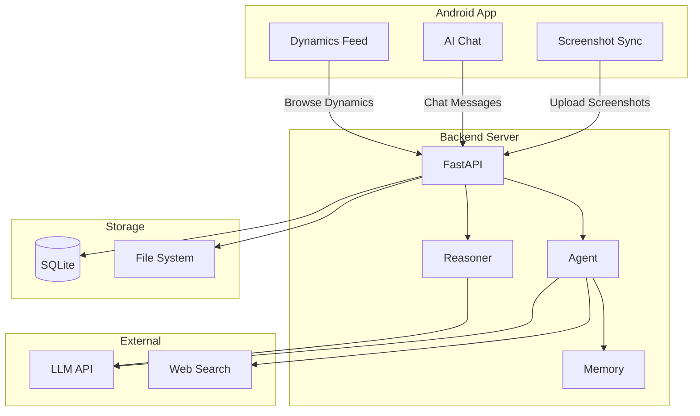

# Evatar

**Screenshot Sync & AI Analysis Assistant** -- Understand your digital life through phone screenshots, proactively organize information for you.

---

## Core Features

| Feature | Description |
|---------|-------------|
| Screenshot Sync | Android background auto-syncs screenshots to server, supports incremental sync and deduplication |
| AI Analysis | Multimodal LLM parses screenshot content, extracts intent, entities, and summaries |
| Smart Assistant | Chat-based Agent with knowledge base search, web search, and file upload support |
| Dynamic Notes | Background intent reasoning engine auto-generates articles, pushed to the Dynamics page |

---

## System Architecture



---

## Quick Start

```bash
# 1. Start the backend
cd backend && python3.11 -m venv .venv && source .venv/bin/activate
pip install -r requirements.txt
EVATAR_LLM_API_KEY="your-key" python main.py

# 2. Start the frontend
cd frontend && pnpm install && pnpm dev

# 3. Build Android
cd android && ./gradlew assembleDebug
adb install app/build/outputs/apk/debug/app-debug.apk
```

See the [Getting Started Guide](/getting-started) for details.

---

## Tech Stack

| Layer | Technology |
|-------|-----------|
| Android | Kotlin, Jetpack Compose, Material3, OkHttp, WorkManager |
| Backend | Python, FastAPI, SQLAlchemy, SQLite, httpx |
| Frontend | React, TypeScript, Vite, Tailwind CSS |
| AI | Multimodal LLM (MiMo/Qwen/OpenAI/Claude), FTS5 RAG |

---

## Documentation Navigation

| Section | Content |
|---------|---------|
| [Getting Started](/getting-started) | Environment setup, first run |
| [Architecture](/architecture) | System architecture, data flow, tech stack |
| [Backend](/backend) | API reference, data models, service layer |
| [Android](/android) | MVVM architecture, screens, sync mechanism |
| [Frontend](/frontend) | React architecture, page descriptions |
| [Features](/features) | Screenshot sync, AI analysis, chat, dynamics |
| [Deployment](/deployment) | Dev/production/Docker deployment |
| [Contributing](/contributing) | Code standards, Git workflow |
